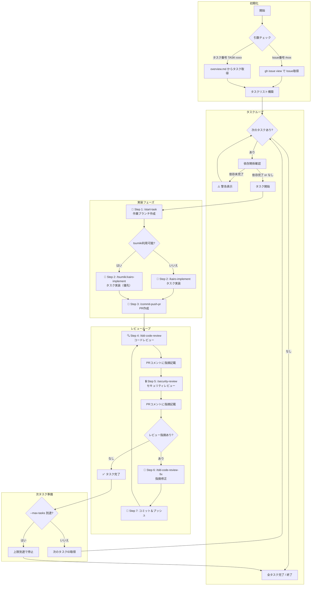

# auto-task-runner

## 目的

複数のGitHub IssueまたはKairoタスクを順番に自動実行し、実装→PR→レビュー→修正のサイクルを自動化するオーケストレーションコマンドなのだ。

## 引数

| 引数 | 必須 | 説明 | 例 |
|------|------|------|-----|
| `requirement_name` | ○ | 要件名（docs/tasks/配下のディレクトリ名） | `atelier-guild-rank` |
| `start_id` | ○ | 開始ID（Issue番号またはタスク番号） | `#123` or `TASK-0055` |
| `--issue-mode` | - | GitHub Issue モードで実行（デフォルトはタスクモード） | - |
| `--dry-run` | - | 実行予定のタスクを表示のみ（実際には実行しない） | - |
| `--skip-review` | - | レビュー工程をスキップ（高速イテレーション用） | - |
| `--max-tasks N` | - | 最大N個のタスクを実行して停止 | `--max-tasks 3` |

## 実行フロー



## 実行内容

### Step 0: 引数解析と初期化

1. 引数を解析（要件名、開始ID、オプション）
2. 開始IDの形式判定
   - `#xxx` → GitHub Issue モード
   - `TASK-xxxx` → Kairoタスクモード
3. タスクリストを構築
   - Issue: `gh issue list --state open` でオープンIssue一覧取得
   - タスク: `docs/tasks/{要件名}/overview.md` から未完了タスク抽出
4. 開始位置から順番にタスクをキューイング

**音声通知**: 「タスク自動実行を開始するのだ」

### Step 1: 依存関係確認

各タスクについて依存関係を確認するのだ。

1. `docs/tasks/{要件名}/overview.md` から依存関係を読み込み
2. 依存タスクの完了状態を確認（ステータスが `[x]` または `completed`）
3. 未完了の依存があれば警告表示＆スキップ

```
⚠️ タスク TASK-0055 は依存タスク TASK-0054 が未完了のためスキップするのだ
```

### Step 2: タスク開始準備 (`/start-task`)

サブエージェント（general-purpose）で実行するのだ。

```
Task実行: /start-task {要件名} {タスクID}
```

処理内容:
1. mainブランチを最新化
2. 作業ブランチを作成（`claude/{task-id}-{short-desc}`）
3. ブランチをチェックアウト

**音声通知**: 「タスク{ID}を開始するのだ」

### Step 3: タスク実装 (`/kairo-implement` or `/tsumiki:kairo-implement`)

サブエージェント（general-purpose）で実行するのだ。

**タスク種別判定ロジック**:
1. tsumiki スキルが利用可能か確認
2. 利用可能 → `/tsumiki:kairo-implement` を使用（優先）
3. 利用不可 → `/kairo-implement` を使用（フォールバック）

```
Task実行（優先）: /tsumiki:kairo-implement {タスクID}
Task実行（代替）: /kairo-implement {タスクID}
```

処理内容:
1. TDDまたは直接作業プロセスで実装
2. テスト実行＆パス確認
3. 実装完了レポート生成

**音声通知**: 「実装が完了したのだ」

### Step 4: PR作成 (`/commit-commands:commit-push-pr`)

サブエージェント（general-purpose）で実行するのだ。

```
Task実行: /commit-commands:commit-push-pr
```

処理内容:
1. 変更をステージング
2. コミット（Conventional Commits形式）
3. リモートにプッシュ
4. PRを作成

出力: PR URL（後続ステップで使用）

### Step 5: コードレビュー (`/tdd-code-review`)

`--skip-review` オプションが指定されていない場合に実行するのだ。

サブエージェント（general-purpose）で実行するのだ。

```
Task実行: /tdd-code-review
```

処理内容:
1. 7つの観点でレビュー
   - セキュリティ
   - パフォーマンス
   - SOLID原則
   - エラーハンドリング
   - テスト品質
   - コード可読性
   - 日本語コメント品質
2. 指摘事項をPRコメントに投稿

```bash
gh pr comment {PR番号} --body "## 🔍 コードレビュー結果

### 指摘事項
{指摘内容をMarkdown形式で記載}

### サマリー
- Critical: {N}件
- Warning: {N}件
- Info: {N}件
"
```

**音声通知**: 「レビューを開始するのだ」

### Step 6: セキュリティレビュー (`/security-review`)

`--skip-review` オプションが指定されていない場合に実行するのだ。

サブエージェント（general-purpose）で実行するのだ。

```
Task実行: /security-review
```

処理内容:
1. Claude Code標準セキュリティレビュー実行
2. 脆弱性検出
3. 指摘事項をPRコメントに投稿

```bash
gh pr comment {PR番号} --body "## 🔒 セキュリティレビュー結果

### 検出された脆弱性
{脆弱性をMarkdown形式で記載}

### 推奨対策
{対策をMarkdown形式で記載}
"
```

### Step 7: レビュー指摘修正 (`/tdd-code-review-fix`)

レビュー指摘がある場合に実行するのだ。

サブエージェント（general-purpose）で実行するのだ。

```
Task実行: /tdd-code-review-fix
```

処理内容:
1. PRコメントから指摘内容を取得（`gh pr view --comments`）
2. 優先度順に修正を実施
3. 修正完了レポート生成

**音声通知**: 「{N}件の指摘があるのだ」

### Step 8: 修正コミット＆プッシュ

サブエージェント（general-purpose）で実行するのだ。

```
Task実行: /commit-commands:commit-push-pr
```

処理内容:
1. 修正内容をコミット（`fix: address review comments`）
2. プッシュ

**音声通知**: 「修正が完了したのだ」

### Step 9: レビューループ判定

1. Step 5〜8の結果を確認
2. **以下の条件を満たすまでループ**：
   - Critical問題: 全て修正完了（Issue作成不可のため必須）
   - Warning問題: 全て「修正完了」または「Issue作成済み」
   - Info問題: 全て「修正完了」または「Issue作成済み」または「スキップ」
3. 最大ループ回数（5回）でタイムアウト

#### Issue作成済み指摘の扱い

`/tdd-code-review-fix` の修正サマリーから以下を確認：
1. 「Issue作成」列の件数をカウント
2. 「修正完了」+「Issue作成」が「検出数」と一致すればループ終了
3. Issue作成された指摘は「対応済み」として扱い、レビューループを継続しない

```
✅ レビュー完了判定:
- Critical問題: {N}件中{N}件修正完了
- Warning問題: {N}件中{M}件修正完了、{K}件Issue作成
- Info問題: {N}件中{M}件修正完了、{K}件Issue作成、{L}件スキップ
→ 全ての問題が対応済みのため、レビューループを終了
```

```
⚠️ レビューループが5回に達したのだ。手動確認が必要なのだ。
```

### Step 10: 次のタスクへ

1. Issue: `gh issue list --state open` で次のオープンIssueを取得
2. タスク: `docs/tasks/{要件名}/overview.md` から次の未完了タスクを取得
3. タスクキューを更新
4. `--max-tasks` に達した場合は停止

**音声通知**: 「タスク{ID}が完了したのだ」

## サブエージェント実行パターン

各ステップは `general-purpose` タイプのサブエージェントで実行するのだ。

```
# タスク開始
Task tool:
  subagent_type: general-purpose
  prompt: "/start-task {要件名} {タスクID} を実行して、作業ブランチを作成してほしいのだ"

# タスク実装（tsumiki優先）
Task tool:
  subagent_type: general-purpose
  prompt: "/tsumiki:kairo-implement {タスクID} を実行して、タスクを実装してほしいのだ"

# PR作成
Task tool:
  subagent_type: general-purpose
  prompt: "/commit-commands:commit-push-pr を実行して、PRを作成してほしいのだ"

# コードレビュー
Task tool:
  subagent_type: general-purpose
  prompt: "/tdd-code-review を実行して、コードをレビューしてほしいのだ。指摘事項は gh pr comment でPR {PR番号} に投稿してほしいのだ"

# セキュリティレビュー
Task tool:
  subagent_type: general-purpose
  prompt: "/security-review を実行して、セキュリティをレビューしてほしいのだ。指摘事項は gh pr comment でPR {PR番号} に投稿してほしいのだ"

# レビュー指摘修正
Task tool:
  subagent_type: general-purpose
  prompt: "/tdd-code-review-fix を実行して、レビュー指摘を修正してほしいのだ"
```

## エラーハンドリング

| エラー | 対応 |
|--------|------|
| 引数不足 | エラーメッセージを表示し、使用方法を案内 |
| 要件名が存在しない | `docs/tasks/{要件名}` が見つからない場合はエラー終了 |
| タスクIDが存在しない | 該当タスクが見つからない場合はスキップして次へ |
| 依存タスク未完了 | 警告表示してスキップ、次のタスクへ |
| 実装エラー | エラー詳細を表示し、該当タスクで停止 |
| レビューループ上限 | 5回到達で警告表示し、手動確認を促す |
| PRコメント投稿失敗 | リトライ（最大3回）後、ローカルにログ出力 |

## 出力フォーマット

### タスク開始時

```
🚀 タスク自動実行を開始するのだ

📋 実行設定:
- 要件名: {requirement_name}
- 開始ID: {start_id}
- モード: {タスクモード or Issueモード}
- オプション: {適用オプション一覧}

📝 実行予定タスク:
1. {TASK-0055}: {タスク名}
2. {TASK-0056}: {タスク名}
3. {TASK-0057}: {タスク名}
```

### 各タスク完了時

```
✅ タスク {TASK-ID} が完了したのだ

📊 実行サマリー:
- 実装タイプ: TDDプロセス
- PR: #{PR番号} ({PR URL})
- レビューループ: {N}回
- 指摘修正: {N}件

📝 次のタスク: {次のタスクID}
```

### 全タスク完了時

```
🎉 全てのタスクが完了したのだ！

📊 実行結果サマリー:
- 実行タスク数: {N}個
- 成功: {N}個
- スキップ: {N}個（依存未完了）
- 作成PR数: {N}個

📝 作成されたPR一覧:
- #{PR番号}: {タスクID} - {タスク名}
- #{PR番号}: {タスクID} - {タスク名}
```

## 音声通知タイミング

| タイミング | メッセージ |
|------------|------------|
| コマンド開始 | 「タスク自動実行を開始するのだ」 |
| タスク開始 | 「タスク{ID}を開始するのだ」 |
| 実装完了 | 「実装が完了したのだ」 |
| レビュー開始 | 「レビューを開始するのだ」 |
| レビュー指摘あり | 「{N}件の指摘があるのだ」 |
| 修正完了 | 「修正が完了したのだ」 |
| タスク完了 | 「タスク{ID}が完了したのだ」 |
| 全タスク完了 | 「全てのタスクが完了したのだ」 |
| エラー発生 | 「エラーが発生したのだ」 |

音声通知設定: `speaker=3, speedScale=1.3`

## 注意事項

1. 各サブエージェントは `general-purpose` タイプで実行するのだ
2. VOICEVOXによる音声通知を各ステップで実施するのだ
3. 信頼性レベル表記（🔵🟡🔴）を活用するのだ
4. TodoWriteで進捗を追跡するのだ
5. レビューループは最大5回まで（無限ループ防止）なのだ
6. 各ステップでエラーが発生した場合は即座に停止し、状態を報告するのだ
7. `--dry-run` オプションで実行前に計画を確認できるのだ

## 使用例

```bash
# タスクモードで実行
/auto-task-runner atelier-guild-rank TASK-0055

# Issueモードで実行
/auto-task-runner atelier-guild-rank #123 --issue-mode

# ドライラン（実行計画のみ表示）
/auto-task-runner atelier-guild-rank TASK-0055 --dry-run

# レビューをスキップして高速実行
/auto-task-runner atelier-guild-rank TASK-0055 --skip-review

# 3タスクまで実行して停止
/auto-task-runner atelier-guild-rank TASK-0055 --max-tasks 3

# 複合オプション
/auto-task-runner atelier-guild-rank TASK-0055 --max-tasks 5 --skip-review
```
