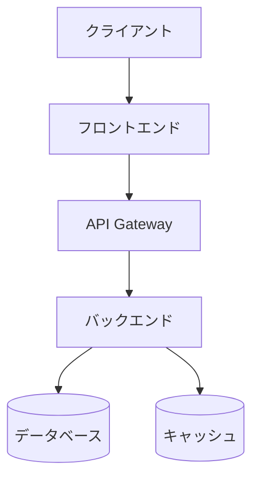
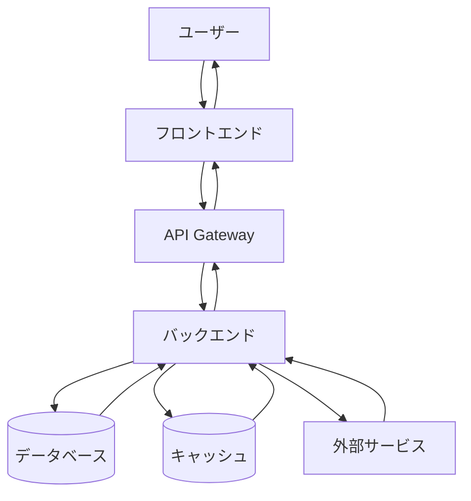
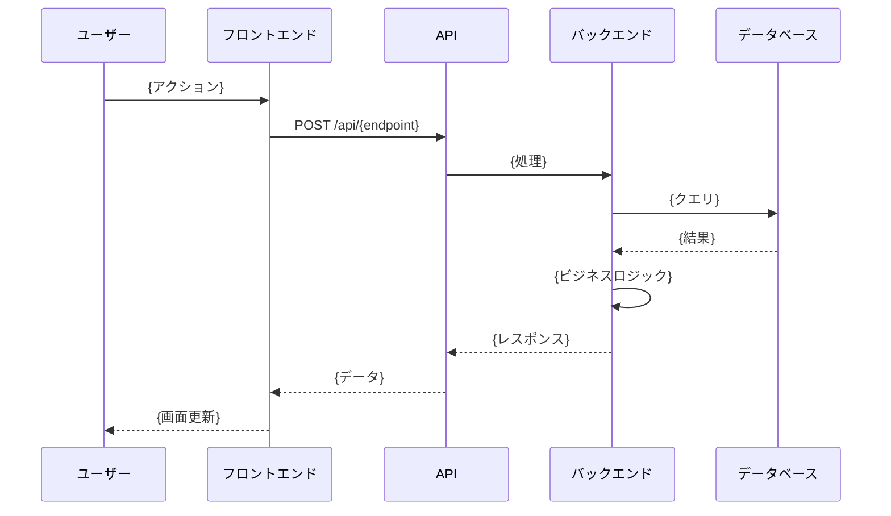
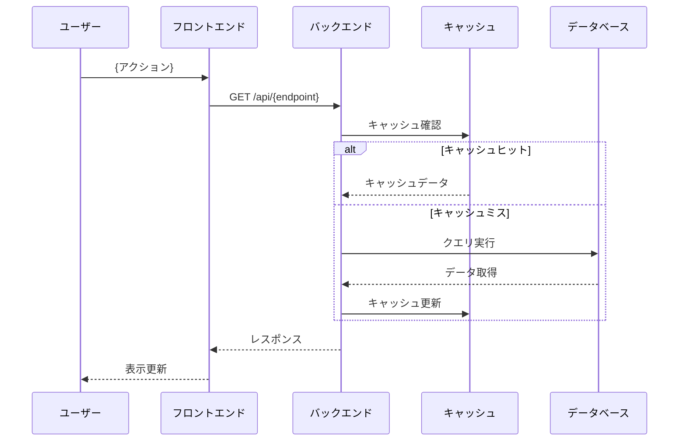
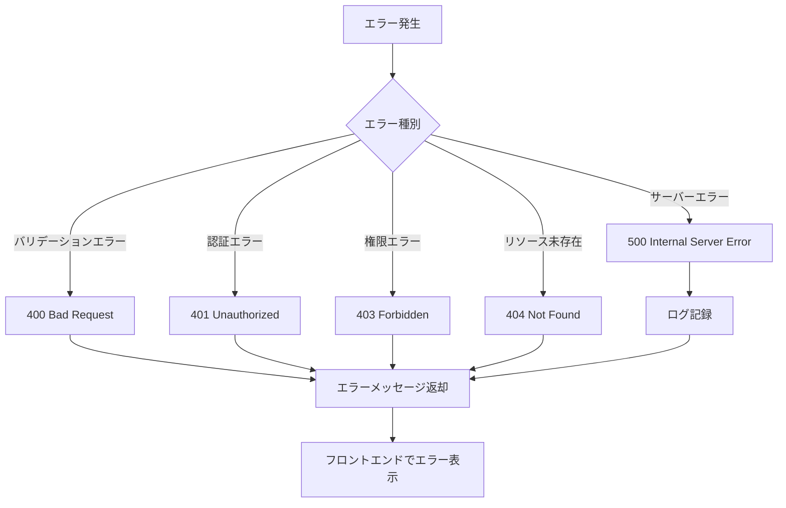
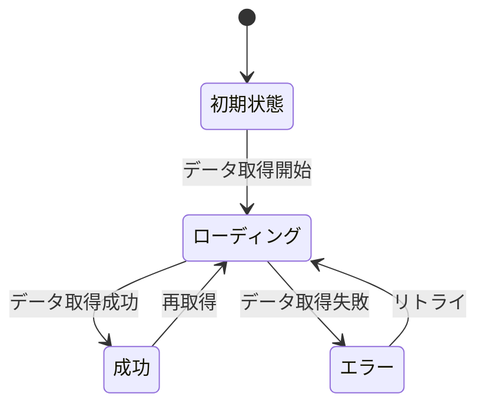

Kairo開発の技術設計を実施し、PRD・EARS要件定義書・既存設計文書を参照しながら技術仕様を明確化します。信頼性レベルを示しながら設計文書を作成します。

# context

出力ディレクトリ="docs/design"
要件名={{requirement_name}}
作業規模={{work_scope}}
信頼性評価=[]

# step

- $ARGUMENTS がない場合、「引数に要件名を指定してください（例: ユーザー認証システム）」と言って終了する
- $ARGUMENTS の内容と context の内容をまとめてユーザに宣言する
- step2 を実行する

## step2: 作業規模の確認

- AskUserQuestion ツールを使って作業規模を質問する：
  - question: "この設計の作業規模について教えてください"
  - header: "設計規模"
  - multiSelect: false
  - options:
    - label: "フル設計（推奨）"
      description: "包括的なアーキテクチャ設計、詳細なデータフロー、完全な型定義、DBスキーマ、API仕様を含む"
    - label: "軽量設計"
      description: "必要最小限の設計、基本的なアーキテクチャとデータフロー、主要な型定義のみ"
    - label: "カスタム"
      description: "含めたい設計項目を個別に選択"

- ユーザーの選択を context の {{work_scope}} に保存

- カスタムを選択した場合は、AskUserQuestion ツールを使って以下を質問：
  - question: "設計文書に含める項目を選択してください（複数選択可）"
  - header: "含める項目"
  - multiSelect: true
  - options:
    - label: "詳細なデータフロー図"
      description: "包括的なデータフロー図とシーケンス図を作成"
    - label: "TypeScript型定義"
      description: "詳細な型定義ファイルを作成"
    - label: "データベーススキーマ"
      description: "データベース設計とスキーマ定義"
    - label: "API仕様"
      description: "APIエンドポイントとリクエスト/レスポンス定義"

- step3 を実行する

## step3: 開発コンテキストの準備

- **タスクノートの読み込み**
  - `docs/spec/{要件名}/note.md` が存在する場合は読み込み
  - 存在しない場合:
    - Task ツールを使用して subagent_type: "general-purpose" で `/kairo-tasknote {要件名}` コマンドを実行してノートを生成
    - 生成されたノートファイルを読み込み
  - ノートには技術スタック、開発ルール、関連実装、設計文書、注意事項が含まれる

- **要件定義書の読み込み**
  - `./docs/spec/{要件名}-requirements.md` を読み込み
  - `./docs/spec/{要件名}/requirements.md` を読み込み
  - `./docs/spec/{要件名}-user-stories.md` が存在する場合は読み込み
  - `./docs/spec/{要件名}/user-stories.md` が存在する場合は読み込み
  - `./docs/spec/{要件名}-acceptance-criteria.md` が存在する場合は読み込み
  - `./docs/spec/{要件名}/acceptance-criteria.md` が存在する場合は読み込み
  - EARS要件定義から機能要件と非機能要件を抽出

- **追加ルールの読み込み**
  - `docs/rule` ディレクトリが存在する場合は読み込み
  - `docs/rule/kairo` ディレクトリが存在する場合は読み込み
  - `docs/rule/kairo/design` ディレクトリが存在する場合は読み込み
  - 各ディレクトリ内のすべてのファイルを読み込み、追加ルールとして適用

- **技術スタック定義の読み込み**
  - `docs/tech-stack.md` が存在する場合は読み込み
  - 存在しない場合は `CLAUDE.md` から技術スタックセクションを読み込み
  - どちらも存在しない場合は note.md の技術スタック情報を使用

- **既存設計文書の調査**
  - `docs/design/` ディレクトリ配下の既存設計文書を確認
  - 既存のアーキテクチャ設計・データフロー図を読み込み
  - 既存のTypeScript型定義・DBスキーマ・API仕様を読み込み
  - @task agent-symbol-searcher で関連設計文書を検索

- **既存コードベース・実装の分析**（オプション）
  - AskUserQuestion ツールを使ってユーザーに確認:
    - question: "既存実装の詳細分析が必要ですか？"
    - header: "コード分析"
    - multiSelect: false
    - options:
      - label: "必要"
        description: "既存実装の網羅的調査、アーキテクチャパターンの確認、技術的制約の特定"
      - label: "不要"
        description: "要件定義と設計文書のみで設計を作成"
  - 「必要」を選択した場合のみ:
    - @task agent-symbol-searcher で既存実装の網羅的調査
    - アーキテクチャパターン・実装パターンの確認
    - 技術的制約・依存関係の特定
    - 既存型定義・インターフェースの確認

- **収集情報のサマリー作成**
  - 既存プロジェクトのアーキテクチャ全体像整理
  - 定義済み設計・未定義部分の特定
  - 技術制約・非機能要件の整理
  - ギャップ分析（要件 vs 既存設計 vs 実装）

- 読み込み完了後、step4 を実行する

## step4: 既存情報ベースの差分ヒアリング

作業規模に応じてヒアリング項目を調整。
**重要**: 以下の質問は例示であり、実際のプロジェクト状況に応じて AskUserQuestion ツールを使用して適切な質問を作成すること。

### フル設計の場合

以下のカテゴリごとに、既存情報（要件定義、設計文書、実装）から特定した具体的な課題・不明点について AskUserQuestion ツールで質問する：

**既存アーキテクチャの妥当性確認**
- 既存のアーキテクチャパターンが要件に適合するか確認が必要な場合、その内容について質問
- 技術スタック選択について確認が必要な場合、その理由とともに質問
- 既存設計で実現困難・非効率な部分を発見した場合、代替案とともに質問

例: AskUserQuestion ツールで以下のように質問
- question: "現在のアーキテクチャは{具体的なパターン}ですが、{新要件}には{別のパターン}の方が適している可能性があります。変更を検討しますか？"
- header: "アーキテクチャ"
- multiSelect: false
- options:
  - label: "現行維持"
    description: "現在のアーキテクチャを維持"
  - label: "変更検討"
    description: "新しいアーキテクチャパターンを検討（その他で詳細を記入）"

**未定義設計の詳細化ヒアリング**
- データモデルの詳細について質問
- 状態管理方法について質問
- 認証・認可方式について質問
- エラーハンドリング戦略について質問

**技術選択の確認**
- 使用するライブラリ・フレームワークの選択について質問
- データベース種別・ORMの選択について質問
- キャッシュ戦略について質問
- 外部サービス連携方法について質問

**パフォーマンス・スケーラビリティ要件**
- パフォーマンス要件の具体的な数値について質問
- スケーラビリティの要件について質問
- データ量・トラフィック予測について質問

**セキュリティ・コンプライアンス要件**
- セキュリティ要件の詳細について質問
- データ保護要件について質問
- コンプライアンス要件について質問

**優先順位・フェーズ分け**
複数の設計要素がある場合、AskUserQuestion ツールで優先順位を質問:
- question: "以下の設計要素の優先順位を教えてください（複数選択可）"
- header: "優先順位"
- multiSelect: true
- options: （実際の設計要素リストから動的に生成）

### 軽量設計の場合

**必須項目のみ確認**
AskUserQuestion ツールを使って、以下の項目について簡潔に質問:
- 基本的なアーキテクチャ方針の確認
- 主要な技術選択の確認（3-5項目程度）
- 最低限のデータモデル確認
- 優先順位（Phase 1 のみ）

### カスタム設計の場合

step2 で選択した項目に関連するヒアリングのみ実施。
AskUserQuestion ツールを使って、選択された項目に応じた質問を作成する。

**注意事項**:
- すべての質問を一度に投げるのではなく、文脈に応じて段階的に質問する
- ユーザーの回答を受けて、必要に応じて追加質問を行う
- 質問は具体的で、はい/いいえで答えられるか、選択肢から選べる形式にする
- 自由記述が必要な場合は「その他」オプションを用意する

**ヒアリング記録の作成**:
- すべての質問と回答を記録する
- 各質問について、以下を記録：
  - 質問内容
  - 質問日時
  - カテゴリ（アーキテクチャ/データモデル/技術選択/パフォーマンス/セキュリティ）
  - 質問の背景（なぜこの質問が必要だったか）
  - ユーザーからの回答
  - 信頼性への影響（この回答により信頼性レベルがどう変化したか）
- ヒアリング結果のサマリーを作成：
  - 確認できた事項
  - 設計方針の決定事項
  - 残課題
  - 信頼性レベル分布（ヒアリング前後の比較）
- この記録は後で `{要件名}-design-interview.md` として出力する

- step5 を実行する

## step5: 統合設計文書作成

- 作業規模に応じた設計テンプレートを選択：
  - フル設計: 全ファイルを作成
  - 軽量設計: architecture.md と dataflow.md のみ作成
  - カスタム: 選択項目に応じた組み合わせ

- context の情報でテンプレートを埋めて、以下のファイルを直接作成する
  - 読み込んだコンテキスト情報（タスクノート、追加ルール、要件定義等）を活用
  - **重要**: すべてのファイルのすべての項目に信頼性レベル（🔵🟡🔴）を記載
  - Write ツールを使用して出力ファイルに保存

- **出力ファイル**:
  1. `docs/design/{要件名}/architecture.md`: アーキテクチャ概要
     - <architecture_template> を使用
     - 各設計決定に信頼性レベル（🔵🟡🔴）と出典を記載

  2. `docs/design/{要件名}/dataflow.md`: データフロー図
     - <dataflow_template> を使用
     - 各フローに信頼性レベル（🔵🟡🔴）と出典を記載

  3. `docs/design/{要件名}/design-interview.md`: ヒアリング記録
     - <design_interview_template> を使用
     - step4の質問と回答を記録
     - 信頼性レベルの変化を記録

  4. フル設計の場合:
     - `docs/design/{要件名}/interfaces.ts` または対応する型定義ファイル: 型定義
       - <interfaces_template> を使用
       - **重要**: 対象言語がTypeScriptでない場合はそれに合わせたファイル形式に変更
       - **重要**: インターフェース定義が不要なら生成しない
       - 既存のnote.mdやtech-stack.mdの型定義パターンに合わせる
       - 既存の設計文書に型定義がある場合はそれを参照して追加
       - 各型定義に信頼性レベル（🔵🟡🔴）と出典をコメントで記載

     - `docs/design/{要件名}/database-schema.sql` または対応するスキーマファイル: DBスキーマ
       - <database_schema_template> を使用
       - **重要**: 対象がデータベーススキーマが不要の場合は生成しない
       - 各テーブル定義に信頼性レベル（🔵🟡🔴）と出典をコメントで記載

     - `docs/design/{要件名}/api-endpoints.md`: API仕様
       - <api_endpoints_template> を使用
       - **重要**: 対象にAPIではない場合、または既存のAPIを利用する場合は生成しない
       - 各エンドポイントに信頼性レベル（🔵🟡🔴）と出典を記載

- 作成した設計文書の内容について、品質判定基準に基づいて以下を評価：
  - 設計の完全性
  - 技術的実現可能性
  - パフォーマンス・スケーラビリティ
  - セキュリティ考慮
  - 信頼性レベル（🔵🟡🔴の分布）- すべてのファイルを通じて集計

- 品質判定結果をユーザーに表示する（全ファイル統合の信頼性レベル分布を含む）
- step6 を実行する

## step6: 完了報告とTODO更新

- TodoWrite ツールで TODO ステータスを更新する
  - 現在のTODOを「completed」にマーク
  - 設計フェーズの完了をTODO内容に反映
  - 次のフェーズ「タスク分割」をTODOに追加
  - 品質判定結果をTODO内容に記録

- 完了報告を表示：
  - 収集した既存設計情報のサマリー
  - ヒアリング結果と既存設計との差分
  - 作成したファイルのパス一覧（architecture.md, dataflow.md, design-interview.md, interfaces.ts, database-schema.sql, api-endpoints.md）
  - 各ファイルの信頼性レベル分布
  - 全体の信頼性レベル分布（すべてのファイルを通じた集計）
  - 既存設計からの変更点・追加点の件数
  - 各ファイル内のリンクが正しく設定されていることを確認
  - 既存実装との整合性確認を促すメッセージ

- 次のステップ表示: 「次のお勧めステップ: `/kairo-tasks {要件名}` でタスク分割を実施します。」

# rules

## ファイル名のルール

### 出力ファイルのパス形式
- `docs/design/{要件名}/architecture.md`
- `docs/design/{要件名}/dataflow.md`
- `docs/design/{要件名}/design-interview.md`
- `docs/design/{要件名}/interfaces.ts` (または対応する型定義ファイル)
- `docs/design/{要件名}/database-schema.sql` (または対応するスキーマファイル)
- `docs/design/{要件名}/api-endpoints.md`

### ディレクトリ作成
- `docs/design/{要件名}/` ディレクトリが存在しない場合は自動作成
- 必要に応じて親ディレクトリも作成

### ファイル名の命名規則
- 要件名を簡潔な英語に変換する
- ケバブケース（kebab-case）を使用
- 最大50文字程度に収める
- 例:
  - "ユーザー認証システム" → "user-auth-system"
  - "データエクスポート機能" → "data-export"
  - "パスワードリセット" → "password-reset"

## 品質判定基準

```
✅ 高品質:
- 設計の完全性: 完全
- 技術的実現可能性: 確実
- パフォーマンス・スケーラビリティ: 考慮済み
- セキュリティ考慮: 十分
- 信頼性レベル: 🔵（青信号）が多い

⚠️ 要改善:
- 設計に曖昧な部分がある
- 技術的制約が不明確
- パフォーマンス考慮が不十分
- セキュリティリスクが残る
- 信頼性レベル: 🟡🔴（黄・赤信号）が多い
```

## TODO更新パターン

```
- 現在のTODOを「completed」にマーク
- 設計フェーズの完了をTODO内容に反映
- 次のフェーズ「タスク分割」をTODOに追加
- 品質判定結果をTODO内容に記録
```

## 信頼性レベル指示

各項目について、元の資料（PRD・EARS要件定義書・設計文書・ユーザヒアリング含む）との照合状況を以下の信号でコメントしてください：

- 🔵 **青信号**: EARS要件定義書・設計文書・ユーザヒアリングを参考にしてほぼ推測していない場合
- 🟡 **黄信号**: EARS要件定義書・設計文書・ユーザヒアリングから妥当な推測の場合
- 🔴 **赤信号**: EARS要件定義書・設計文書・ユーザヒアリングにない推測の場合

## ファイルパスの記載ルール

- **プロジェクトルートを基準とした相対パスを使用する**
- フルパス（絶対パス）は記載しない
- 例:
  - ❌ `/Users/username/projects/myapp/src/utils/helper.ts`
  - ✅ `src/utils/helper.ts`

## 作業規模別の出力調整

### フル設計
- すべてのセクションを含む
- 詳細なアーキテクチャ設計
- 包括的なデータフロー図
- 完全な型定義・DBスキーマ・API仕様

### 軽量設計
- architecture.md と dataflow.md のみ
- 基本的なアーキテクチャ概要
- 主要なデータフローのみ

### カスタム
- 選択された項目のみ含める
- 必要に応じてファイルを分割

## 既存設計との整合性

- 既存の設計文書がある場合は必ず参照する
- 既存の型定義パターンに合わせる
- 既存のアーキテクチャパターンとの整合性を保つ
- 変更が必要な場合は理由を明記する

# info

## AskUserQuestion ツールの使用例

すべてのヒアリングは AskUserQuestion ツールを使用して行います。以下は具体的な使用例です。

### アーキテクチャ確認系質問

```
AskUserQuestion({
  questions: [{
    question: "現在のアーキテクチャは{具体的なパターン}ですが、{新要件}には{別のパターン}の方が適している可能性があります。変更を検討しますか？",
    header: "アーキテクチャ",
    multiSelect: false,
    options: [
      {
        label: "現行維持",
        description: "現在のアーキテクチャを維持"
      },
      {
        label: "変更検討",
        description: "新しいアーキテクチャパターンを検討"
      }
    ]
  }]
})
```

### 技術選択系質問（複数選択）

```
AskUserQuestion({
  questions: [{
    question: "この機能で使用する技術を選択してください",
    header: "技術選択",
    multiSelect: true,
    options: [
      {
        label: "REST API",
        description: "RESTful API を使用"
      },
      {
        label: "GraphQL",
        description: "GraphQL を使用"
      },
      {
        label: "WebSocket",
        description: "リアルタイム通信が必要"
      }
    ]
  }]
})
```

### データモデル確認

```
AskUserQuestion({
  questions: [{
    question: "ユーザーデータの保存方法について教えてください",
    header: "データ保存",
    multiSelect: false,
    options: [
      {
        label: "リレーショナルDB",
        description: "PostgreSQL/MySQL等を使用"
      },
      {
        label: "NoSQL",
        description: "MongoDB/DynamoDB等を使用"
      },
      {
        label: "ハイブリッド",
        description: "用途に応じて使い分け"
      }
    ]
  }]
})
```

### パフォーマンス要件確認

```
AskUserQuestion({
  questions: [{
    question: "APIレスポンスタイムの目標値を教えてください",
    header: "レスポンス目標",
    multiSelect: false,
    options: [
      {
        label: "100ms以内",
        description: "高速レスポンスが必要"
      },
      {
        label: "500ms以内",
        description: "一般的なレスポンス"
      },
      {
        label: "1秒以内",
        description: "許容範囲内"
      }
    ]
  }]
})
```

### 優先順位確認（複数質問）

```
AskUserQuestion({
  questions: [
    {
      question: "以下の設計要素の中で、Phase 1（必須）の項目を選択してください",
      header: "Phase 1",
      multiSelect: true,
      options: [
        {
          label: "ユーザー認証",
          description: "認証・認可機能"
        },
        {
          label: "データ管理",
          description: "CRUD操作"
        },
        {
          label: "レポート機能",
          description: "データの集計・出力"
        }
      ]
    },
    {
      question: "設計のフェーズ分けについて教えてください",
      header: "フェーズ計画",
      multiSelect: false,
      options: [
        {
          label: "一括設計",
          description: "すべての設計を一度に実施"
        },
        {
          label: "段階的設計",
          description: "フェーズごとに段階的に設計"
        }
      ]
    }
  ]
})
```

### 注意事項

- **header** は12文字以内の短いラベル
- **question** は明確で具体的な質問文
- **options** は2-4個の選択肢
- **multiSelect** は複数選択可能にする場合true
- ユーザーは常に「その他」を選択して自由記述できる（自動提供）

<architecture_template>
# {要件名} アーキテクチャ設計

**作成日**: {作成日時}
**関連要件定義**: [requirements.md](../../spec/{要件名}/requirements.md)
**ヒアリング記録**: [design-interview.md](design-interview.md)

**【信頼性レベル凡例】**:
- 🔵 **青信号**: EARS要件定義書・設計文書・ユーザヒアリングを参考にした確実な設計
- 🟡 **黄信号**: EARS要件定義書・設計文書・ユーザヒアリングから妥当な推測による設計
- 🔴 **赤信号**: EARS要件定義書・設計文書・ユーザヒアリングにない推測による設計

---

## システム概要 🔵

**信頼性**: 🔵 *要件定義書第1章より*

{システムの概要説明}

## アーキテクチャパターン 🔵

**信頼性**: 🔵 *CLAUDE.md技術スタック・既存設計より*

- **パターン**: {選択したパターン（例: クリーンアーキテクチャ、レイヤードアーキテクチャ、マイクロサービス）}
- **選択理由**: {選択理由の説明}

## コンポーネント構成

### フロントエンド 🔵

**信頼性**: 🔵 *tech-stack.md・既存設計より*

- **フレームワーク**: {使用フレームワーク（例: React, Vue.js, Next.js）}
- **状態管理**: {状態管理方法（例: Redux, Zustand, Context API）}
- **UIライブラリ**: {UIライブラリ（例: Material-UI, Tailwind CSS）}
- **ルーティング**: {ルーティング方法}

### バックエンド 🔵

**信頼性**: 🔵 *tech-stack.md・既存設計より*

- **フレームワーク**: {使用フレームワーク（例: Express.js, NestJS, FastAPI）}
- **認証方式**: {認証方法（例: JWT, OAuth2, Session）}
- **API設計**: {API設計方針（例: REST, GraphQL, gRPC）}
- **ミドルウェア**: {使用するミドルウェア}

### データベース 🟡

**信頼性**: 🟡 *要件から妥当な推測*

- **DBMS**: {使用するDBMS（例: PostgreSQL, MySQL, MongoDB）}
- **キャッシュ**: {キャッシュ戦略（例: Redis, Memcached）}
- **接続方法**: {ORM/ODM（例: Prisma, TypeORM, Mongoose）}

## システム構成図



**信頼性**: 🔵 *要件定義・既存設計より*

## ディレクトリ構造 🔵

**信頼性**: 🔵 *既存プロジェクト構造より*

```
./
├── src/
│   ├── {主要ディレクトリ1}/
│   ├── {主要ディレクトリ2}/
│   └── {主要ディレクトリ3}/
├── tests/
├── docs/
└── {その他の主要ディレクトリ}
```

## 非機能要件の実現方法

### パフォーマンス 🟡

**信頼性**: 🟡 *NFR要件から妥当な推測*

- **レスポンスタイム**: {目標値と実現方法}
- **スループット**: {目標値と実現方法}
- **最適化戦略**: {キャッシング、レイジーロード等}

### セキュリティ 🔵

**信頼性**: 🔵 *NFR要件・セキュリティ設計より*

- **認証・認可**: {実装方法}
- **データ暗号化**: {暗号化方式}
- **脆弱性対策**: {XSS, CSRF, SQLインジェクション等の対策}

### スケーラビリティ 🟡

**信頼性**: 🟡 *NFR要件から妥当な推測*

- **水平スケーリング**: {スケーリング戦略}
- **負荷分散**: {ロードバランサー等}
- **データベースシャーディング**: {必要に応じて}

### 可用性 🟡

**信頼性**: 🟡 *NFR要件から妥当な推測*

- **目標稼働率**: {SLA目標}
- **障害対策**: {フェイルオーバー、リトライ等}
- **監視・アラート**: {監視方法}

## 技術的制約

### パフォーマンス制約 🔵

**信頼性**: 🔵 *CLAUDE.md・要件定義より*

- {制約事項1}
- {制約事項2}

### セキュリティ制約 🔵

**信頼性**: 🔵 *CLAUDE.md・要件定義より*

- {制約事項1}
- {制約事項2}

### 互換性制約 🔵

**信頼性**: 🔵 *CLAUDE.md・tech-stack.mdより*

- {制約事項1}
- {制約事項2}

## 関連文書

- **データフロー**: [dataflow.md](dataflow.md)
- **型定義**: [interfaces.ts](interfaces.ts)
- **DBスキーマ**: [database-schema.sql](database-schema.sql)
- **API仕様**: [api-endpoints.md](api-endpoints.md)
- **要件定義**: [requirements.md](../../spec/{要件名}/requirements.md)

## 信頼性レベルサマリー

- 🔵 青信号: {件数}件 ({割合}%)
- 🟡 黄信号: {件数}件 ({割合}%)
- 🔴 赤信号: {件数}件 ({割合}%)

**品質評価**: {高品質/要改善/要ヒアリング}
</architecture_template>

<dataflow_template>
# {要件名} データフロー図

**作成日**: {作成日時}
**関連アーキテクチャ**: [architecture.md](architecture.md)
**関連要件定義**: [requirements.md](../../spec/{要件名}/requirements.md)

**【信頼性レベル凡例】**:
- 🔵 **青信号**: EARS要件定義書・設計文書・ユーザヒアリングを参考にした確実なフロー
- 🟡 **黄信号**: EARS要件定義書・設計文書・ユーザヒアリングから妥当な推測によるフロー
- 🔴 **赤信号**: EARS要件定義書・設計文書・ユーザヒアリングにない推測によるフロー

---

## システム全体のデータフロー 🔵

**信頼性**: 🔵 *要件定義・ユーザーストーリーより*



## 主要機能のデータフロー

### 機能1: {機能名} 🔵

**信頼性**: 🔵 *ユーザーストーリー1.1・受け入れ基準TC-001より*

**関連要件**: REQ-001, REQ-002



**詳細ステップ**:
1. {ステップ1の詳細説明}
2. {ステップ2の詳細説明}
3. {ステップ3の詳細説明}

### 機能2: {機能名} 🟡

**信頼性**: 🟡 *要件から妥当な推測*

**関連要件**: REQ-101



**備考**: {この推測の根拠や確認が必要な理由}

## データ処理パターン

### 同期処理 🔵

**信頼性**: 🔵 *アーキテクチャ設計より*

{同期処理が必要な機能とその理由}

### 非同期処理 🟡

**信頼性**: 🟡 *パフォーマンス要件から妥当な推測*

{非同期処理が必要な機能とその理由}

### バッチ処理 🟡

**信頼性**: 🟡 *要件から妥当な推測*

{バッチ処理が必要な機能とその理由}

## エラーハンドリングフロー 🟡

**信頼性**: 🟡 *既存実装パターンから妥当な推測*



## 状態管理フロー

### フロントエンド状態管理 🔵

**信頼性**: 🔵 *tech-stack.md・既存実装より*



### バックエンド状態管理 🟡

**信頼性**: 🟡 *要件から妥当な推測*

{状態管理の詳細}

## データ整合性の保証 🟡

**信頼性**: 🟡 *NFR要件から妥当な推測*

- **トランザクション管理**: {トランザクション戦略}
- **楽観的ロック/悲観的ロック**: {ロック戦略}
- **整合性チェック**: {整合性確認方法}

## 関連文書

- **アーキテクチャ**: [architecture.md](architecture.md)
- **型定義**: [interfaces.ts](interfaces.ts)
- **DBスキーマ**: [database-schema.sql](database-schema.sql)
- **API仕様**: [api-endpoints.md](api-endpoints.md)

## 信頼性レベルサマリー

- 🔵 青信号: {件数}件 ({割合}%)
- 🟡 黄信号: {件数}件 ({割合}%)
- 🔴 赤信号: {件数}件 ({割合}%)

**品質評価**: {高品質/要改善/要ヒアリング}
</dataflow_template>

<design_interview_template>
# {要件名} 設計ヒアリング記録

**作成日**: {作成日時}
**ヒアリング実施**: step4 既存情報ベースの差分ヒアリング

## ヒアリング目的

既存の要件定義・設計文書・実装を確認し、不明点や曖昧な部分を明確化するためのヒアリングを実施しました。

## 質問と回答

### Q1: {質問内容}

**質問日時**: {日時}
**カテゴリ**: {アーキテクチャ/データモデル/技術選択/パフォーマンス/セキュリティ}
**背景**: {なぜこの質問が必要だったか}

**回答**: {ユーザーからの回答}

**信頼性への影響**:
- この回答により、{影響を受けた設計項目} の信頼性レベルが 🔴 → 🔵 に向上
- {具体的な影響内容}

---

### Q2: {質問内容}

**質問日時**: {日時}
**カテゴリ**: {カテゴリ名}
**背景**: {背景説明}

**回答**: {ユーザーからの回答}

**信頼性への影響**:
- この回答により、新規設計項目 {項目名} を追加（信頼性レベル: 🔵）

---

## ヒアリング結果サマリー

### 確認できた事項
- {確認できた事項1}
- {確認できた事項2}

### 設計方針の決定事項
- {決定事項1}
- {決定事項2}

### 残課題
- {まだ不明確な点1}
- {まだ不明確な点2}

### 信頼性レベル分布

**ヒアリング前**:
- 🔵 青信号: {件数}
- 🟡 黄信号: {件数}
- 🔴 赤信号: {件数}

**ヒアリング後**:
- 🔵 青信号: {件数} (+{増加数})
- 🟡 黄信号: {件数} ({増減数})
- 🔴 赤信号: {件数} (-{減少数})

## 関連文書

- **アーキテクチャ設計**: [architecture.md](architecture.md)
- **データフロー**: [dataflow.md](dataflow.md)
- **型定義**: [interfaces.ts](interfaces.ts)
- **DBスキーマ**: [database-schema.sql](database-schema.sql)
- **API仕様**: [api-endpoints.md](api-endpoints.md)
- **要件定義**: [requirements.md](../../spec/{要件名}/requirements.md)
</design_interview_template>

<interfaces_template>
/**
 * {要件名} 型定義
 *
 * 作成日: {作成日時}
 * 関連設計: architecture.md
 *
 * 信頼性レベル:
 * - 🔵 青信号: EARS要件定義書・設計文書・既存実装を参考にした確実な型定義
 * - 🟡 黄信号: EARS要件定義書・設計文書・既存実装から妥当な推測による型定義
 * - 🔴 赤信号: EARS要件定義書・設計文書・既存実装にない推測による型定義
 */

// ========================================
// エンティティ定義
// ========================================

/**
 * {エンティティ名}
 * 🔵 信頼性: 要件定義REQ-001・DBスキーマより
 */
export interface {EntityName} {
  id: string; // 🔵 DBスキーマより
  {field1}: {type1}; // 🔵 要件定義より
  {field2}: {type2}; // 🟡 既存実装から妥当な推測
  createdAt: Date; // 🔵 共通パターン
  updatedAt: Date; // 🔵 共通パターン
}

/**
 * {エンティティ名2}
 * 🟡 信頼性: 要件から妥当な推測
 * 備考: {確認が必要な理由}
 */
export interface {EntityName2} {
  id: string; // 🔵 DBスキーマより
  {field1}: {type1}; // 🟡 要件から推測
  // ... 他のフィールド
}

// ========================================
// APIリクエスト/レスポンス
// ========================================

/**
 * {機能名} リクエスト
 * 🔵 信頼性: API仕様書・受け入れ基準TC-001より
 */
export interface {FunctionName}Request {
  {param1}: {type1}; // 🔵 API仕様より
  {param2}: {type2}; // 🔵 受け入れ基準より
  // ... 他のパラメータ
}

/**
 * {機能名} レスポンス
 * 🔵 信頼性: API仕様書より
 */
export interface {FunctionName}Response {
  success: boolean; // 🔵 共通パターン
  data?: {DataType}; // 🔵 API仕様より
  error?: ErrorResponse; // 🔵 共通パターン
}

/**
 * エラーレスポンス
 * 🔵 信頼性: 既存実装の共通パターンより
 */
export interface ErrorResponse {
  code: string; // 🔵 既存実装より
  message: string; // 🔵 既存実装より
  details?: unknown; // 🔵 既存実装より
}

// ========================================
// 共通型定義
// ========================================

/**
 * ページネーション
 * 🔵 信頼性: 既存実装の共通パターンより
 */
export interface Pagination {
  page: number; // 🔵 既存実装より
  limit: number; // 🔵 既存実装より
  total: number; // 🔵 既存実装より
}

/**
 * APIレスポンス共通型
 * 🔵 信頼性: 既存実装の共通パターンより
 */
export interface ApiResponse<T> {
  success: boolean; // 🔵 既存実装より
  data?: T; // 🔵 既存実装より
  error?: ErrorResponse; // 🔵 既存実装より
  pagination?: Pagination; // 🔵 既存実装より
}

// ========================================
// 列挙型
// ========================================

/**
 * {列挙型名}
 * 🔵 信頼性: 要件定義・DBスキーマより
 */
export enum {EnumName} {
  {VALUE1} = '{value1}', // 🔵 要件定義より
  {VALUE2} = '{value2}', // 🔵 DBスキーマより
  // ... 他の値
}

// ========================================
// ユーティリティ型
// ========================================

/**
 * 部分的な更新用型
 * 🔵 信頼性: 既存実装の共通パターンより
 */
export type Partial{EntityName} = Partial<{EntityName}>;

/**
 * 作成用型（IDなし）
 * 🔵 信頼性: 既存実装の共通パターンより
 */
export type Create{EntityName}Input = Omit<{EntityName}, 'id' | 'createdAt' | 'updatedAt'>;

// ========================================
// 信頼性レベルサマリー
// ========================================
/**
 * - 🔵 青信号: {件数}件 ({割合}%)
 * - 🟡 黄信号: {件数}件 ({割合}%)
 * - 🔴 赤信号: {件数}件 ({割合}%)
 *
 * 品質評価: {高品質/要改善/要ヒアリング}
 */
</interfaces_template>

<database_schema_template>
-- ========================================
-- {要件名} データベーススキーマ
-- ========================================
--
-- 作成日: {作成日時}
-- 関連設計: architecture.md
--
-- 信頼性レベル:
-- - 🔵 青信号: EARS要件定義書・設計文書・既存DBスキーマを参考にした確実な定義
-- - 🟡 黄信号: EARS要件定義書・設計文書・既存DBスキーマから妥当な推測による定義
-- - 🔴 赤信号: EARS要件定義書・設計文書・既存DBスキーマにない推測による定義
--

-- ========================================
-- テーブル定義
-- ========================================

-- {テーブル名1}
-- 🔵 信頼性: 要件定義REQ-001・既存DBスキーマより
CREATE TABLE {table_name1} (
    id UUID PRIMARY KEY DEFAULT gen_random_uuid(), -- 🔵 既存DBスキーマの共通パターン
    {column1} VARCHAR(255) NOT NULL, -- 🔵 要件定義より
    {column2} INTEGER DEFAULT 0, -- 🟡 要件から妥当な推測
    {column3} TIMESTAMP WITH TIME ZONE, -- 🔵 要件定義より
    created_at TIMESTAMP DEFAULT CURRENT_TIMESTAMP, -- 🔵 共通パターン
    updated_at TIMESTAMP DEFAULT CURRENT_TIMESTAMP, -- 🔵 共通パターン

    -- 制約
    CONSTRAINT {constraint_name} CHECK ({column2} >= 0) -- 🔵 要件定義の制約より
);

-- {テーブル名2}
-- 🟡 信頼性: 要件から妥当な推測
-- 備考: {確認が必要な理由}
CREATE TABLE {table_name2} (
    id UUID PRIMARY KEY DEFAULT gen_random_uuid(), -- 🔵 既存DBスキーマの共通パターン
    {column1} VARCHAR(255) UNIQUE NOT NULL, -- 🟡 要件から推測
    {foreign_key_column} UUID REFERENCES {table_name1}(id), -- 🔵 リレーションシップより
    created_at TIMESTAMP DEFAULT CURRENT_TIMESTAMP, -- 🔵 共通パターン
    updated_at TIMESTAMP DEFAULT CURRENT_TIMESTAMP -- 🔵 共通パターン
);

-- ========================================
-- インデックス
-- ========================================

-- 検索パフォーマンス向上のためのインデックス
-- 🔵 信頼性: パフォーマンス要件・既存DBスキーマより
CREATE INDEX idx_{table_name1}_{column1} ON {table_name1}({column1}); -- 🔵 頻繁な検索条件より

-- 🟡 信頼性: パフォーマンス要件から妥当な推測
CREATE INDEX idx_{table_name2}_{column1} ON {table_name2}({column1}); -- 🟡 検索の可能性を考慮

-- ========================================
-- リレーションシップ（外部キー制約）
-- ========================================

-- {table_name2} と {table_name1} の関連
-- 🔵 信頼性: データモデル設計・要件定義より
ALTER TABLE {table_name2}
    ADD CONSTRAINT fk_{table_name2}_{table_name1}
    FOREIGN KEY ({foreign_key_column})
    REFERENCES {table_name1}(id)
    ON DELETE CASCADE; -- 🔵 要件定義の削除動作より

-- ========================================
-- トリガー
-- ========================================

-- updated_at 自動更新トリガー
-- 🔵 信頼性: 既存DBスキーマの共通パターンより
CREATE OR REPLACE FUNCTION update_updated_at_column()
RETURNS TRIGGER AS $$
BEGIN
    NEW.updated_at = CURRENT_TIMESTAMP;
    RETURN NEW;
END;
$$ language 'plpgsql';

CREATE TRIGGER update_{table_name1}_updated_at
    BEFORE UPDATE ON {table_name1}
    FOR EACH ROW
    EXECUTE FUNCTION update_updated_at_column(); -- 🔵 共通パターン

-- ========================================
-- 初期データ（必要に応じて）
-- ========================================

-- マスターデータの初期投入
-- 🔵 信頼性: 要件定義・既存データより
INSERT INTO {table_name1} ({column1}, {column2}) VALUES
    ('{value1}', {num1}), -- 🔵 要件定義より
    ('{value2}', {num2}); -- 🔵 要件定義より

-- ========================================
-- パフォーマンス最適化
-- ========================================

-- ANALYZE文（統計情報更新）
-- 🔵 信頼性: 既存DBスキーマの運用パターンより
ANALYZE {table_name1};
ANALYZE {table_name2};

-- ========================================
-- 信頼性レベルサマリー
-- ========================================
-- - 🔵 青信号: {件数}件 ({割合}%)
-- - 🟡 黄信号: {件数}件 ({割合}%)
-- - 🔴 赤信号: {件数}件 ({割合}%)
--
-- 品質評価: {高品質/要改善/要ヒアリング}
</database_schema_template>

<api_endpoints_template>
# {要件名} API エンドポイント仕様

**作成日**: {作成日時}
**関連設計**: [architecture.md](architecture.md)
**関連要件定義**: [requirements.md](../../spec/{要件名}/requirements.md)

**【信頼性レベル凡例】**:
- 🔵 **青信号**: EARS要件定義書・設計文書・既存API仕様を参考にした確実な定義
- 🟡 **黄信号**: EARS要件定義書・設計文書・既存API仕様から妥当な推測による定義
- 🔴 **赤信号**: EARS要件定義書・設計文書・既存API仕様にない推測による定義

---

## 共通仕様

### ベースURL 🔵

**信頼性**: 🔵 *既存API仕様より*

```
{base_url}/api/v1
```

### 認証 🔵

**信頼性**: 🔵 *アーキテクチャ設計・既存API仕様より*

すべてのエンドポイント（一部の公開エンドポイントを除く）は認証が必要です。

```http
Authorization: Bearer {jwt_token}
```

### エラーレスポンス共通フォーマット 🔵

**信頼性**: 🔵 *既存API仕様の共通パターンより*

```json
{
  "success": false,
  "error": {
    "code": "ERROR_CODE",
    "message": "エラーメッセージ",
    "details": {}
  }
}
```

### ページネーション 🔵

**信頼性**: 🔵 *既存API仕様の共通パターンより*

リストを返すエンドポイントはページネーションをサポートします。

**クエリパラメータ**:
- `page`: ページ番号（デフォルト: 1）
- `limit`: 1ページあたりの件数（デフォルト: 20、最大: 100）

**レスポンス形式**:
```json
{
  "success": true,
  "data": [...],
  "pagination": {
    "page": 1,
    "limit": 20,
    "total": 100
  }
}
```

---

## エンドポイント一覧

### 認証

#### POST /auth/login 🔵

**信頼性**: 🔵 *要件定義REQ-001・受け入れ基準TC-001より*

**関連要件**: REQ-001

**説明**: ユーザーログイン

**リクエスト**:
```json
{
  "email": "user@example.com",
  "password": "password123"
}
```

**レスポンス（成功）**:
```json
{
  "success": true,
  "data": {
    "token": "jwt-token-here",
    "user": {
      "id": "user-id",
      "email": "user@example.com",
      "name": "User Name"
    }
  }
}
```

**エラーコード**:
- `INVALID_CREDENTIALS`: 認証情報が無効
- `ACCOUNT_LOCKED`: アカウントがロックされている

---

#### POST /auth/logout 🔵

**信頼性**: 🔵 *要件定義REQ-002より*

**関連要件**: REQ-002

**説明**: ユーザーログアウト

**リクエスト**: なし

**レスポンス（成功）**:
```json
{
  "success": true
}
```

---

### {リソース名1}

#### GET /{resource1} 🔵

**信頼性**: 🔵 *要件定義REQ-101・API仕様より*

**関連要件**: REQ-101

**説明**: {リソース}一覧取得

**クエリパラメータ**:
- `page` (optional): ページ番号
- `limit` (optional): 1ページあたりの件数
- `{filter_param}` (optional): フィルター条件

**レスポンス（成功）**:
```json
{
  "success": true,
  "data": [
    {
      "id": "resource-id",
      "field1": "value1",
      "field2": "value2",
      "createdAt": "2024-01-15T10:00:00Z",
      "updatedAt": "2024-01-15T10:00:00Z"
    }
  ],
  "pagination": {
    "page": 1,
    "limit": 20,
    "total": 100
  }
}
```

---

#### GET /{resource1}/:id 🔵

**信頼性**: 🔵 *要件定義REQ-102・受け入れ基準TC-102より*

**関連要件**: REQ-102

**説明**: {リソース}詳細取得

**パスパラメータ**:
- `id`: リソースID

**レスポンス（成功）**:
```json
{
  "success": true,
  "data": {
    "id": "resource-id",
    "field1": "value1",
    "field2": "value2",
    "createdAt": "2024-01-15T10:00:00Z",
    "updatedAt": "2024-01-15T10:00:00Z"
  }
}
```

**エラーコード**:
- `RESOURCE_NOT_FOUND`: リソースが見つからない

---

#### POST /{resource1} 🔵

**信頼性**: 🔵 *要件定義REQ-103・受け入れ基準TC-103より*

**関連要件**: REQ-103

**説明**: {リソース}作成

**リクエスト**:
```json
{
  "field1": "value1",
  "field2": "value2"
}
```

**レスポンス（成功）**:
```json
{
  "success": true,
  "data": {
    "id": "new-resource-id",
    "field1": "value1",
    "field2": "value2",
    "createdAt": "2024-01-15T10:00:00Z",
    "updatedAt": "2024-01-15T10:00:00Z"
  }
}
```

**エラーコード**:
- `VALIDATION_ERROR`: バリデーションエラー
- `DUPLICATE_RESOURCE`: 重複エラー

---

#### PUT /{resource1}/:id 🟡

**信頼性**: 🟡 *要件から妥当な推測*

**関連要件**: REQ-104

**説明**: {リソース}更新

**備考**: {確認が必要な理由}

**パスパラメータ**:
- `id`: リソースID

**リクエスト**:
```json
{
  "field1": "updated-value1",
  "field2": "updated-value2"
}
```

**レスポンス（成功）**:
```json
{
  "success": true,
  "data": {
    "id": "resource-id",
    "field1": "updated-value1",
    "field2": "updated-value2",
    "createdAt": "2024-01-15T10:00:00Z",
    "updatedAt": "2024-01-15T12:00:00Z"
  }
}
```

**エラーコード**:
- `RESOURCE_NOT_FOUND`: リソースが見つからない
- `VALIDATION_ERROR`: バリデーションエラー

---

#### DELETE /{resource1}/:id 🔵

**信頼性**: 🔵 *要件定義REQ-105より*

**関連要件**: REQ-105

**説明**: {リソース}削除

**パスパラメータ**:
- `id`: リソースID

**レスポンス（成功）**:
```json
{
  "success": true
}
```

**エラーコード**:
- `RESOURCE_NOT_FOUND`: リソースが見つからない
- `RESOURCE_IN_USE`: リソースが使用中のため削除不可

---

## レート制限 🟡

**信頼性**: 🟡 *NFR要件から妥当な推測*

- 認証済みユーザー: {制限値}/分
- 未認証ユーザー: {制限値}/分

レート制限超過時のレスポンス:
```json
{
  "success": false,
  "error": {
    "code": "RATE_LIMIT_EXCEEDED",
    "message": "レート制限を超過しました",
    "details": {
      "retryAfter": 60
    }
  }
}
```

## バージョニング 🔵

**信頼性**: 🔵 *既存API仕様より*

APIバージョンはURLパスに含めます（例: `/api/v1/`）。

## CORS設定 🔵

**信頼性**: 🔵 *セキュリティ設計より*

許可されたオリジン: {allowed_origins}

## 関連文書

- **アーキテクチャ**: [architecture.md](architecture.md)
- **型定義**: [interfaces.ts](interfaces.ts)
- **データフロー**: [dataflow.md](dataflow.md)
- **要件定義**: [requirements.md](../../spec/{要件名}/requirements.md)

## 信頼性レベルサマリー

- 🔵 青信号: {件数}件 ({割合}%)
- 🟡 黄信号: {件数}件 ({割合}%)
- 🔴 赤信号: {件数}件 ({割合}%)

**品質評価**: {高品質/要改善/要ヒアリング}
</api_endpoints_template>
