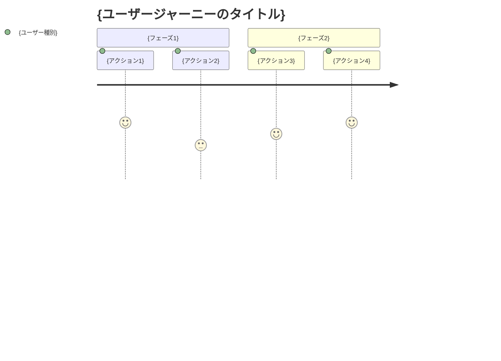

# kairo-requirements

## 目的

既存プロジェクトの情報を収集・分析し、ユーザから要件をヒアリングして、EARS（Easy Approach to Requirements Syntax）記法を使用した詳細な受け入れ基準を含む要件定義書を作成する。
ユーザに要件をヒアリングするときは一問一答形式で選択肢から選ぶか自由入力を可能にする

## 前提条件

- 既存プロジェクト（コードベース、設計文書等）が存在する
- `docs/spec/` ディレクトリが存在する（なければ作成）

## 実行フロー

### Phase 0: 既存プロジェクト情報の網羅的収集

**【信頼性レベル指示】**:
各項目について、元の資料（EARS要件定義書・設計文書・ユーザヒアリング含む）との照合状況を以下の信号でコメントしてください：

- 🔵 **青信号**: EARS要件定義書・設計文書・ユーザヒアリングを参考にしてほぼ推測していない場合
- 🟡 **黄信号**: EARS要件定義書・設計文書・ユーザヒアリングから妥当な推測の場合
- 🔴 **赤信号**: EARS要件定義書・設計文書・ユーザヒアリングにない推測の場合

1. **追加ルールの読み込み**
   - `docs/rule` ディレクトリが存在する場合は読み込み
   - `docs/rule/kairo` ディレクトリが存在する場合は読み込み  
   - `docs/rule/kairo/requirements` ディレクトリが存在する場合は読み込み
   - 各ディレクトリ内のすべてのファイルを読み込み、追加ルールとして適用

2. **プロジェクト基本情報収集**
   - `CLAUDE.md` の内容を読み込み（プロジェクト概要・技術スタック・制約）
   - `README.md` が存在する場合は読み込み
   - プロジェクト構造（ディレクトリ構成）を把握

3. **既存設計文書・仕様書の調査**
   - `docs/` ディレクトリ配下の全設計文書を確認
   - 既存の要件定義書・設計書を読み込み
   - タスク管理ファイル（phase*.md）の内容確認
   - API仕様書・DB設計書があれば確認

4. **既存コードベース・開発状況の分析**
   - @agent-symbol-searcher で既存仕様・実装の網羅的調査
   - git status/log で現在の開発状況・進捗確認
   - 実装済み機能 vs 設計書の差分分析
   - 残タスク・未実装部分の特定

5. **収集情報のサマリー作成**
   - 既存プロジェクトの全体像整理
   - 定義済み要件・未定義部分の特定
   - 技術制約・非機能要件の整理
   - ギャップ分析（設計 vs 実装 vs ユーザー期待）

### Phase 1: 既存情報ベースの差分ヒアリング

6. **既存設計の妥当性・過不足確認**
   - 既存の機能要件・非機能要件の確認質問
   - 現在の制約事項（性能・データ制限等）の妥当性確認
   - 技術スタック選択の再確認
   - 既存設計で実現困難・不適切な部分の特定

7. **未定義・曖昧部分の詳細化ヒアリング**
   - 設計文書で詳細が不明な機能の具体化
   - ユーザーの実際の業務フロー・ユースケースの確認
   - 入出力データの詳細仕様確認
   - UI/UX の具体的な期待値確認

8. **追加・変更要件の特定**
   - 既存設計にない新規機能要件の聞き出し
   - 外部システム連携の追加需要確認
   - レポート・分析機能等の追加需要確認
   - 運用・メンテナンス要件の追加確認

9. **既存機能への影響範囲確認**
   - 新規要件による既存機能への影響許容度確認
   - パフォーマンス要件への影響確認
   - セキュリティ・アクセシビリティ要件への影響確認
   - データ移行・互換性要件の確認

10. **優先順位・スコープ調整**
   - Must Have / Should Have / Could Have / Won't Have の分類
   - リリーススコープ・段階的リリース計画の確認
   - 予算・スケジュール制約に基づく優先順位調整

### Phase 2: 統合要件定義書作成

11. **ユーザストーリーの作成・更新**
    - WHO（誰が）、WHAT（何を）、WHY（なぜ）の形式で記述
    - 既存ユーザストーリーの更新・新規ストーリーの追加
    - 各機能の価値・優先順位を明確化

12. **EARS記法による統合要件定義**
    - **通常要件（SHALL）**: システムが通常実行すべき動作
    - **条件付き要件（WHEN/IF-THEN）**: 特定の条件下での動作
    - **不要要件（WHERE）**: 特定の状態での動作
    - **オプション要件（MAY）**: 任意の機能
    - **制約要件（MUST）**: システムの制約事項
    - 既存要件との統合・重複排除・矛盾解決

13. **Edgeケース・非機能要件の定義**
    - 異常系の処理・エラーハンドリング
    - 境界値の処理・データ制限
    - パフォーマンス・セキュリティ・ユーザビリティ要件
    - 運用・保守・移行要件

14. **統合要件定義書ファイルの作成**
    - `docs/spec/{要件名}-requirements.md`: 統合機能要件と関連文書へのリンク
    - `docs/spec/{要件名}-user-stories.md`: 詳細なユーザストーリー
    - `docs/spec/{要件名}-acceptance-criteria.md`: 受け入れ基準とテスト項目
    - 既存要件からの変更点・追加点を明記
   **【信頼性レベル指示】**:
     各項目について、元の資料（EARS要件定義書・設計文書・ユーザヒアリング含む）との照合状況を以下の信号でコメントしてください：

    - 🔵 **青信号**: EARS要件定義書・設計文書・ユーザヒアリングを参考にしてほぼ推測していない場合
    - 🟡 **黄信号**: EARS要件定義書・設計文書・ユーザヒアリングから妥当な推測の場合
    - 🔴 **赤信号**: EARS要件定義書・設計文書・ユーザヒアリングにない推測の場合

## 出力フォーマット例

### 1. requirements.md（メインファイル）

```markdown
# {要件名} 要件定義書

## 概要

{要件の概要}

## 関連文書

- **ユーザストーリー**: [📖 {要件名}-user-stories.md]({要件名}-user-stories.md)
- **受け入れ基準**: [✅ {要件名}-acceptance-criteria.md]({要件名}-acceptance-criteria.md)

## 機能要件（EARS記法）

**【信頼性レベル凡例】**:
- 🔵 **青信号**: EARS要件定義書・設計文書・ユーザヒアリングを参考にした確実な要件
- 🟡 **黄信号**: EARS要件定義書・設計文書・ユーザヒアリングから妥当な推測による要件  
- 🔴 **赤信号**: EARS要件定義書・設計文書・ユーザヒアリングにない推測による要件

### 通常要件

- REQ-001: システムは {通常の動作} しなければならない 🔵 *EARS要件定義書第3章より*
- REQ-002: システムは {通常の動作} しなければならない 🟡 *設計文書から妥当な推測*
- REQ-003: システムは {通常の動作} しなければならない 🔵 *ユーザヒアリング2024-01-15より*

### 条件付き要件

- REQ-101: {条件} の場合、システムは {動作} しなければならない 🔵 *ユーザー要件・API仕様書より*
- REQ-102: {条件} の場合、システムは {動作} しなければならない 🔴 *設計文書にない推測*
- REQ-103: {条件} の場合、システムは {動作} しなければならない 🟡 *ユーザヒアリング内容から妥当な推測*

### 状態要件

- REQ-201: {状態} にある場合、システムは {動作} しなければならない 🟡 *DB設計書から妥当な推測*

### オプション要件

- REQ-301: システムは {オプション機能} してもよい 🔵 *CLAUDE.md技術制約より*

### 制約要件

- REQ-401: システムは {制約事項} しなければならない 🔵 *CLAUDE.md・既存実装より*

## 非機能要件

### パフォーマンス

- NFR-001: {パフォーマンス要件} 🟡 *CLAUDE.md制約から妥当な推測*

### セキュリティ

- NFR-101: {セキュリティ要件} 🔵 *セキュリティ設計書・実装より*

### ユーザビリティ

- NFR-201: {ユーザビリティ要件} 🔴 *ユーザー要件にない推測*
- NFR-202: {ユーザビリティ要件} 🔵 *ユーザヒアリング2024-01-20 UX要望より*

## Edgeケース

### エラー処理

- EDGE-001: {エラーケース} 🟡 *既存実装から妥当な推測*

### 境界値

- EDGE-101: {境界値ケース} 🔵 *API仕様書・テストケースより*
```

### 2. user-stories.md（詳細なユーザストーリー）

```markdown
# {要件名} ユーザストーリー

## 概要

このドキュメントは{要件名}機能の詳細なユーザストーリーを記載します。

## ユーザー種別の定義

### プライマリユーザー

- **エンドユーザー**: {エンドユーザーの詳細説明}
- **管理者**: {管理者の詳細説明}
- **開発者**: {開発者の詳細説明}

### セカンダリユーザー

- **システム管理者**: {システム管理者の詳細説明}
- **外部システム**: {外部システムの詳細説明}

## ユーザストーリー

**【信頼性レベル凡例】**:
- 🔵 **青信号**: EARS要件定義書・設計文書・ユーザヒアリングを参考にした確実なストーリー
- 🟡 **黄信号**: EARS要件定義書・設計文書・ユーザヒアリングから妥当な推測によるストーリー  
- 🔴 **赤信号**: EARS要件定義書・設計文書・ユーザヒアリングにない推測によるストーリー

### 📚 エピック1: {大きな機能グループ} 🔵 *ユーザヒアリング2024-01-15より*

#### ストーリー1.1: {具体的なストーリー名} 🔵 *EARS要件定義書・ユーザヒアリングより*

**ユーザストーリー**:
- **私は** {ユーザー種別} **として**
- **{具体的な状況・コンテキスト} において**
- **{実現したい行動・操作} をしたい**
- **そうすることで** {得られる価値・解決される問題}

**詳細説明**:
- **背景**: {なぜこの機能が必要なのか}
- **前提条件**: {このストーリーの前提となる状況}
- **利用シーン**: {具体的な利用場面の例}
- **期待する体験**: {ユーザーが期待する体験の詳細}

**関連要件**: REQ-001, REQ-002

**優先度**: 高/中/低

**見積もり**: {ストーリーポイントまたは工数}

#### ストーリー1.2: {具体的なストーリー名} 🟡 *設計文書から妥当な推測*

{同様の形式で記載}

### 📚 エピック2: {大きな機能グループ} 🔴 *既存資料にない推測*

{同様の形式で記載}

## ユーザージャーニー

### ジャーニー1: {代表的な利用フロー} 🔵 *ユーザヒアリング業務フローより*



**詳細**:
1. **{アクション1}**: {詳細な説明}
2. **{アクション2}**: {詳細な説明}

## ペルソナ定義

### ペルソナ1: {代表的ユーザー名} 🔵 *ユーザヒアリング2024-01-18 ペルソナ調査より*

- **基本情報**: {年齢、職業、技術レベル等}
- **ゴール**: {このユーザーが達成したいこと}
- **課題**: {現在抱えている問題}
- **行動パターン**: {典型的な行動の特徴}
- **利用環境**: {使用するデバイス、環境等}

## 非機能的ユーザー要求

### ユーザビリティ要求

- **学習容易性**: {初回利用時の学習コスト}
- **効率性**: {熟練後の作業効率}
- **記憶しやすさ**: {再利用時の記憶のしやすさ}
- **エラー対応**: {エラー時の対応しやすさ}
- **満足度**: {主観的な満足度}

### アクセシビリティ要求

- **視覚**: {視覚障害者への配慮}
- **聴覚**: {聴覚障害者への配慮}
- **運動**: {運動機能障害者への配慮}
- **認知**: {認知障害者への配慮}
```

### 3. acceptance-criteria.md（受け入れ基準）

```markdown
# {要件名} 受け入れ基準

## 概要

このドキュメントは{要件名}機能の受け入れ基準とテスト項目を記載します。

## 機能テスト基準

**【信頼性レベル凡例】**:
- 🔵 **青信号**: EARS要件定義書・設計文書・ユーザヒアリングを参考にした確実なテスト基準
- 🟡 **黄信号**: EARS要件定義書・設計文書・ユーザヒアリングから妥当な推測によるテスト基準  
- 🔴 **赤信号**: EARS要件定義書・設計文書・ユーザヒアリングにない推測によるテスト基準

### REQ-001: {要件名} の受け入れ基準 🔵 *EARS要件定義書・既存テスト仕様より*

**Given（前提条件）**:
- {テスト実行前の状態}
- {必要な初期データ}

**When（実行条件）**:
- {実行するアクション}
- {入力するデータ}

**Then（期待結果）**:
- {期待される出力・状態}
- {確認すべき副作用}

**テストケース**:
- [ ] 正常系: {正常なケースの詳細}
- [ ] 異常系: {異常なケースの詳細}
- [ ] 境界値: {境界値テストの詳細}

### REQ-002: {要件名} の受け入れ基準 🟡 *ユーザヒアリング要望から妥当な推測*

{同様の形式で記載}

## 非機能テスト基準

### パフォーマンステスト

**NFR-001: {パフォーマンス要件} 🔵 *CLAUDE.md制約・ユーザヒアリングより***

- [ ] 応答時間: {具体的な時間基準}
- [ ] スループット: {処理量の基準}
- [ ] 同時接続数: {同時利用者数の基準}
- [ ] リソース使用量: {CPU・メモリ使用量の基準}

**テスト方法**:
- 負荷テストツール: {使用するツール}
- テストシナリオ: {具体的なテスト手順}
- 合格基準: {定量的な合格ライン}

### セキュリティテスト

**NFR-101: {セキュリティ要件} 🟡 *セキュリティ設計書から妥当な推測***

- [ ] 認証: {認証機能のテスト項目}
- [ ] 認可: {権限制御のテスト項目}
- [ ] データ保護: {データ暗号化のテスト項目}
- [ ] 脆弱性: {セキュリティ脆弱性のテスト項目}

## ユーザビリティテスト基準

### UX/UIテスト

- [ ] 直感的操作性: {操作の分かりやすさ}
- [ ] レスポンシブデザイン: {各デバイスでの表示}
- [ ] アクセシビリティ: {WCAG 2.1準拠}
- [ ] エラーメッセージ: {分かりやすいエラー表示}

**テスト方法**:
- ユーザビリティテスト: {実施方法}
- A/Bテスト: {比較テストの方法}
- アクセシビリティチェック: {使用するツール}

## Edgeケーステスト基準

### EDGE-001: {エラーケース} の受け入れ基準 🔴 *既存資料にない推測*

**テストシナリオ**:
- {異常な状況の設定}
- {期待されるエラーハンドリング}
- {ユーザーへの適切な通知}

**合格基準**:
- [ ] システムがクラッシュしない
- [ ] 適切なエラーメッセージが表示される
- [ ] データの整合性が保たれる
- [ ] 復旧可能な状態を維持する

## 統合テスト基準

### システム間連携テスト

- [ ] 外部API連携: {外部システムとの連携テスト}
- [ ] データベース連携: {DB操作の整合性テスト}
- [ ] ファイルシステム: {ファイル操作のテスト}

## リグレッションテスト基準

### 既存機能影響確認

- [ ] 既存機能の動作確認: {影響範囲の特定と確認}
- [ ] パフォーマンス劣化確認: {既存機能の性能確認}
- [ ] セキュリティ設定確認: {セキュリティ機能の継続確認}

## 受け入れテスト実行チェックリスト

### テスト実行前

- [ ] テスト環境の準備完了
- [ ] テストデータの準備完了
- [ ] テストツールの準備完了
- [ ] 実行担当者の確認完了

### テスト実行中

- [ ] 全機能テストの実行
- [ ] 全非機能テストの実行
- [ ] 問題発見時の記録
- [ ] 修正後の再テスト

### テスト完了後

- [ ] テスト結果の記録
- [ ] 残存問題の整理
- [ ] 受け入れ可否の判定
- [ ] ステークホルダーへの報告
```

## ヒアリング質問例

### 既存設計確認系質問

- "現在のCLAUDE.mdで定義されている{制約事項}について、実際の運用で問題ないでしょうか？"
- "技術スタック（{技術名}）について、変更希望や追加制約はありますか？"
- "既存の{機能名}機能で、想定しているユースケースに追加はありますか？"
- "パフォーマンス要件（{具体的な数値}）で、実際の業務に支障はないでしょうか？"

### 詳細化系質問

- "{機能名}で、具体的にどのような操作フローを想定していますか？"
- "データの入力項目について、{項目名}以外に必要なものはありますか？"
- "エラーが発生した場合、どのような通知・対応を期待しますか？"
- "外部システムとの連携で、{システム名}との接続は必要ですか？"

### 追加要件系質問

- "現在の設計にない機能で、実現したいものはありますか？"
- "レポート・分析機能は必要ですか？必要な場合、どのような情報が欲しいですか？"
- "モバイルアプリでの利用は想定していますか？"
- "複数人での同時利用・権限管理は必要ですか？"

### 影響確認系質問

- "この新機能により、既存の{機能名}の変更は許容できますか？"
- "データ移行が発生する場合、どの程度の作業時間が許容できますか？"
- "パフォーマンスへの影響で、許容できる範囲を教えてください"
- "セキュリティ要件で、追加で考慮すべき点はありますか？"

## 実行後の確認

- Phase 0で収集した既存プロジェクト情報のサマリーを表示
- Phase 1でのヒアリング結果と既存情報との差分を明確化
- 作成した3つのファイルのパスを表示
  - `docs/spec/{要件名}-requirements.md`
  - `docs/spec/{要件名}-user-stories.md` 
  - `docs/spec/{要件名}-acceptance-criteria.md`
- 既存要件からの変更点・追加点の件数を報告
- 各ファイル内のリンクが正しく設定されていることを確認
- 既存設計書・実装との整合性確認を促すメッセージを表示
