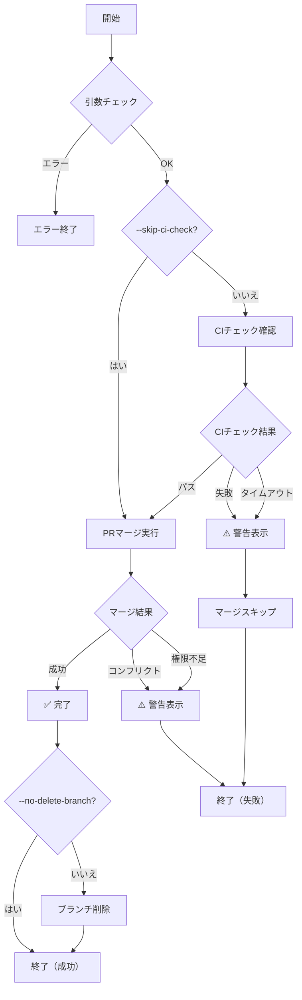

# pr-merge

## 目的

PRのCIチェック確認とマージを実行する単独スキルなのだ。`auto-task-runner` からの呼び出しと、単独での使用の両方に対応するのだ。

---

## ⚠️ 重要: 実行時チェックリスト

**以下のチェックリストを順番に実行すること。**

```
□ Step 1: 引数チェック・PR検証
□ Step 2: CIチェック確認（--skip-ci-check時を除く）
□ Step 3: PRマージ実行
□ Step 4: ブランチ削除（--no-delete-branch時を除く）
□ Step 5: 完了報告
```

---

## 引数

| 引数 | 必須 | 説明 | 例 |
|------|------|------|-----|
| `pr_number` | ○ | PR番号 | `#123` or `123` |
| `--strategy` | - | マージ戦略（squash/merge/rebase）デフォルト: merge | `--strategy squash` |
| `--no-delete-branch` | - | マージ後にブランチを削除しない | - |
| `--skip-ci-check` | - | CIチェック確認をスキップ | - |
| `--wait-timeout` | - | CIチェック待機タイムアウト（秒）デフォルト: 600 | `--wait-timeout 300` |

---

## 実行フロー図



---

## 詳細手順

### Step 1: 引数チェック・PR検証

**実行内容**:
1. 引数を解析（PR番号、オプション）
2. PR番号の正規化（`#123` → `123`）
3. PRが存在するか確認

**コマンド**:
```bash
# PRの存在確認と状態取得
gh pr view {PR番号} --json number,state,title,mergeable
```

**バリデーション**:
- PRが存在しない場合 → エラー終了
- PRが既にクローズされている場合 → エラー終了
- PRが既にマージされている場合 → エラー終了

**音声通知（必須）**: 「PRマージを開始するのだ」

**完了条件**: PRが存在し、オープン状態である

---

### Step 2: CIチェック確認

**実行条件**: `--skip-ci-check` オプションが指定されていない場合

**実行内容**:
1. `gh pr checks {PR番号}` でCIチェック状態を取得
2. 未完了の場合は `--watch` オプションで待機
3. タイムアウト（デフォルト600秒）で打ち切り

**コマンド**:
```bash
# CIチェック状態を確認（タイムアウト付き）
timeout {wait-timeout}s gh pr checks {PR番号} --watch --fail-fast
```

**音声通知**:
- 開始時: 「CIチェックを確認中なのだ」
- 完了時: 「CIチェックがパスしたのだ」
- 失敗時: 「CIチェックが失敗したのだ」
- タイムアウト時: 「CIチェックがタイムアウトしたのだ」

**チェック結果判定**:
- 全てパス → Step 3へ
- 失敗あり → 警告表示、マージスキップ
- タイムアウト → 警告表示、マージスキップ

**完了条件**: CIチェックがパス、または失敗/タイムアウトが確定

---

### Step 3: PRマージ実行

**実行内容**:
1. マージ戦略に応じたコマンドを実行
2. `--delete-branch` フラグの設定（`--no-delete-branch`指定時は除外）

**コマンド**:
```bash
# 通常マージ + ブランチ削除（デフォルト）
gh pr merge {PR番号} --merge --delete-branch

# Squashマージ + ブランチ削除
gh pr merge {PR番号} --squash --delete-branch

# リベースマージ + ブランチ削除
gh pr merge {PR番号} --rebase --delete-branch

# ブランチ削除なし
gh pr merge {PR番号} --{strategy}
```

**音声通知**:
- 開始時: 「PRをマージするのだ」
- 完了時: 「マージが完了したのだ」
- 失敗時: 「マージに失敗したのだ」

**エラー判定**:
- マージコンフリクト → 警告表示、手動対応を促す
- 権限不足 → 警告表示、手動対応を促す
- その他のエラー → エラー詳細を表示

**完了条件**: PRがマージされている

---

### Step 4: ブランチ削除

**実行条件**: `--no-delete-branch` オプションが指定されていない場合、かつStep 3で `--delete-branch` を使用しなかった場合

**実行内容**:
リモートブランチが削除されていない場合は手動で削除

**コマンド**:
```bash
# リモートブランチの削除（必要な場合のみ）
gh api repos/{owner}/{repo}/git/refs/heads/{branch} -X DELETE
```

**完了条件**: ブランチが削除されている、または `--no-delete-branch` が指定されている

---

### Step 5: 完了報告

**実行内容**:
1. マージ結果のサマリーを出力
2. 終了コードを返却

**音声通知（必須）**: 「PRマージが完了したのだ」

**成功時の出力**:
```
✅ PR #{PR番号} をマージしたのだ

📊 マージサマリー:
- 戦略: {merge|squash|rebase}
- CIチェック: ✅ パス
- ブランチ削除: ✅ 完了
```

**失敗時の出力**:
```
⚠️ PR #{PR番号} のマージに失敗したのだ

📊 失敗サマリー:
- 理由: {失敗理由}
- 失敗したチェック: {チェック名リスト}（CIチェック失敗時のみ）
- 対応: 手動で修正してください
```

---

## エラーハンドリング

| エラー | 対応 | 終了コード |
|--------|------|-----------|
| 引数不足 | エラーメッセージを表示し、使用方法を案内 | 1 |
| PRが存在しない | エラーメッセージを表示 | 1 |
| PRが既にクローズ/マージ済み | 警告メッセージを表示 | 0 |
| CIチェック失敗 | 警告表示、マージをスキップ | 1 |
| CIタイムアウト | 警告表示、マージをスキップ | 2 |
| マージコンフリクト | 警告表示、手動対応を促す | 3 |
| 権限不足 | 警告表示、手動対応を促す | 4 |

---

## 音声通知一覧（必須）

| タイミング | メッセージ | 実行タイミング |
|------------|------------|----------------|
| コマンド開始 | 「PRマージを開始するのだ」 | Step 1開始時 |
| CIチェック開始 | 「CIチェックを確認中なのだ」 | Step 2開始時 |
| CIチェックパス | 「CIチェックがパスしたのだ」 | CIチェック成功時 |
| CIチェック失敗 | 「CIチェックが失敗したのだ」 | CIチェック失敗時 |
| CIタイムアウト | 「CIチェックがタイムアウトしたのだ」 | タイムアウト時 |
| マージ開始 | 「PRをマージするのだ」 | Step 3開始時 |
| マージ完了 | 「マージが完了したのだ」 | マージ成功時 |
| マージ失敗 | 「マージに失敗したのだ」 | マージ失敗時 |
| 完了 | 「PRマージが完了したのだ」 | Step 5完了時 |

**音声通知設定**: `speaker=3, speedScale=1.3`

---

## 使用例

```bash
# 基本的な使用（CIチェック→mergeマージ→ブランチ削除）
/pr-merge 123

# PR番号を#付きで指定
/pr-merge #123

# Squashマージ
/pr-merge 123 --strategy squash

# Rebaseマージ
/pr-merge 123 --strategy rebase

# CIチェックをスキップ
/pr-merge 123 --skip-ci-check

# ブランチを残す
/pr-merge 123 --no-delete-branch

# タイムアウトを5分に設定
/pr-merge 123 --wait-timeout 300

# 複合オプション（Squashマージ、CIスキップ、ブランチ残す）
/pr-merge 123 --strategy squash --skip-ci-check --no-delete-branch
```

---

## 注意事項

1. CIチェックは `--skip-ci-check` を指定しない限り必ず確認するのだ
2. デフォルトのマージ戦略は `merge` なのだ
3. デフォルトでマージ後にブランチは削除されるのだ
4. CIチェックのタイムアウトはデフォルト600秒（10分）なのだ
5. マージコンフリクトが発生した場合は手動での解決が必要なのだ
6. 権限不足の場合はリポジトリの設定を確認するのだ
7. VOICEVOXによる音声通知を各ステップで必ず実施するのだ
