# デッキ管理機能拡張 データフロー設計

**作成日**: 2025-01-26
**関連要件定義**: [requirements.md](../../spec/deck-management-extension/requirements.md)
**ベースデータフロー**: [shadowverse-battle-log/dataflow.md](../shadowverse-battle-log/dataflow.md)

**【信頼性レベル凡例】**:
- 🔵 **青信号**: ユーザヒアリング・設計文書を参考にした確実な設計
- 🟡 **黄信号**: ユーザヒアリング・設計文書から妥当な推測による設計
- 🔴 **赤信号**: ユーザヒアリング・設計文書にない推測による設計

---

## 1. デッキ種別管理フロー 🔵

### 1.1 デッキ種別追加フロー 🔵

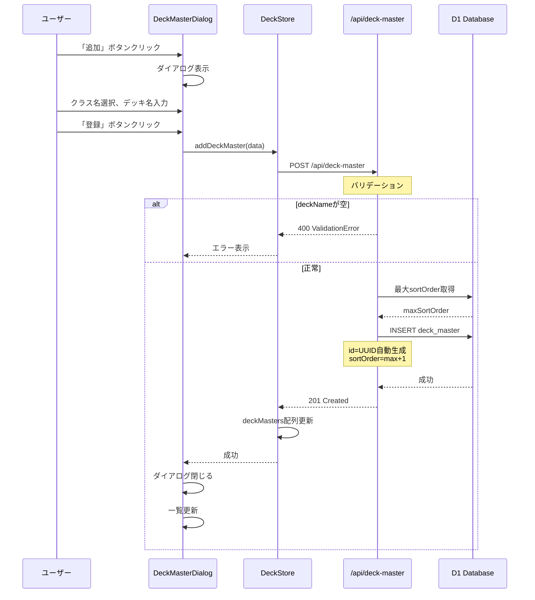

### 1.2 デッキ種別編集フロー 🔵

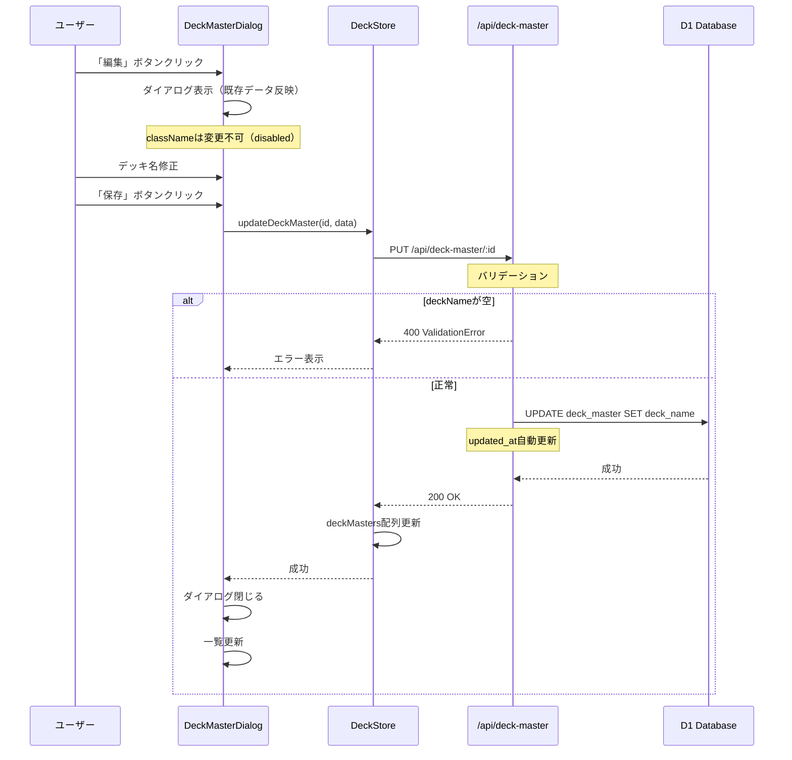

### 1.3 デッキ種別削除フロー 🔵

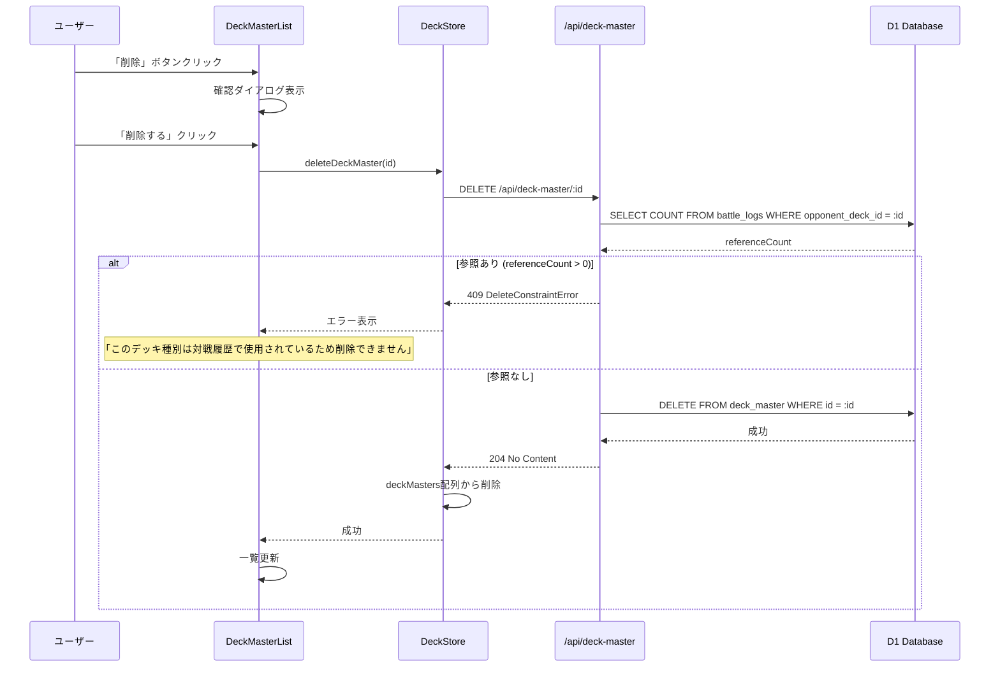

---

## 2. 使用デッキ管理フロー 🔵

### 2.1 使用デッキ追加フロー 🔵

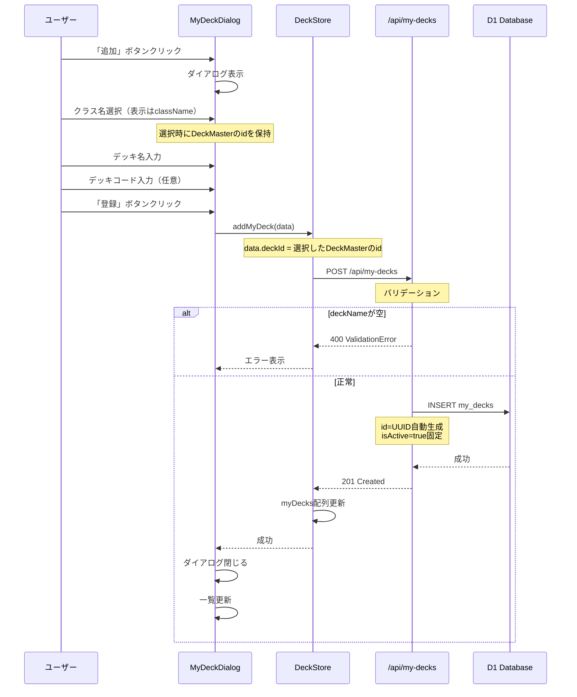

### 2.2 使用デッキ削除フロー 🔵

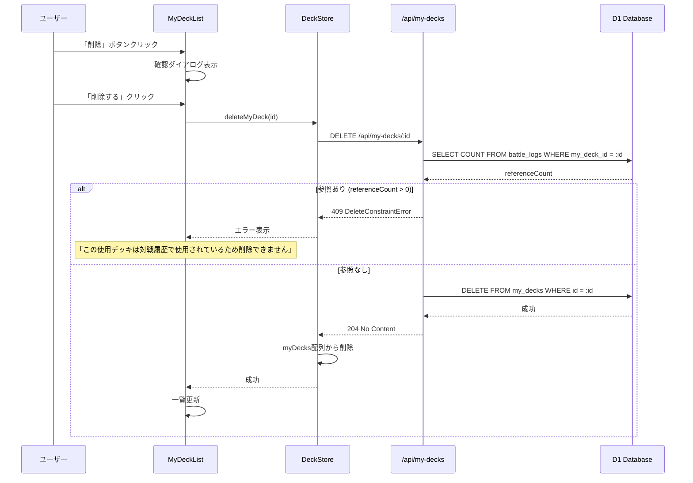

---

## 3. 統計画面フロー 🔵

### 3.1 統計画面初期表示フロー 🔵

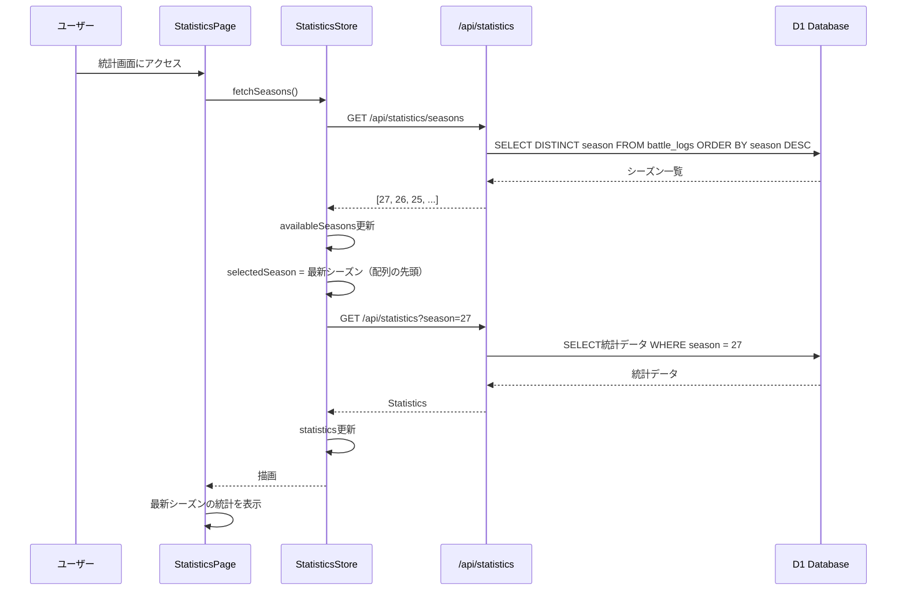

### 3.2 シーズン切り替えフロー 🔵

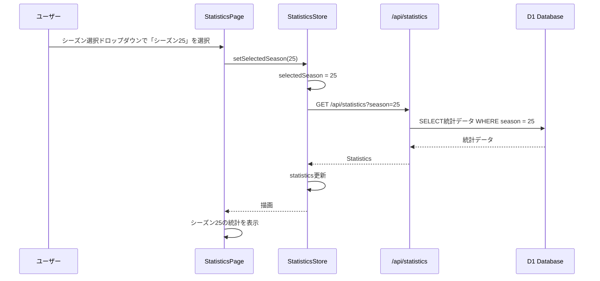

### 3.3 統計画面からの対戦履歴登録フロー 🔵

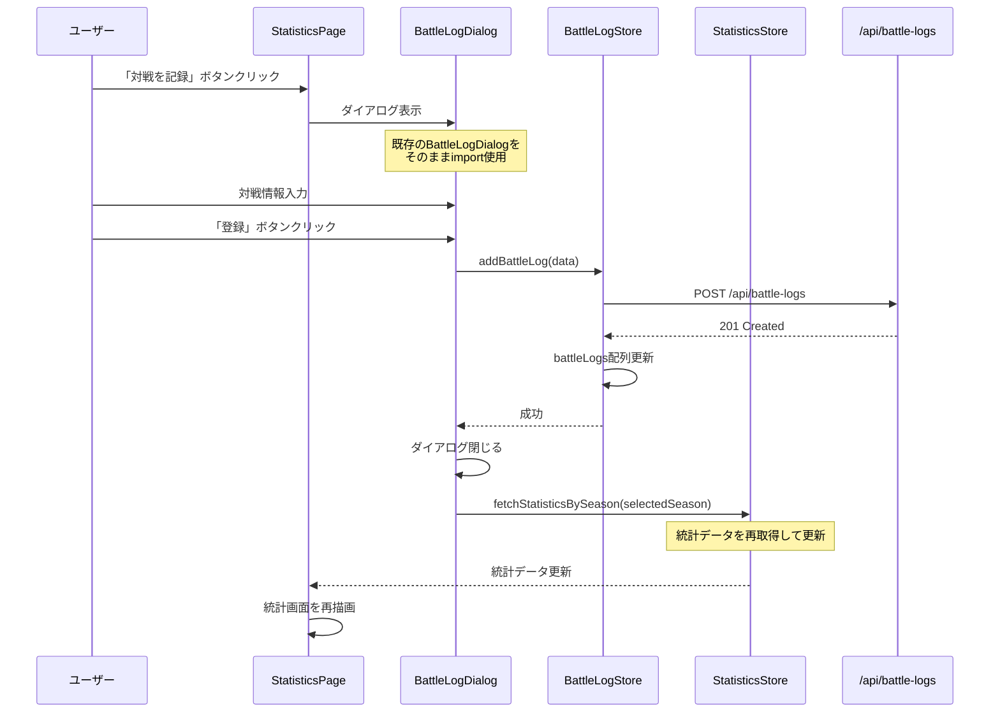

---

## 4. 対戦履歴登録UI改善フロー 🔵

### 4.1 相手デッキ選択肢ソートフロー 🔵

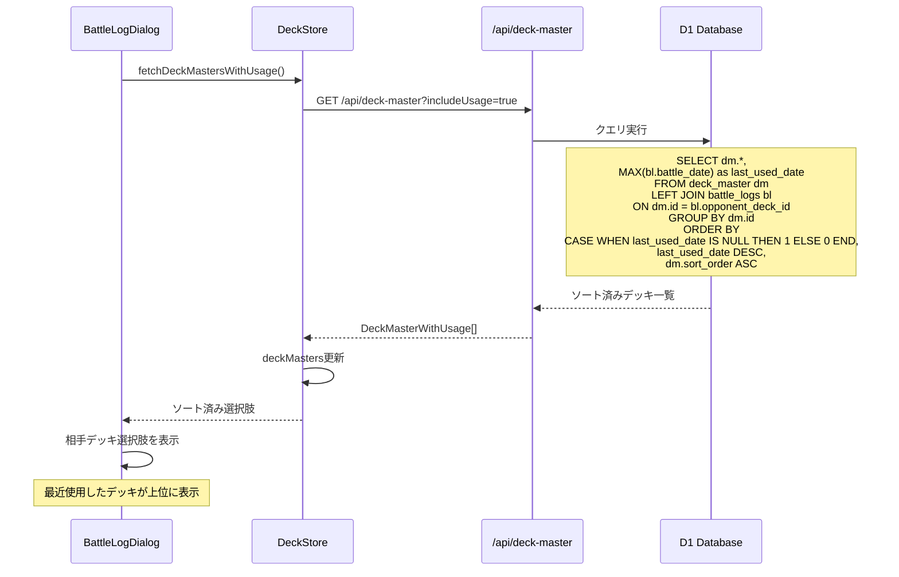

### 4.2 対戦履歴が0件の場合のフォールバック 🔵

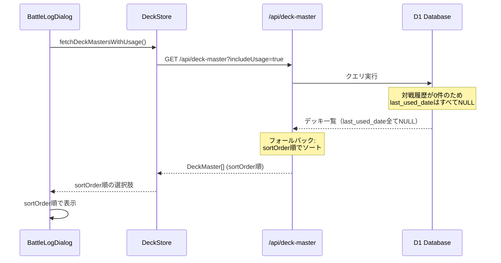

---

## 5. データ整合性フロー 🔵

### 5.1 削除制約チェックフロー 🔵

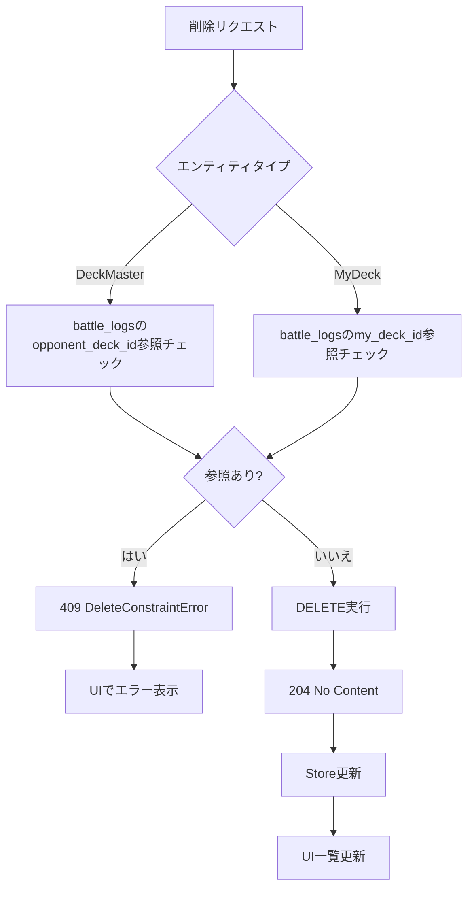

---

## 6. キャッシュ無効化フロー 🟡

### 6.1 デッキ種別CRUD時のキャッシュ無効化 🟡

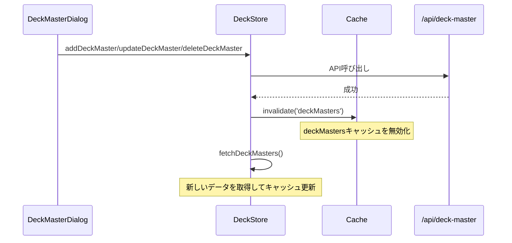

### 6.2 対戦履歴登録時のキャッシュ無効化 🟡

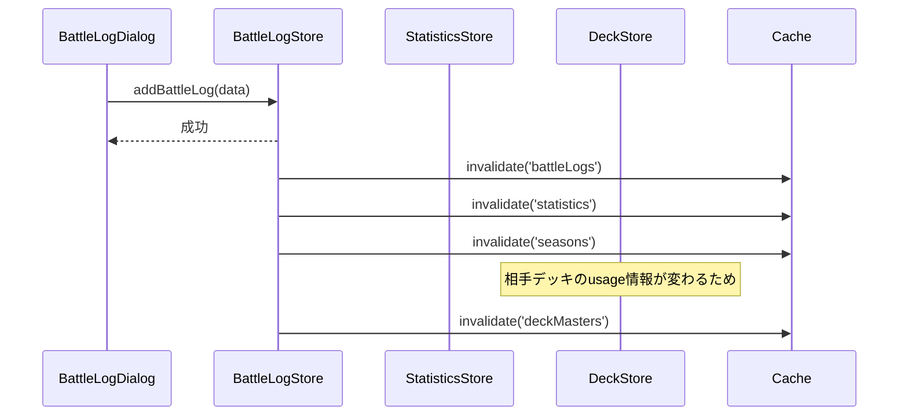

---

## 7. エラーハンドリングフロー 🔵

### 7.1 バリデーションエラーフロー 🔵

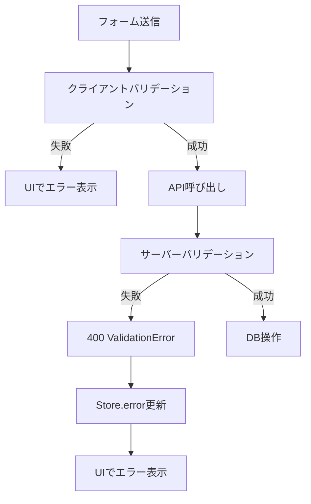

### 7.2 ネットワークエラーフロー 🔵

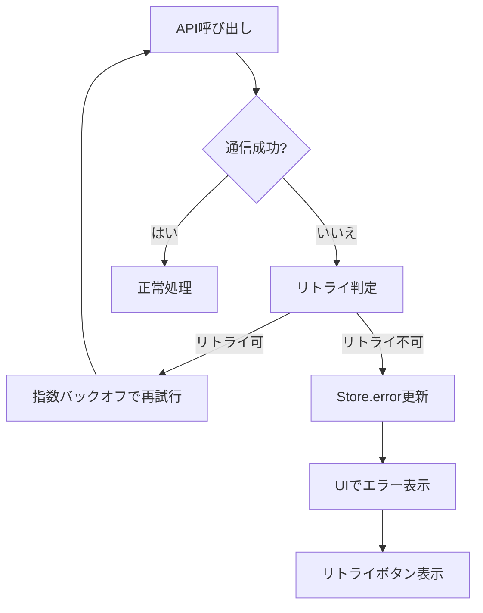

---

## 8. 信頼性レベルサマリー

- 🔵 青信号: 18件 (90%)
- 🟡 黄信号: 2件 (10%)
- 🔴 赤信号: 0件 (0%)

**品質評価**: 高品質（ほぼすべてのフローがユーザヒアリングと既存設計に基づく）

---

## 更新履歴

- **2025-01-26**: 初版作成（tsumiki:kairo-design により生成）
