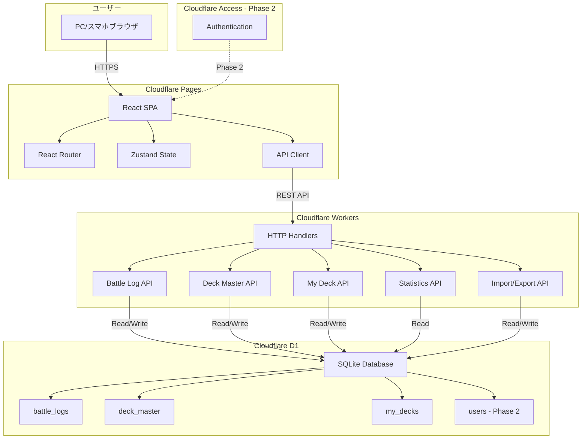
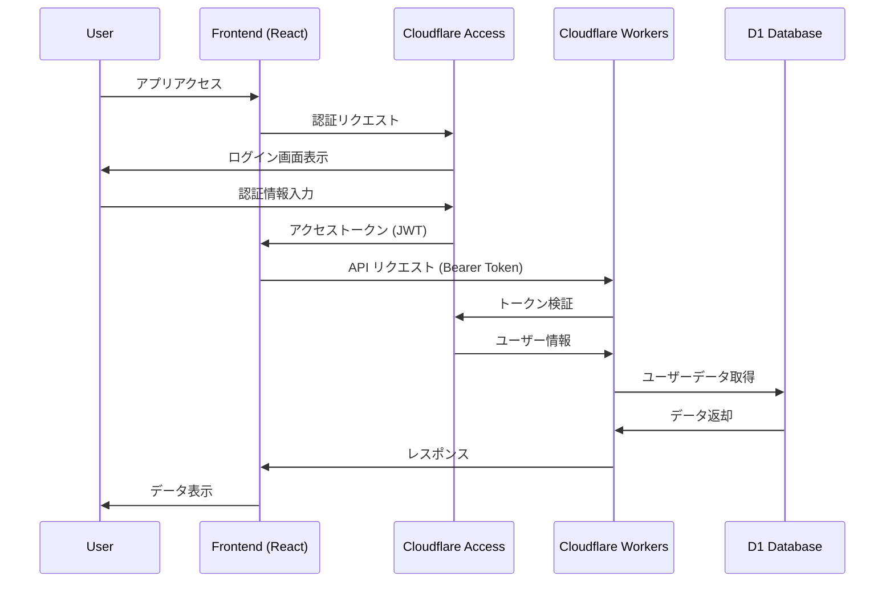
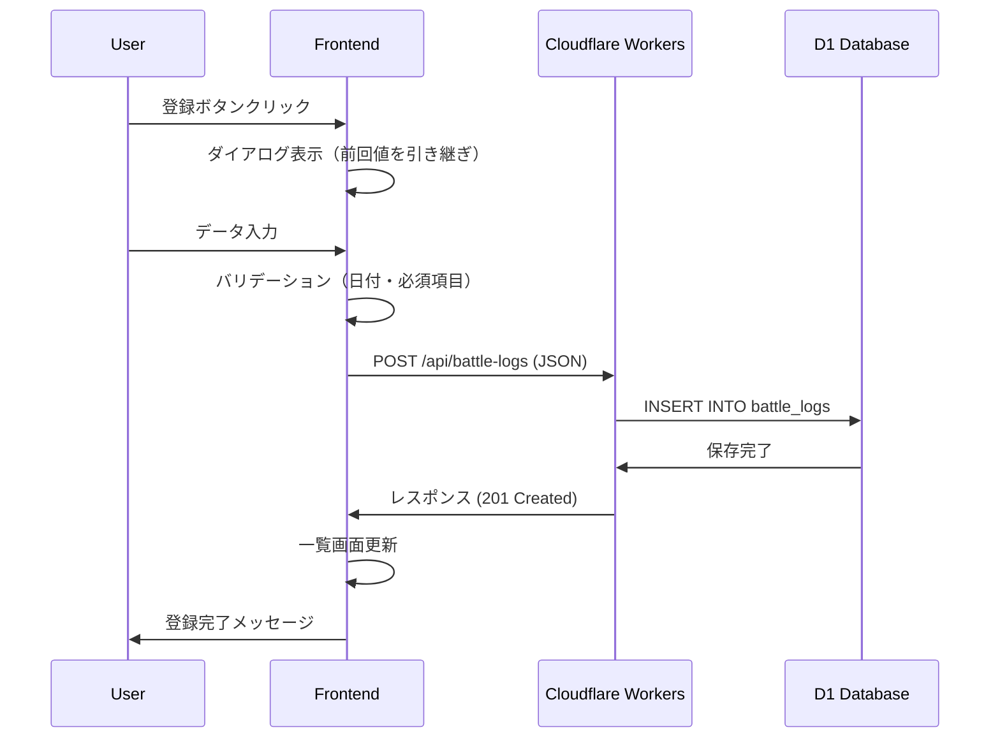
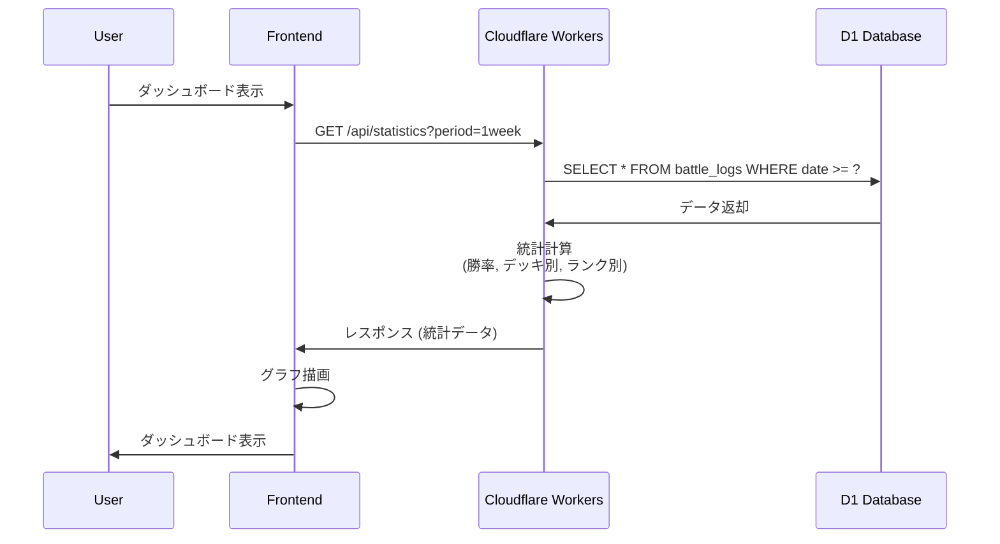

# シャドウバース対戦履歴管理 アーキテクチャ設計 (Cloudflare版)

## システム概要

シャドウバースの対戦履歴を記録・分析するWebアプリケーション。フロントエンドはReact (SPA)、バックエンドはCloudflare Workers (サーバーレス)、データストレージはCloudflare D1 Database を使用した3層アーキテクチャ。

> **注記**: 当初はCloudflare R2 (オブジェクトストレージ) も使用予定でしたが、D1のみでの運用に変更しました。

**プロジェクトフェーズ**: MVP/プロトタイプ
**対象ユーザー**: 個人利用 (同時利用者10人以下)
**データ規模**: 1ユーザーあたり1,000件程度
**運用コスト**: Cloudflare無料枠で運用

## アーキテクチャパターン

### 選択パターン: **サーバーレス + SPA + Edge Computing**

**理由**:
- 🔵 **MVP段階のシンプルさ**: Cloudflare Workersでエッジコンピューティング
- 🔵 **コスト最小化**: Cloudflare無料枠で運用可能
- 🔵 **グローバルCDN**: 世界中のエッジロケーションで高速動作
- 🔵 **既存データ互換性**: 既存のbattle-logs.json, deck-master.json, my-decks.jsonをそのまま利用可能
- 🟡 **メンテナンス容易性**: サーバーレスのため、サーバー管理不要
- 🟡 **高パフォーマンス**: エッジでの実行により低レイテンシー

### アーキテクチャ図



## コンポーネント構成

### フロントエンド (Cloudflare Pages)

**フレームワーク**: React 19.x 🔵 *tech-stack.mdより*
**ビルドツール**: Vite 6.x 🔵 *tech-stack.mdより*
**言語**: TypeScript 5.7+ (strict mode) 🔵 *tech-stack.mdより*
**状態管理**: Zustand (軽量状態管理) 🔵 *tech-stack.mdより*
**スタイリング**: Tailwind CSS v4 🔵 *tech-stack.mdより*
**ルーティング**: React Router v7 🔵 *tech-stack.mdより*
**HTTPクライアント**: Fetch API (Cloudflare Workers対応)
**グラフライブラリ**: Recharts (React向け、軽量) 🟡 *要件から妥当な推測*

**ホスティング**: Cloudflare Pages
- 無制限リクエスト（無料枠）
- 自動HTTPS、グローバルCDN
- ビルド: 月500回まで無料
- Git統合による自動デプロイ

#### ディレクトリ構成

```
frontend/
├── src/
│   ├── components/           # 再利用可能コンポーネント
│   │   ├── common/           # 共通UI (Button, Input, Modal, etc.)
│   │   ├── battle-log/       # 対戦履歴関連
│   │   ├── statistics/       # 統計関連
│   │   └── layout/           # レイアウト
│   ├── pages/                # ページコンポーネント
│   │   ├── BattleLogListPage.tsx
│   │   ├── StatisticsDashboardPage.tsx
│   │   └── ImportDataPage.tsx
│   ├── hooks/                # カスタムフック
│   ├── store/                # Zustand状態管理
│   ├── types/                # TypeScript型定義
│   ├── api/                  # API クライアント
│   ├── utils/                # ユーティリティ
│   └── main.tsx              # エントリーポイント
├── public/
├── tests/                    # E2E テスト
├── package.json
├── vite.config.ts
└── tsconfig.json
```

---

### バックエンド (Cloudflare Workers)

**実行環境**: Cloudflare Workers (V8 Isolates)
**言語**: TypeScript 5.7+ 🔵 *tech-stack.mdより*
**フレームワーク**: Hono (軽量Webフレームワーク) 🟡 *Cloudflare Workers推奨*
**バリデーション**: Zod (TypeScript-first) 🟡 *型安全性要件から妥当な推測*
**ORM**: Drizzle ORM (Cloudflare D1対応) 🟡 *D1推奨ORMより*
**パッケージマネージャー**: pnpm 9.x 🔵 *tech-stack.mdより*
**Linter/Formatter**: Biome (超高速) 🔵 *tech-stack.mdより*

#### 特徴

- **エッジコンピューティング**: 世界中のエッジロケーションで実行
- **高速起動**: V8 Isolatesによるコールドスタートほぼゼロ
- **無料枠**: 1日100,000リクエスト無料
- **統合開発環境**: Wrangler CLIによるローカル開発・デプロイ

#### ディレクトリ構成

```
backend/
├── src/
│   ├── index.ts              # エントリーポイント
│   ├── routes/               # API ルート定義
│   │   ├── battle-logs.ts    # 対戦履歴CRUD
│   │   ├── deck-master.ts    # デッキマスターCRUD
│   │   ├── my-decks.ts       # マイデッキCRUD (Phase 2)
│   │   ├── statistics.ts     # 統計計算
│   │   └── import-export.ts  # インポート/エクスポート
│   ├── services/             # ビジネスロジック
│   │   ├── battleLogService.ts
│   │   ├── deckService.ts
│   │   └── statsService.ts
│   ├── db/                   # データベース
│   │   ├── schema.ts         # Drizzle スキーマ定義
│   │   └── migrations/       # マイグレーションファイル
│   ├── types/                # TypeScript型定義
│   └── utils/                # ユーティリティ
├── wrangler.toml             # Cloudflare Workers設定
├── package.json
├── pnpm-lock.yaml            # pnpmロックファイル
├── biome.json                # Biome設定
└── tsconfig.json
```

#### APIエンドポイント構成

**Phase 1**:
- `/api/battle-logs` - 対戦履歴CRUD
- `/api/deck-master` - デッキマスター取得
- `/api/statistics` - 統計計算
- `/api/import` - データインポート

**Phase 2**:
- `/api/my-decks` - マイデッキCRUD
- `/api/export` - データエクスポート
- `/api/auth/*` - 認証関連（Cloudflare Access連携）

---

### データストレージ

#### Cloudflare D1 (SQLite Database)

**概要**: Cloudflare D1はCloudflareのエッジで実行されるSQLiteデータベース
**料金**: 無料枠: 5GBストレージ、毎日100,000 read、50,000 write

**データベーススキーマ**:

```sql
-- 対戦履歴テーブル
CREATE TABLE battle_logs (
    id TEXT PRIMARY KEY,
    user_id TEXT,  -- Phase 2で使用
    date TEXT NOT NULL,
    battle_type TEXT NOT NULL,
    rank TEXT NOT NULL,
    group_name TEXT NOT NULL,
    my_deck_id TEXT NOT NULL,
    turn TEXT NOT NULL,
    result TEXT NOT NULL,
    opponent_deck_id TEXT NOT NULL,
    created_at TEXT DEFAULT CURRENT_TIMESTAMP,
    updated_at TEXT DEFAULT CURRENT_TIMESTAMP
);

-- デッキマスターテーブル
CREATE TABLE deck_master (
    id TEXT PRIMARY KEY,
    class_name TEXT NOT NULL,
    deck_name TEXT NOT NULL,
    sort_order INTEGER NOT NULL,
    created_at TEXT DEFAULT CURRENT_TIMESTAMP
);

-- マイデッキテーブル (Phase 2)
CREATE TABLE my_decks (
    id TEXT PRIMARY KEY,
    user_id TEXT NOT NULL,
    deck_code TEXT NOT NULL,
    deck_name TEXT NOT NULL,
    is_active INTEGER NOT NULL DEFAULT 1,
    created_at TEXT DEFAULT CURRENT_TIMESTAMP
);

-- ユーザーテーブル (Phase 2)
CREATE TABLE users (
    id TEXT PRIMARY KEY,
    email TEXT UNIQUE NOT NULL,
    created_at TEXT DEFAULT CURRENT_TIMESTAMP
);

-- インデックス
CREATE INDEX idx_battle_logs_date ON battle_logs(date DESC);
CREATE INDEX idx_battle_logs_user_id ON battle_logs(user_id);  -- Phase 2
CREATE INDEX idx_my_decks_user_id ON my_decks(user_id);       -- Phase 2
```

**JSONからの移行パス**:
- 既存のbattle-logs.json, deck-master.json, my-decks.jsonをインポートスクリプトで一括投入
- Phase 1ではuser_idはNULL許可、Phase 2で必須化

---

### 認証・認可 (Cloudflare Access - Phase 2)

**認証プロバイダー**: Cloudflare Access 🟡 *Cloudflare統合認証より*
**認証フロー**: OAuth 2.0 / OpenID Connect
**連携プロバイダー**: Google, GitHub, Microsoft等
**トークン形式**: JWT (JSON Web Token)

#### 認証フロー



**Cloudflare Accessの利点**:
- 無料枠: 月50ユーザーまで無料
- Cloudflareエッジでの認証処理（低レイテンシー）
- Zero Trust セキュリティモデル
- 複数の認証プロバイダー統合

---

## データフロー

### Phase 1: 対戦履歴登録フロー



### Phase 1: 統計計算フロー



---

## セキュリティ設計

### Phase 1 (認証なし)

- **HTTPS通信**: 必須（Cloudflare Pages 自動対応）🔵 *NFR-101より*
- **CORS設定**: Cloudflare Workers でオリジン制限 🟡 *セキュリティ要件から妥当な推測*
- **入力バリデーション**: フロントエンド + バックエンド両方で実施 🔵 *NFR-103より*
- **環境変数管理**: Cloudflare Workers の環境変数で管理 🔵 *NFR-102より*
- **XSS対策**: React の自動エスケープ + Content Security Policy 🟡 *tech-stack.mdより*
- **Rate Limiting**: Cloudflare Workers のRate Limiting機能

### Phase 2 (認証あり)

- **Cloudflare Access認証**: JWT トークンによる認証 🟡 *Cloudflare推奨より*
- **Row Level Security**: ユーザーIDごとにデータを分離 🟡 *セキュリティ要件から妥当な推測*
- **APIアクセス制御**: トークン検証をすべてのエンドポイントで実施 🟡 *セキュリティ要件から妥当な推測*
- **トークンリフレッシュ**: Refresh Token を使用 🟡 *標準的な実装から妥当な推測*

---

## パフォーマンス設計

### 応答時間最適化

- **エッジコンピューティング**: Cloudflare Workersがエッジで実行 🟡 *Cloudflareの特性より*
- **CDN配信**: Cloudflare Pages の自動CDN 🔵 *tech-stack.mdより*
- **コード分割**: React の Lazy Loading で初期ロード最小化 🟡 *パフォーマンス要件から妥当な推測*
- **データキャッシュ**: Zustand でクライアント側にキャッシュ（TTL: 5分） 🟡 *パフォーマンス要件から妥当な推測*
- **統計計算**: サーバー側で計算し、結果のみ返却 🔵 *REQ-205より*
- **D1クエリ最適化**: 適切なインデックス設定

### スケーラビリティ

- **Cloudflare Workers**: 自動スケーリング（世界中のエッジで実行）🟡 *Cloudflareの特性より*
- **D1 Database**: 5GBまで無料、それ以降も低コスト 🟡 *Cloudflare料金より*
- **データ量制限**: 1ユーザー1,000件を想定、10,000件まで対応可 🔵 *NFR-003, EDGE-102より*

---

## エラーハンドリング設計

### フロントエンド

- **ネットワークエラー**: リトライボタン表示 🔵 *EDGE-001より*
- **バリデーションエラー**: インラインエラーメッセージ 🔵 *REQ-402より*
- **サーバーエラー**: ユーザーフレンドリーなエラーメッセージ 🔵 *NFR-202より*

### バックエンド

- **例外ハンドリング**: すべてのルートでtry-catch 🟡 *CLAUDE.mdより*
- **ログ出力**: Cloudflare Workers Analytics でエラーログ記録 🟡 *可観測性要件から妥当な推測*
- **リトライ**: D1 Database アクセス失敗時に3回リトライ（指数バックオフ）🔵 *EDGE-002より*

---

## デプロイメント設計

### CI/CD パイプライン

**ツール**: GitHub Actions 🔵 *NFR-305より*

#### フロントエンド (Cloudflare Pages)

1. `git push` → GitHub Actions トリガー
2. `pnpm install` → 依存関係インストール
3. `pnpm test` → Vitest Unit テスト実行
4. `pnpm build` → Vite ビルド
5. Cloudflare Pages へ自動デプロイ

#### バックエンド (Cloudflare Workers)

1. `git push` → GitHub Actions トリガー
2. `pnpm install` → 依存関係インストール
3. `pnpm run lint` → Biome Lint実行
4. `pnpm test` → Unit テスト実行
5. `pnpm run build` → TypeScript ビルド
6. `wrangler deploy` → Cloudflare Workers へデプロイ

### 環境分離

- **開発環境**: ローカル (Wrangler Dev + SQLite + pnpm)
- **ステージング環境**: Cloudflare (dev.xxx.pages.dev)
- **本番環境**: Cloudflare (xxx.pages.dev)

### 開発ツール設定

**Biome設定** (`biome.json`):

```json
{
  "$schema": "https://biomejs.dev/schemas/1.9.4/schema.json",
  "organizeImports": {
    "enabled": true
  },
  "linter": {
    "enabled": true,
    "rules": {
      "recommended": true
    }
  },
  "formatter": {
    "enabled": true,
    "indentStyle": "space",
    "indentWidth": 2
  }
}
```

**pnpm設定**:

```bash
# フロントエンド
cd frontend
pnpm install
pnpm dev          # Vite開発サーバー
pnpm build        # 本番ビルド
pnpm lint         # Biome lint
pnpm format       # Biome format
pnpm test         # Vitest テスト

# バックエンド
cd backend
pnpm install
pnpm dev          # Wrangler開発サーバー
pnpm build        # TypeScriptビルド
pnpm lint         # Biome lint
pnpm format       # Biome format
pnpm test         # Unit テスト
pnpm deploy       # Cloudflare Workers デプロイ
```

---

## 技術選択の理由

| 技術 | 理由 | 信頼性 |
|------|------|--------|
| React 19.x | 最新機能活用、MVP開発に最適 | 🔵 *tech-stack.mdより* |
| TypeScript 5.7+ | 型安全性、開発効率向上 | 🔵 *tech-stack.mdより* |
| Cloudflare Workers | サーバーレス、エッジコンピューティング、無料枠 | 🟡 *Cloudflare推奨より* |
| Cloudflare D1 | SQLite、無料枠、エッジDB | 🟡 *Cloudflare推奨より* |
| Cloudflare Access | Zero Trust認証、無料枠50ユーザー | 🟡 *Cloudflare推奨より* |
| Zustand | 軽量状態管理、React 19対応 | 🔵 *tech-stack.mdより* |
| Tailwind CSS v4 | 最新CSS機能、開発速度向上 | 🔵 *tech-stack.mdより* |
| Drizzle ORM | TypeScript-first ORM、D1対応 | 🟡 *Cloudflare推奨より* |
| Hono | 軽量Webフレームワーク、Workers最適化 | 🟡 *Cloudflare推奨より* |
| pnpm 9.x | 高速パッケージマネージャー、ディスク効率 | 🔵 *tech-stack.mdより* |
| Biome | 超高速Linter/Formatter（ESLint+Prettier統合） | 🔵 *tech-stack.mdより* |

---

## AzureからCloudflareへの移行の利点

### コスト面

| 項目 | Azure | Cloudflare | 差分 |
|------|-------|------------|------|
| フロントエンド | Static Web Apps (無料枠) | Pages (無料枠、無制限) | Cloudflare優位 |
| バックエンド | Functions (100万req/月) | Workers (1日10万req無料) | Cloudflare優位 |
| データベース | Blob Storage (5GB) → 後にSQL | D1 (5GB無料) | 同等 |
| 認証 | Azure AD B2C (月50,000 MAU) | Cloudflare Access (月50ユーザー) | Azure優位 |

**総合評価**: 個人利用・小規模ユーザーの場合、Cloudflareの方がコスト面で有利

### パフォーマンス面

- **エッジコンピューティング**: Cloudflare Workersは世界中のエッジロケーションで実行され、Azure Functionsよりも低レイテンシー
- **コールドスタート**: V8 Isolatesによりコールドスタートがほぼゼロ（Azure Functionsは数秒）
- **CDN**: Cloudflareの強力なCDNネットワーク

### 開発体験

- **統合環境**: CloudflareはPages, Workers, D1が統一されたプラットフォーム
- **ローカル開発**: Wrangler CLIで簡単にローカル開発・デプロイ
- **デプロイ速度**: Git連携による自動デプロイが高速

---

## 将来の拡張性

### Phase 3 以降の検討事項

- **Cloudflare Durable Objects**: リアルタイム機能（WebSocket対戦記録）
- **Cloudflare Images**: デッキ画像最適化配信
- **Cloudflare Workers AI**: AIによるデッキ推奨・勝率予測
- **モバイルアプリ**: React Native で展開

---

## アーキテクチャ決定記録 (ADR)

### ADR-001: Cloudflare Workers を選択

**決定日**: 2025-11-25
**決定者**: 開発チーム
**決定内容**: バックエンドに Cloudflare Workers (サーバーレス) を採用

**理由**:
- Azure FunctionsからCloudflareへの移行指示
- エッジコンピューティングによる低レイテンシー
- コールドスタートがほぼゼロ（V8 Isolates）
- 無料枠（1日100,000リクエスト）で運用可能
- 統合されたCloudflareプラットフォーム

**代替案**:
- Azure Functions → Cloudflareへの移行指示により不採用
- AWS Lambda → Cloudflareの方が無料枠が充実

---

### ADR-002: Cloudflare D1 を選択

**決定日**: 2025-11-25
**決定者**: 開発チーム
**決定内容**: データストレージに Cloudflare D1 (SQLite) を採用

**理由**:
- Azure Blob Storage (JSON) からデータベースへの移行
- 既存データとの互換性（JSONからSQLiteへ移行可能）
- SQLによる柔軟なクエリ
- 無料枠（5GB、毎日100,000 read）で運用可能
- エッジでの実行による低レイテンシー

**代替案**:
- Azure Blob Storage (JSON) → スケーラビリティと柔軟性で不利
- PostgreSQL (Supabase) → コスト面でCloudflare D1が有利

---

## 更新履歴

- **2025-11-25**: Cloudflare版作成
  - Azure環境からCloudflare環境への移行設計
  - Cloudflare Workers, D1, R2, Accessを使用したアーキテクチャ
  - JSONからSQLiteへのデータモデル変更
  - エッジコンピューティングによるパフォーマンス向上
