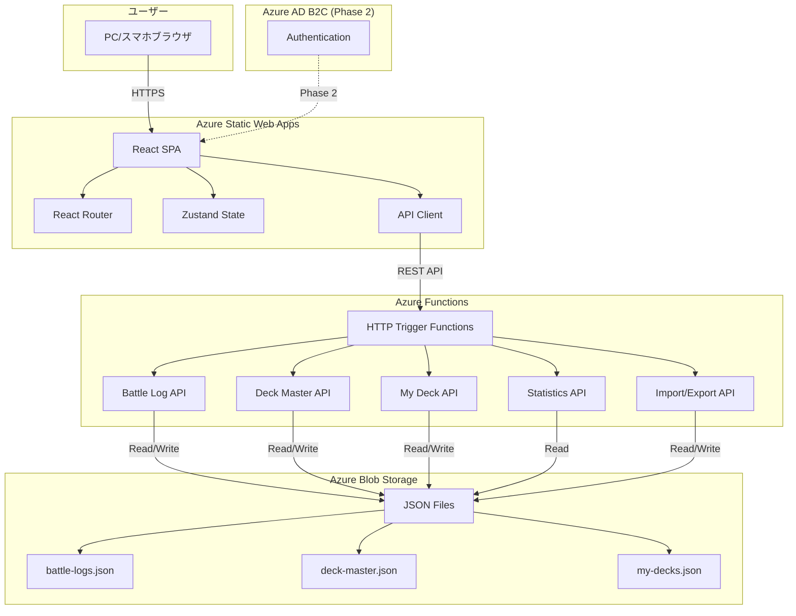
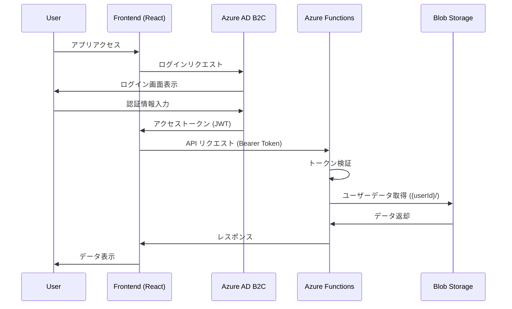
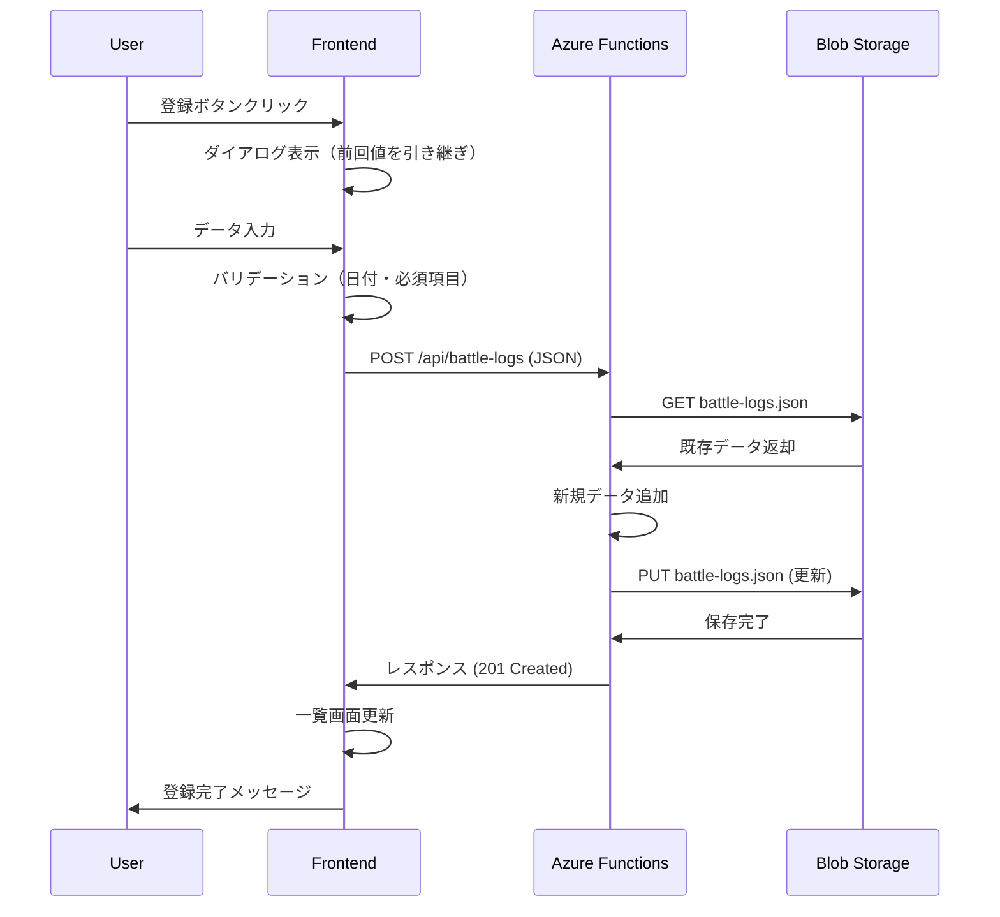
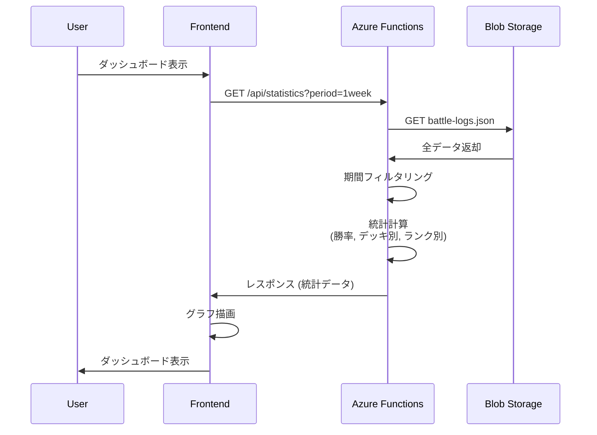

# シャドウバース対戦履歴管理 アーキテクチャ設計 (Azure版 - 非推奨)

> ⚠️ **注意**: このドキュメントはAzure版の設計です。現在はCloudflare版に移行済みのため、
> 最新の設計は `architecture-cloudflare.md` を参照してください。

## システム概要

シャドウバースの対戦履歴を記録・分析するWebアプリケーション。フロントエンドはReact (SPA)、バックエンドはAzure Functions (サーバーレス)、データストレージはAzure Blob Storage (JSON形式) を使用した3層アーキテクチャ。

**プロジェクトフェーズ**: MVP/プロトタイプ
**対象ユーザー**: 個人利用 (同時利用者10人以下)
**データ規模**: 1ユーザーあたり1,000件程度
**運用コスト**: Azure無料枠・低コスト枠で運用

## アーキテクチャパターン

### 選択パターン: **サーバーレス + SPA + ファイルストレージ**

**理由**:
- 🔵 **MVP段階のシンプルさ**: データベース不要、JSONファイルベースで迅速に開発
- 🔵 **コスト最小化**: Azure無料枠で運用可能
- 🔵 **スケーラビリティ**: 将来的にDB移行が容易（JSON→PostgreSQL）
- 🔵 **既存データ互換性**: 既存のbattle-logs.json, deck-master.json, my-decks.jsonをそのまま利用
- 🟡 **メンテナンス容易性**: サーバーレスのため、サーバー管理不要

### アーキテクチャ図



## コンポーネント構成

### フロントエンド (Azure Static Web Apps)

**フレームワーク**: React 19.x 🔵 *tech-stack.mdより*
**ビルドツール**: Vite 6.x 🔵 *tech-stack.mdより*
**言語**: TypeScript 5.7+ (strict mode) 🔵 *tech-stack.mdより*
**状態管理**: Zustand (軽量状態管理) 🔵 *tech-stack.mdより*
**スタイリング**: Tailwind CSS v4 🔵 *tech-stack.mdより*
**ルーティング**: React Router v7 🔵 *tech-stack.mdより*
**HTTPクライアント**: Axios / Fetch API
**グラフライブラリ**: Recharts (React向け、軽量) 🟡 *要件から妥当な推測*

#### ディレクトリ構成

```
frontend/
├── src/
│   ├── components/           # 再利用可能コンポーネント
│   │   ├── common/           # 共通UI (Button, Input, Modal, etc.)
│   │   ├── battle-log/       # 対戦履歴関連 (BattleLogForm, BattleLogList, BattleLogDetail)
│   │   ├── statistics/       # 統計関連 (StatsDashboard, WinRateChart, DeckDistribution)
│   │   └── layout/           # レイアウト (Header, Footer, Navigation)
│   ├── pages/                # ページコンポーネント
│   │   ├── BattleLogListPage.tsx
│   │   ├── StatisticsDashboardPage.tsx
│   │   └── ImportDataPage.tsx
│   ├── hooks/                # カスタムフック
│   │   ├── useBattleLog.ts
│   │   ├── useStatistics.ts
│   │   └── useImport.ts
│   ├── store/                # Zustand状態管理
│   │   ├── battleLogStore.ts
│   │   └── deckStore.ts
│   ├── types/                # TypeScript型定義
│   │   └── index.ts
│   ├── api/                  # API クライアント
│   │   ├── battleLogApi.ts
│   │   ├── deckApi.ts
│   │   └── statsApi.ts
│   ├── utils/                # ユーティリティ
│   │   ├── dateUtils.ts
│   │   ├── validationUtils.ts
│   │   └── formatUtils.ts
│   └── main.tsx              # エントリーポイント
├── public/
│   └── manifest.json         # PWA manifest (Phase 2)
├── tests/                    # E2E テスト (Playwright)
├── package.json
├── vite.config.ts
├── tailwind.config.ts
└── tsconfig.json
```

#### 主要コンポーネント

**Phase 1**:
- `BattleLogForm`: 対戦履歴登録ダイアログ（REQ-001〜005）
- `BattleLogList`: 対戦履歴一覧（REQ-101〜106）
- `StatsDashboard`: 統計ダッシュボード（REQ-201〜205）
- `ImportDialog`: データインポート（REQ-301〜303）

**Phase 2**:
- `MyDeckManager`: マイデッキ管理（REQ-801〜803）
- `DeckMasterManager`: デッキマスター管理（REQ-901〜902）
- `ExportDialog`: データエクスポート（REQ-1001〜1002）
- `LoginButton`: Azure AD B2C認証（REQ-701〜702）

---

### バックエンド (Azure Functions - Node.js/TypeScript)

**実行環境**: Node.js 22.x LTS 🔵 *tech-stack.mdより*
**言語**: TypeScript 5.7+ 🔵 *tech-stack.mdより*
**フレームワーク**: Azure Functions v4 🔵 *REQ-604より*
**バリデーション**: Zod (TypeScript-first) 🟡 *型安全性要件から妥当な推測*
**HTTPトリガー**: すべてのAPIエンドポイント

#### ディレクトリ構成

```
backend/
├── src/
│   ├── functions/            # Azure Functions
│   │   ├── battle-log.ts     # 対戦履歴CRUD
│   │   ├── deck-master.ts    # デッキマスターCRUD
│   │   ├── my-deck.ts        # マイデッキCRUD (Phase 2)
│   │   ├── statistics.ts     # 統計計算
│   │   └── import-export.ts  # インポート/エクスポート
│   ├── services/             # ビジネスロジック
│   │   ├── battleLogService.ts
│   │   ├── deckService.ts
│   │   └── statsService.ts
│   ├── storage/              # Blob Storage アクセス
│   │   └── blobStorageClient.ts
│   ├── types/                # TypeScript型定義（フロントエンドと共有）
│   │   └── index.ts
│   ├── utils/                # ユーティリティ
│   │   ├── validation.ts
│   │   └── errorHandler.ts
│   └── index.ts              # エントリーポイント
├── tests/                    # pytest テスト
├── package.json
├── tsconfig.json
├── host.json
└── local.settings.json
```

#### APIエンドポイント構成

**Phase 1**:
- `/api/battle-logs` - 対戦履歴CRUD
- `/api/deck-master` - デッキマスター取得
- `/api/statistics` - 統計計算
- `/api/import` - データインポート

**Phase 2**:
- `/api/my-decks` - マイデッキCRUD
- `/api/export` - データエクスポート
- `/api/auth/*` - 認証関連（Azure AD B2C連携）

---

### データストレージ (Azure Blob Storage)

**ストレージタイプ**: Azure Blob Storage 🔵 *REQ-602より*
**データ形式**: JSON 🔵 *REQ-601, REQ-602より*
**コンテナ構成**: `shadowverse-data` (単一コンテナ)

#### データファイル構成

```
shadowverse-data/
├── {userId}/                 # Phase 2: ユーザーごとに分離
│   ├── battle-logs.json      # 対戦履歴データ
│   ├── my-decks.json         # マイデッキデータ (Phase 2)
│   └── user-settings.json    # ユーザー設定 (Phase 2)
└── shared/
    └── deck-master.json      # デッキマスター（共通データ）
```

**Phase 1** (認証なし):
- すべてのファイルをルートに配置
- `battle-logs.json`, `deck-master.json`, `my-decks.json`

**Phase 2** (認証あり):
- `{userId}/` ディレクトリ配下にユーザーごとのデータを配置
- `shared/` ディレクトリに共通マスターデータを配置

#### Blob Storage アクセスパターン

- **Read**: Azure Functions から Blob Storage SDK で JSON を取得し、パース
- **Write**: JSON をシリアライズし、Blob Storage SDK で保存（上書き）
- **Concurrency**: ユーザー数が少ないため、楽観的ロック不要（MVP段階）
- **Backup**: Azure Blob Storage の自動バックアップ機能を利用

---

### 認証・認可 (Azure AD B2C - Phase 2)

**認証プロバイダー**: Azure AD B2C 🔵 *REQ-701より*
**認証フロー**: Authorization Code Flow with PKCE 🟡 *セキュリティ要件から妥当な推測*
**トークン形式**: JWT (JSON Web Token) 🟡 *標準的な実装から妥当な推測*
**ライブラリ**: @azure/msal-browser (フロントエンド)、@azure/msal-node (バックエンド)

#### 認証フロー



---

## データフロー

### Phase 1: 対戦履歴登録フロー



### Phase 1: 統計計算フロー



---

## セキュリティ設計

### Phase 1 (認証なし)

- **HTTPS通信**: 必須（Azure Static Web Apps 自動対応）🔵 *NFR-101より*
- **CORS設定**: Azure Functions で静的Webアプリのオリジンのみ許可 🟡 *セキュリティ要件から妥当な推測*
- **入力バリデーション**: フロントエンド + バックエンド両方で実施 🔵 *NFR-103より*
- **環境変数管理**: Azure Functions の Application Settings で管理 🔵 *NFR-102より*
- **XSS対策**: React の自動エスケープ + Content Security Policy 🟡 *tech-stack.mdより*

### Phase 2 (認証あり)

- **Azure AD B2C認証**: JWT トークンによる認証 🔵 *REQ-701より*
- **Row Level Security**: ユーザーIDごとにデータを分離 🟡 *セキュリティ要件から妥当な推測*
- **APIアクセス制御**: トークン検証をすべてのエンドポイントで実施 🟡 *セキュリティ要件から妥当な推測*
- **トークンリフレッシュ**: Refresh Token を使用 🟡 *標準的な実装から妥当な推測*

---

## パフォーマンス設計

### 応答時間最適化

- **CDN配信**: Azure Static Web Apps の自動CDN 🔵 *tech-stack.mdより*
- **コード分割**: React の Lazy Loading で初期ロード最小化 🟡 *パフォーマンス要件から妥当な推測*
- **データキャッシュ**: Zustand でクライアント側にキャッシュ（TTL: 5分） 🟡 *パフォーマンス要件から妥当な推測*
- **統計計算**: サーバー側で計算し、結果のみ返却 🔵 *REQ-205より*

### スケーラビリティ

- **Azure Functions**: 自動スケーリング（同時実行数: 10まで）🟡 *NFR-002より*
- **Blob Storage**: 無制限スケール可能 🟡 *Azureの仕様から*
- **データ量制限**: 1ユーザー1,000件を想定、10,000件まで対応可 🔵 *NFR-003, EDGE-102より*

---

## エラーハンドリング設計

### フロントエンド

- **ネットワークエラー**: リトライボタン表示 🔵 *EDGE-001より*
- **バリデーションエラー**: インラインエラーメッセージ 🔵 *REQ-402より*
- **サーバーエラー**: ユーザーフレンドリーなエラーメッセージ 🔵 *NFR-202より*

### バックエンド

- **例外ハンドリング**: すべての関数でtry-catch 🟡 *CLAUDE.mdより*
- **ログ出力**: Application Insights でエラーログ記録 🟡 *可観測性要件から妥当な推測*
- **リトライ**: Blob Storage アクセス失敗時に3回リトライ（指数バックオフ）🔵 *EDGE-002より*

---

## デプロイメント設計

### CI/CD パイプライン

**ツール**: GitHub Actions 🔵 *NFR-305より*

#### フロントエンド

1. `git push` → GitHub Actions トリガー
2. `pnpm install` → 依存関係インストール
3. `pnpm test` → Vitest Unit テスト実行
4. `pnpm build` → Vite ビルド
5. `pnpm test:e2e` → Playwright E2E テスト実行（オプション）
6. Azure Static Web Apps へデプロイ

#### バックエンド

1. `git push` → GitHub Actions トリガー
2. `npm install` → 依存関係インストール
3. `npm test` → Jest Unit テスト実行
4. `npm run build` → TypeScript ビルド
5. Azure Functions へデプロイ

### 環境分離

- **開発環境**: ローカル (Docker Compose)
- **ステージング環境**: Azure (無料枠) - オプション
- **本番環境**: Azure (無料枠)

---

## 技術選択の理由

| 技術 | 理由 | 信頼性 |
|------|------|--------|
| React 19.x | 最新機能活用、MVP開発に最適 | 🔵 *tech-stack.mdより* |
| TypeScript 5.7+ | 型安全性、開発効率向上 | 🔵 *tech-stack.mdより* |
| Azure Functions | サーバーレス、無料枠、スケーラブル | 🔵 *REQ-604より* |
| Azure Blob Storage | JSON管理、既存データ互換性、無料枠 | 🔵 *REQ-602より* |
| Azure AD B2C | 個人利用向け認証、月50,000 MAU無料 | 🔵 *ユーザヒアリング2025-10-23より* |
| Zustand | 軽量状態管理、React 19対応 | 🔵 *tech-stack.mdより* |
| Tailwind CSS v4 | 最新CSS機能、開発速度向上 | 🔵 *tech-stack.mdより* |
| Recharts | React向け、軽量、グラフ描画 | 🟡 *要件から妥当な推測* |

---

## 将来の拡張性

### Phase 3 以降の検討事項

- **データベース移行**: JSON → Azure SQL Database / PostgreSQL（Supabase）
- **リアルタイム更新**: Azure SignalR Service
- **画像保存**: デッキ画像を Blob Storage に保存
- **モバイルアプリ**: React Native で展開
- **AI機能**: デッキ推奨、勝率予測

---

## アーキテクチャ決定記録 (ADR)

### ADR-001: Azure Functions を選択

**決定日**: 2025-10-23
**決定者**: 開発チーム
**決定内容**: バックエンドに Azure Functions (サーバーレス) を採用

**理由**:
- ユーザヒアリングで Azure 環境が指定された
- MVP段階のため、サーバー管理不要なサーバーレスが最適
- 無料枠（月100万リクエスト）で運用可能
- 将来的にスケーリングが容易

**代替案**:
- FastAPI (tech-stack.mdの推奨) → Azure Functions で Node.js/TypeScript に変更
- AWS Lambda → Azure 環境指定のため不採用

---

### ADR-002: JSON ファイルストレージを選択

**決定日**: 2025-10-23
**決定者**: 開発チーム
**決定内容**: データストレージに Azure Blob Storage (JSON形式) を採用

**理由**:
- ユーザヒアリングで「可能であれば Azure Blob Storage」が指定された
- 既存データ (battle-logs.json等) との互換性を保持
- MVP段階のため、データベース不要
- 無料枠（5GB）で運用可能

**代替案**:
- PostgreSQL (Supabase) → Phase 2以降で検討
- SQLite → ローカル開発のみで使用

---

## 更新履歴

- **2025-10-23**: 初版作成（tsumiki:kairo-design により自動生成）
  - ユーザヒアリング2025-10-23の内容を反映
  - Azure 環境に基づくアーキテクチャ設計
  - tech-stack.md（React/FastAPI推奨）から Azure Functions/Node.js に変更
  - Phase 1（認証なし）・Phase 2（認証あり）の設計分離
