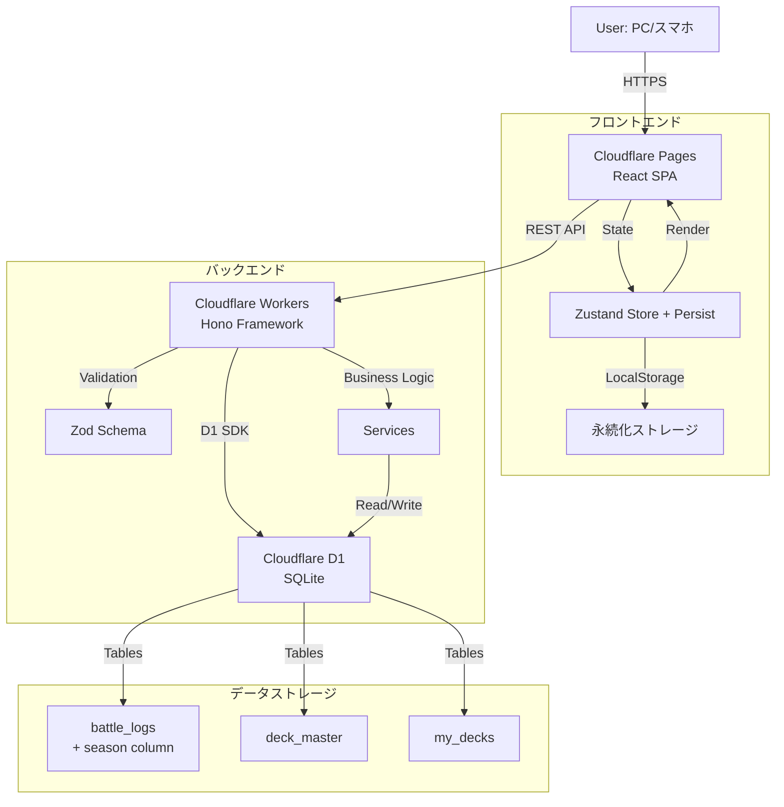
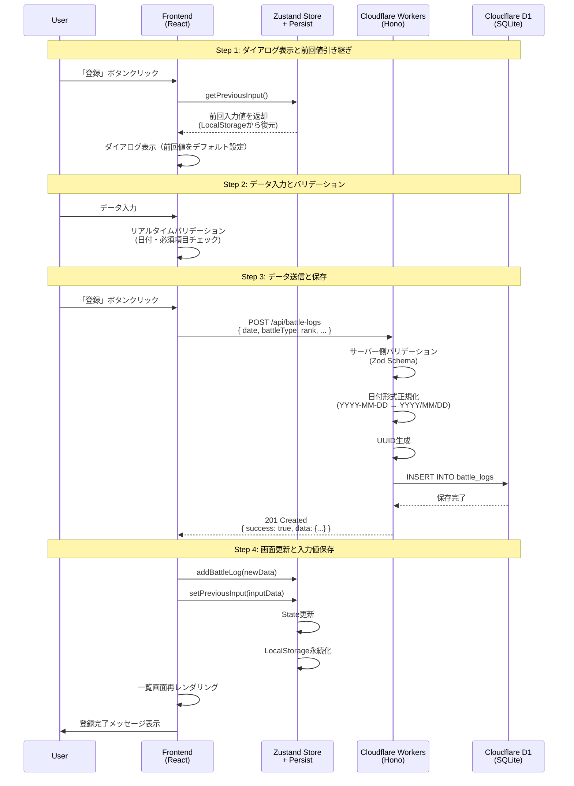
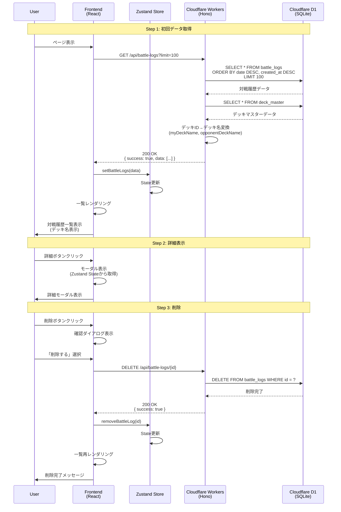
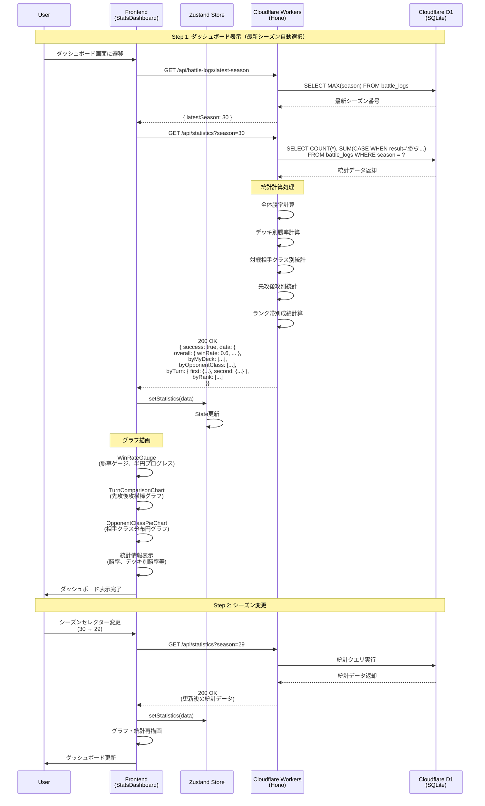
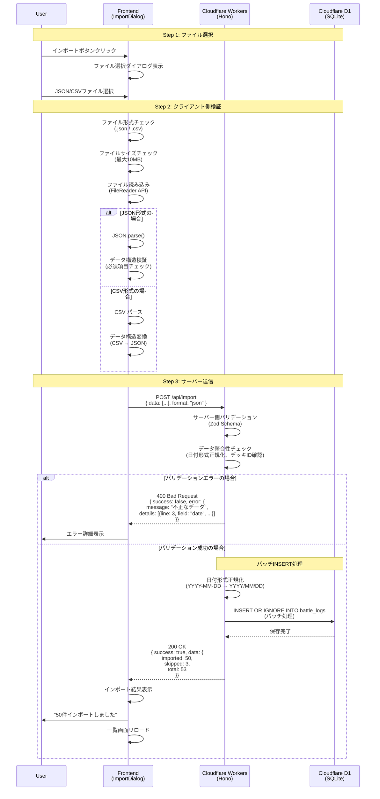
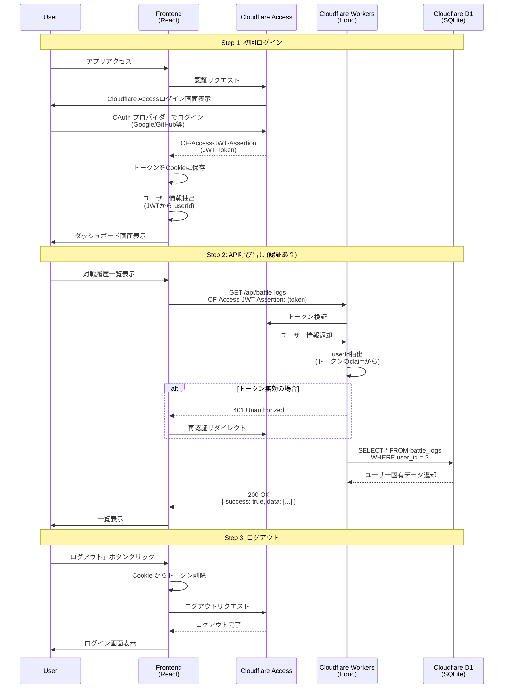
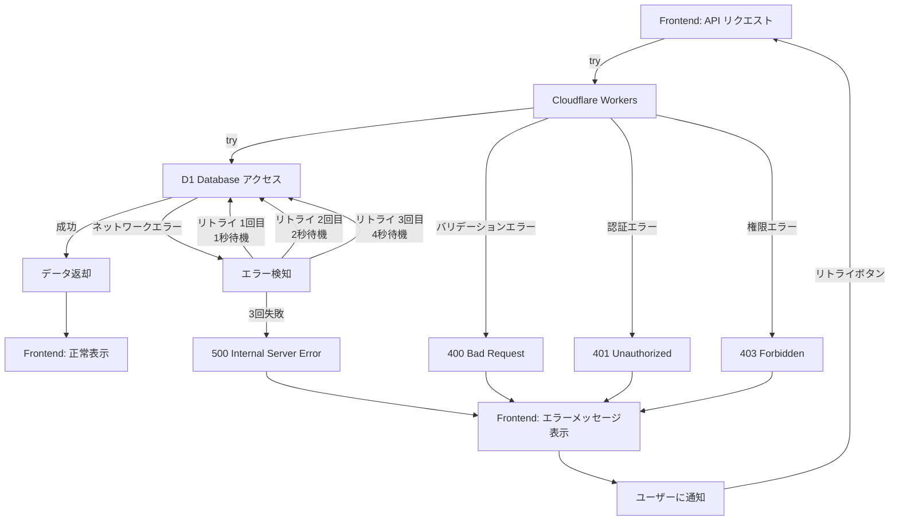
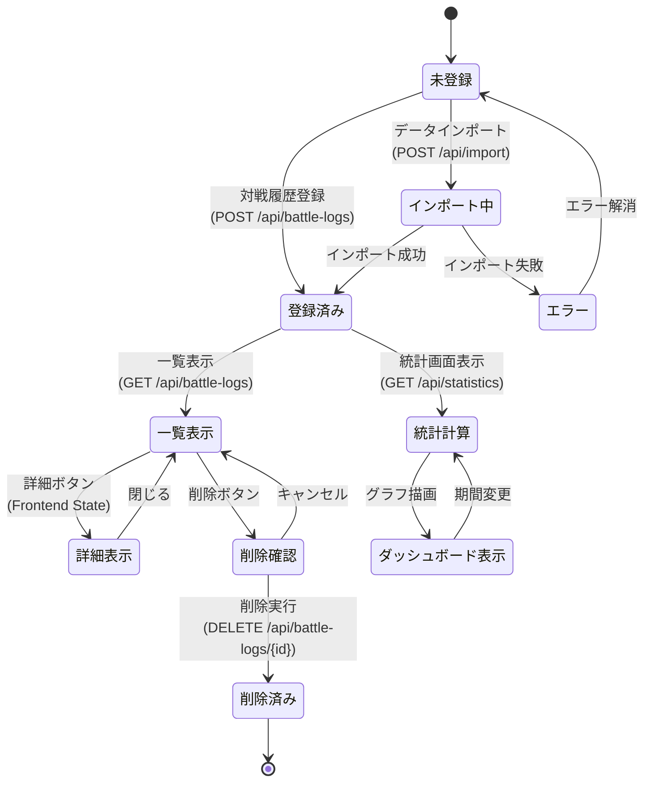

# データフロー図 (Cloudflare版)

**【信頼性レベル凡例】**:
- 🔵 **青信号**: EARS要件定義書・設計文書を参考にしてほぼ推測していない場合
- 🟡 **黄信号**: EARS要件定義書・設計文書から妥当な推測の場合
- 🔴 **赤信号**: EARS要件定義書・設計文書にない推測の場合

---

## システム全体のデータフロー 🔵 *要件定義書より*



---

## Phase 1: 対戦履歴登録フロー 🔵 *REQ-001〜005より*



---

## Phase 1: 対戦履歴一覧表示フロー 🔵 *REQ-101〜106より*



---

## Phase 1: 統計計算・ダッシュボード表示フロー 🔵 *REQ-201〜205より*



---

## Phase 1: データインポートフロー 🔵 *REQ-301〜303より*



---

## Phase 2: 認証フロー (Cloudflare Access) 🔵 *REQ-701〜702より*



---

## エラーハンドリングフロー 🔵 *EDGE-001, EDGE-002より*



---

## データキャッシュ戦略 🟡 *パフォーマンス要件から妥当な推測*

```mermaid
flowchart TD
    A[Frontend: データ要求] --> B{Zustand Store<br/>にキャッシュあり?}

    B -->|はい| C{TTL<br/>5分以内?}
    C -->|はい| D[キャッシュから返却]
    C -->|いいえ| E[API リクエスト]

    B -->|いいえ| E

    E --> F[Cloudflare Workers]
    F --> G[D1 Database]
    G --> H[データ取得]
    H --> I[Frontend: State 更新]
    I --> J[TTL設定: 5分]
    J --> K[データ表示]

    D --> K

    L[ユーザーがデータ変更<br/>(登録・削除)] --> M[キャッシュ無効化]
    M --> E

    N[フォーム入力] --> O[Zustand Persist]
    O --> P[LocalStorage保存]
    P --> Q[ブラウザ更新後も復元]
```

---

## Phase 1 データライフサイクル 🔵 *要件定義書より*



---

## 更新履歴

- **2025-12-06**: シーズン機能・グラフィカルダッシュボード追加
  - battle_logsテーブルにseasonカラム追加
  - 統計ダッシュボードフローを最新シーズン自動選択対応に更新
  - グラフィカルダッシュボードコンポーネント（WinRateGauge、TurnComparisonChart、OpponentClassPieChart）を追加
  - シーズンセレクターによるフィルタリングフローを追加
  - 対戦相手クラス別統計・先攻後攻別統計フローを追加
- **2025-12-05**: Cloudflare版に全面更新
  - Azure (Functions, Blob Storage) → Cloudflare (Workers, D1) に移行
  - Zustand persist middleware によるフォーム入力永続化フローを追加
  - 日付形式正規化（YYYY-MM-DD → YYYY/MM/DD）フローを追加
  - BattleLogWithDeckNames型によるデッキ名表示フローを追加
  - Phase 2認証をAzure AD B2CからCloudflare Accessに変更
- **2025-10-23**: 初版作成（tsumiki:kairo-design により自動生成）
  - Phase 1（基本機能）のデータフロー定義
  - Phase 2（認証機能）のデータフロー定義
  - エラーハンドリング・キャッシュ戦略・データライフサイクルを追加
