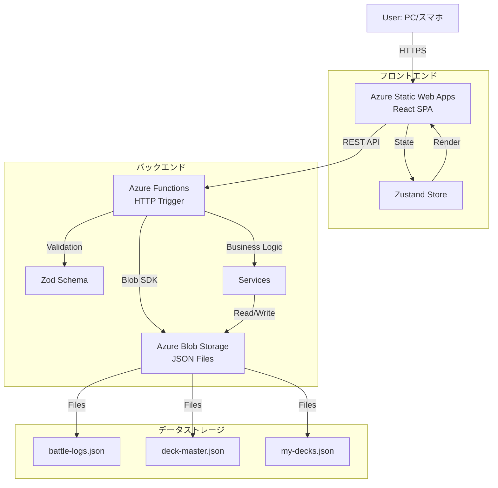
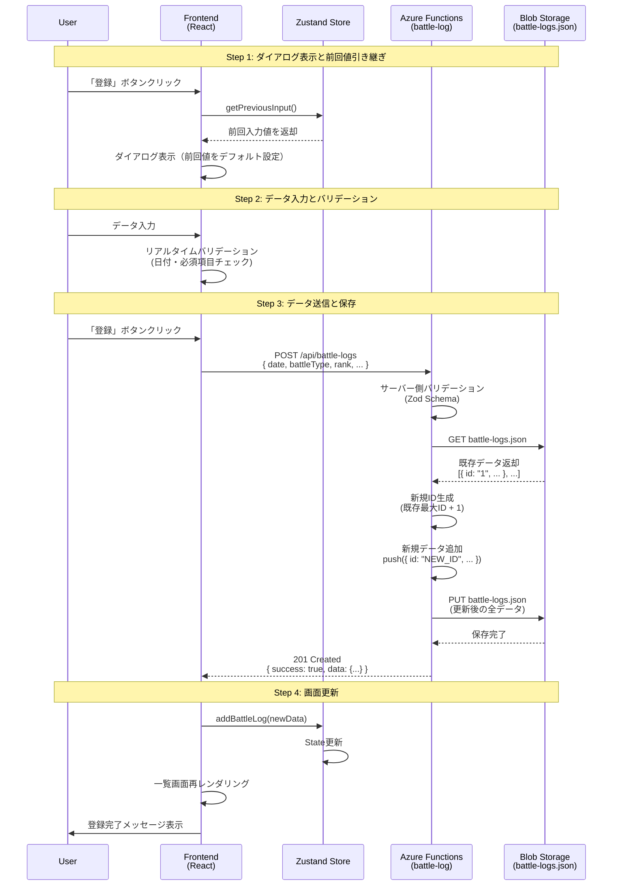
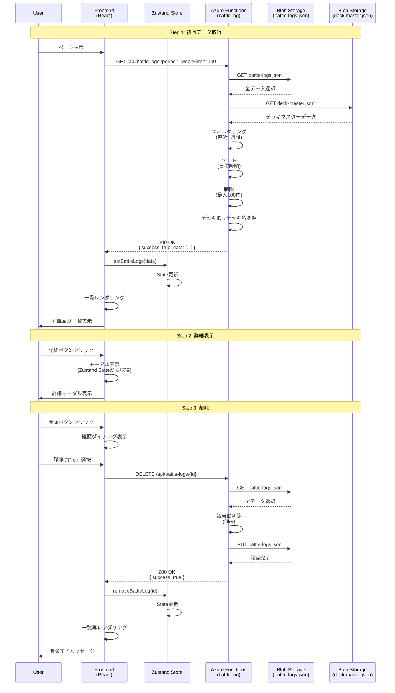
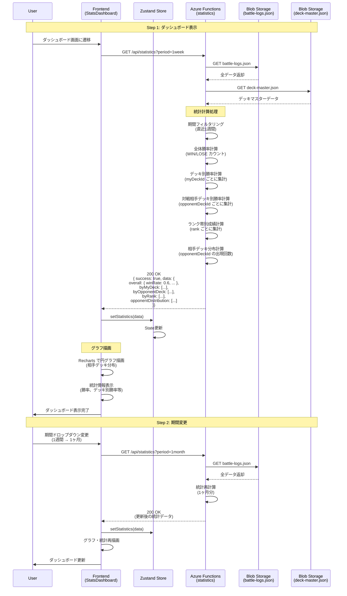
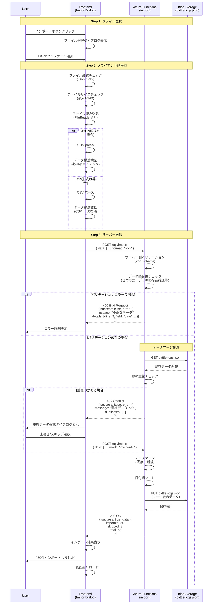
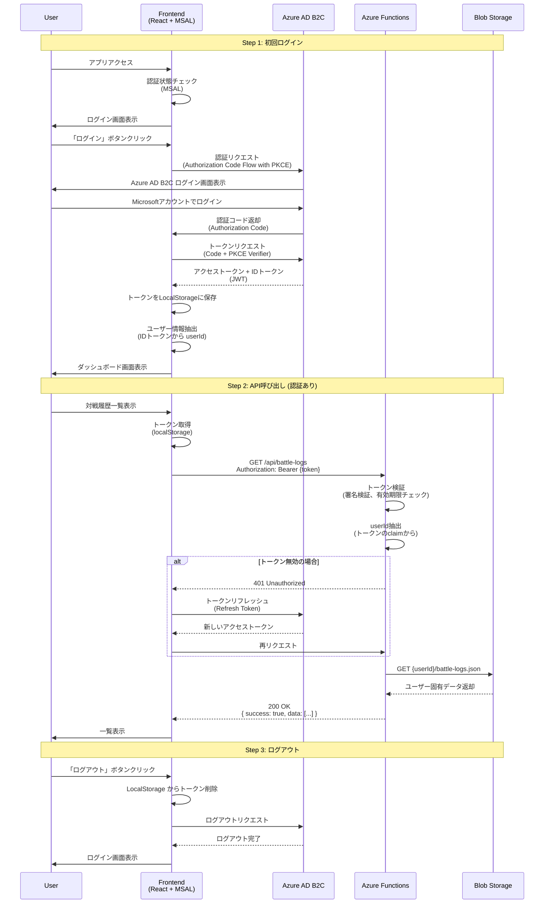
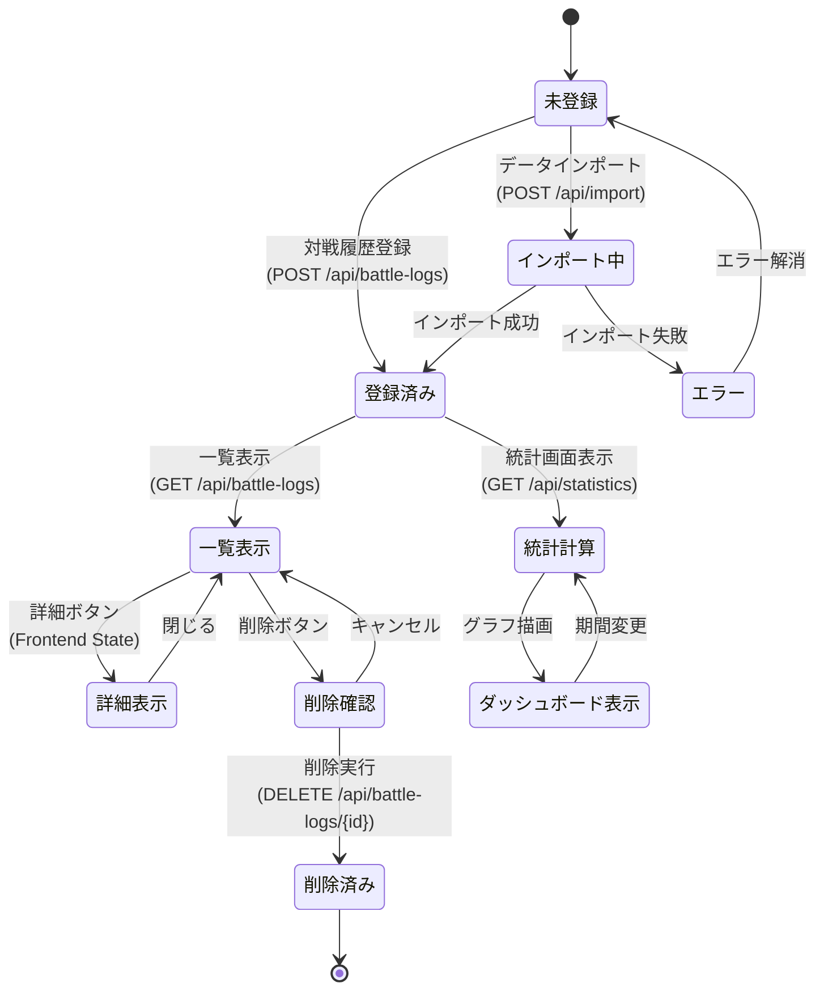

# データフロー図

**【信頼性レベル凡例】**:
- 🔵 **青信号**: EARS要件定義書・設計文書を参考にしてほぼ推測していない場合
- 🟡 **黄信号**: EARS要件定義書・設計文書から妥当な推測の場合
- 🔴 **赤信号**: EARS要件定義書・設計文書にない推測の場合

---

## システム全体のデータフロー 🔵 *要件定義書より*



---

## Phase 1: 対戦履歴登録フロー 🔵 *REQ-001〜005より*



---

## Phase 1: 対戦履歴一覧表示フロー 🔵 *REQ-101〜106より*



---

## Phase 1: 統計計算・ダッシュボード表示フロー 🔵 *REQ-201〜205より*



---

## Phase 1: データインポートフロー 🔵 *REQ-301〜303より*



---

## Phase 2: 認証フロー (Azure AD B2C) 🔵 *REQ-701〜702より*



---

## エラーハンドリングフロー 🔵 *EDGE-001, EDGE-002より*


---

## データキャッシュ戦略 🟡 *パフォーマンス要件から妥当な推測*

```mermaid
flowchart TD
    A[Frontend: データ要求] --> B{Zustand Store<br/>にキャッシュあり?}

    B -->|はい| C{TTL<br/>5分以内?}
    C -->|はい| D[キャッシュから返却]
    C -->|いいえ| E[API リクエスト]

    B -->|いいえ| E

    E --> F[Azure Functions]
    F --> G[Blob Storage]
    G --> H[データ取得]
    H --> I[Frontend: State 更新]
    I --> J[TTL設定: 5分]
    J --> K[データ表示]

    D --> K

    L[ユーザーがデータ変更<br/>(登録・削除)] --> M[キャッシュ無効化]
    M --> E
```

---

## Phase 1 データライフサイクル 🔵 *要件定義書より*



---

## 更新履歴

- **2025-10-23**: 初版作成（tsumiki:kairo-design により自動生成）
  - Phase 1（基本機能）のデータフロー定義
  - Phase 2（認証機能）のデータフロー定義
  - エラーハンドリング・キャッシュ戦略・データライフサイクルを追加
