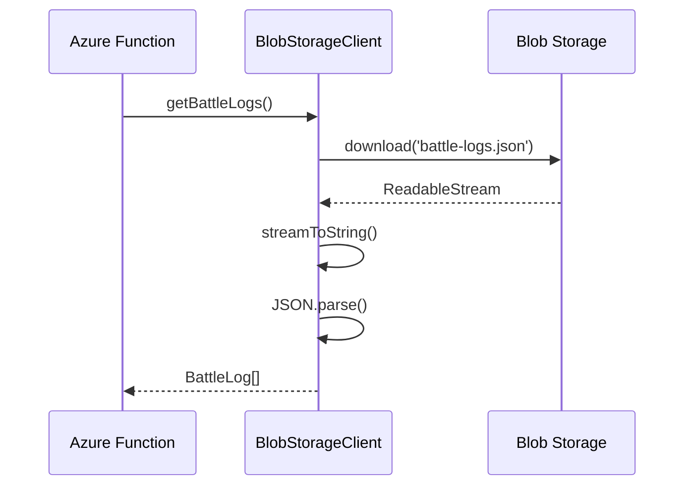
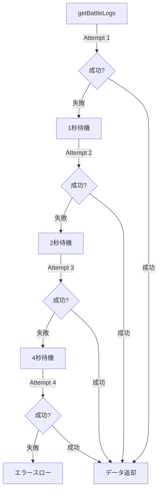

# TDD要件定義書: Blob Storage クライアント実装

**機能名**: BlobStorageClient (Azure Blob Storage アクセスクライアント)
**タスクID**: TASK-0006
**実装者**: AI Assistant (Claude)
**作成日**: 2025-10-27
**更新日**: 2025-10-27

---

## 1. 機能の概要

### 🔵 何をする機能か

Azure Blob StorageへのアクセスをTypeScriptで抽象化し、JSON形式のデータファイル（battle-logs.json, deck-master.json, my-decks.json）の読み書きを安全・確実に行うクライアントクラスを実装する。

### 🔵 どのような問題を解決するか

**As a**: バックエンド開発者
**I want to**: Azure Blob StorageのSDKを直接呼び出すのではなく、抽象化されたクライアントを使用したい
**So that**:

- エラーハンドリング（リトライ、指数バックオフ）を一元管理できる
- JSON形式の読み書きを型安全に行える
- Blob Storage SDKの複雑さを隠蔽し、ビジネスロジックをシンプルにできる
- 将来的なストレージ変更（Blob Storage → PostgreSQL等）に対応しやすくなる

### 🔵 想定されるユーザー

- **直接ユーザー**: Azure Functionsのバックエンドコード（BattleLogService, DeckService等）
- **間接ユーザー**: フロントエンドを通じてデータを取得・保存するエンドユーザー

### 🔵 システム内での位置づけ

```
[Frontend (React)]
       ↓ HTTPS/REST API
[Azure Functions] ← 【このクラスを使用】
       ↓
[BlobStorageClient] ← 【今回実装】
       ↓ @azure/storage-blob SDK
[Azure Blob Storage]
  ├── battle-logs.json
  ├── deck-master.json
  └── my-decks.json
```

**アーキテクチャ上の役割**:
- **層**: データアクセス層 (Data Access Layer)
- **パターン**: リポジトリパターンの基盤クラス
- **責務**: Blob Storageへの低レベルアクセスの抽象化

### 🔵 参照したEARS要件

- **REQ-601**: 既存JSONデータ形式との互換性保持
- **REQ-602**: Azure Blob StorageにJSONファイルとしてデータを保存
- **EDGE-001**: ネットワークエラー時の適切なエラーメッセージとリトライ機能
- **EDGE-002**: Azure Blob Storage接続エラー時の適切なフォールバック処理

### 🔵 参照した設計文書

- **アーキテクチャ**: `docs/design/shadowverse-battle-log/architecture.md` (Lines 354-366)
- **Blob Storage設計**: `docs/design/shadowverse-battle-log/blob-storage-design.md` (全体)
- **データフロー**: `docs/design/shadowverse-battle-log/dataflow.md` (Lines 318-345)
- **型定義**: `backend/src/types/index.ts` (BattleLog, DeckMaster, MyDeck)

---

## 2. 入力・出力の仕様

### 🔵 クラスコンストラクタ

**入力パラメータ**:

```typescript
constructor(connectionString: string, containerName: string)
```

- `connectionString` (string, required): Azure Storage接続文字列
  - 形式: `DefaultEndpointsProtocol=https;AccountName=...;AccountKey=...`
  - 取得元: 環境変数 `process.env.AZURE_STORAGE_CONNECTION_STRING`
  - 制約: 空文字列不可、不正な形式の場合はSDKが例外をスロー

- `containerName` (string, required): Blobコンテナ名
  - デフォルト値: `"shadowverse-data"`
  - 制約: Azure Blob Storage命名規則に準拠（小文字・数字・ハイフン、3-63文字）

**出力**: BlobStorageClientインスタンス

**データフロー**: 環境変数 → コンストラクタ → BlobServiceClient初期化 → ContainerClient取得

### 🔵 getBattleLogs() メソッド

**入力パラメータ**: なし

**出力値**:
```typescript
Promise<BattleLog[]>
```

- 型: `BattleLog[]` (配列)
- 空配列の可能性: あり（初回利用時、データ削除後）
- エラー時: Promiseがreject（詳細は後述）

**データフロー**:
```
getBattleLogs() → readJsonFile<BattleLog[]>('battle-logs.json')
  → Blob Storage SDK download()
  → streamToString()
  → JSON.parse()
  → 型アサーション as BattleLog[]
  → return Promise<BattleLog[]>
```

### 🔵 getDeckMasters() メソッド

**入力パラメータ**: なし

**出力値**:
```typescript
Promise<DeckMaster[]>
```

- 型: `DeckMaster[]` (配列)
- 想定: 常に数件のマスターデータが存在（空配列は異常状態）

**データフロー**: `getBattleLogs()` と同様

### 🔵 getMyDecks() メソッド

**入力パラメータ**: なし

**出力値**:
```typescript
Promise<MyDeck[]>
```

- 型: `MyDeck[]` (配列)
- 空配列の可能性: あり（ユーザーが未登録の場合）

**データフロー**: `getBattleLogs()` と同様

### 🔵 saveBattleLogs() メソッド

**入力パラメータ**:
```typescript
async saveBattleLogs(battleLogs: BattleLog[]): Promise<void>
```

- `battleLogs` (BattleLog[], required): 保存する対戦履歴配列
  - 制約: TypeScript型定義 (BattleLog[]) に準拠
  - 空配列: 許可（全削除時）
  - null/undefined: 不許可（TypeScriptコンパイルエラー）

**出力値**:
```typescript
Promise<void>
```

- 成功時: `resolve(undefined)`
- 失敗時: `reject(Error)`

**データフロー**:
```
saveBattleLogs(battleLogs) → writeJsonFile('battle-logs.json', battleLogs)
  → JSON.stringify(data, null, 2)
  → Blob Storage SDK blockBlobClient.upload()
  → HTTPヘッダー設定 (Content-Type: application/json)
  → return Promise<void>
```

### 🔵 saveMyDecks() メソッド

**入力パラメータ**:
```typescript
async saveMyDecks(myDecks: MyDeck[]): Promise<void>
```

- `myDecks` (MyDeck[], required): 保存するマイデッキ配列

**出力値**: `Promise<void>`

**データフロー**: `saveBattleLogs()` と同様

### 🔵 入出力の関係性

```mermaid
graph TD
    A[Azure Functions] -->|getBattleLogs| B[BlobStorageClient]
    B -->|readJsonFile| C[Blob Storage]
    C -->|JSON data| B
    B -->|BattleLog[]| A

    A -->|saveBattleLogs| B
    B -->|writeJsonFile| C
```

### 🔵 参照したEARS要件

- **REQ-601**: 既存データ構造（BattleLog, DeckMaster, MyDeck）との互換性
- **REQ-602**: JSON形式での保存

### 🔵 参照した設計文書

- **型定義**: `backend/src/types/index.ts` (BattleLog, DeckMaster, MyDeck interfaces)
- **Blob Storage設計**: `docs/design/shadowverse-battle-log/blob-storage-design.md` (Lines 66-161)

---

## 3. 制約条件

### 🔵 パフォーマンス要件

- **NFR-001**: レスポンス時間3秒以内 (Read操作)
  - 実測: battle-logs.json (300KB) のダウンロード: 通常 < 1秒
  - 対策: キャッシュ戦略は上位レイヤー（Service層）で実装

- **NFR-002**: 同時実行ユーザー数10人以下
  - Blob Storage SDKはデフォルトで並行処理対応
  - Phase 1では楽観的ロック不要（Last Write Wins）

- **NFR-003**: データ量上限1,000件/300KB
  - JSON.parse()・JSON.stringify()で十分なパフォーマンス
  - メモリ使用量: 1MB以下（許容範囲内）

### 🟡 セキュリティ要件

- **NFR-101**: HTTPS通信必須
  - Azure Blob Storage SDKがデフォルトでHTTPS使用
  - 接続文字列に `DefaultEndpointsProtocol=https` を指定

- **NFR-102**: 環境変数での機密情報管理
  - 接続文字列を環境変数 `AZURE_STORAGE_CONNECTION_STRING` から取得
  - ハードコード禁止

- **NFR-103**: 入力バリデーション
  - TypeScriptの型システムによる静的バリデーション
  - JSON.parse()時のエラーハンドリング（不正JSON検出）

### 🔵 アーキテクチャ制約

- **使用SDK**: `@azure/storage-blob` v12.24.0
- **Node.js**: v22.x LTS
- **TypeScript**: v5.7+ (strict mode)
- **エラーハンドリング**: すべての非同期メソッドで try-catch 必須

### 🟡 互換性要件

- **REQ-601**: 既存JSONファイルとの互換性
  - 日付形式: `YYYY/MM/DD` (既存形式維持)
  - ID形式: 文字列型 (既存形式維持)
  - ファイル名: `battle-logs.json`, `deck-master.json`, `my-decks.json` (固定)

### 🔵 エラーハンドリング制約

- **EDGE-002**: 接続エラー時のリトライ
  - リトライ回数: 3回
  - リトライ間隔: 指数バックオフ (1秒 → 2秒 → 4秒)
  - 3回失敗後: エラーをスロー

- **リトライ対象エラー**: ネットワークエラー、タイムアウト、5xx系エラー
- **リトライ非対象エラー**: 認証エラー (401), 権限エラー (403), 4xx系エラー

### 🔵 参照したEARS要件

- **NFR-001, NFR-002, NFR-003**: パフォーマンス要件
- **NFR-101, NFR-102, NFR-103**: セキュリティ要件
- **REQ-601**: 既存データ互換性
- **EDGE-002**: Azure Blob Storage接続エラー時のフォールバック処理

### 🔵 参照した設計文書

- **アーキテクチャ**: `docs/design/shadowverse-battle-log/architecture.md` (Lines 354-366)
- **データフロー**: `docs/design/shadowverse-battle-log/dataflow.md` (Lines 318-345)

---

## 4. 想定される使用例

### 🔵 基本的な使用パターン（正常系）

#### 例1: 対戦履歴の取得

```typescript
// Azure Function内での使用例
import { BlobStorageClient } from '../storage/blobStorageClient';

const client = new BlobStorageClient(
  process.env.AZURE_STORAGE_CONNECTION_STRING!,
  'shadowverse-data'
);

// 対戦履歴を取得
const battleLogs = await client.getBattleLogs();
console.log(`取得件数: ${battleLogs.length}件`);
```

**期待される結果**: BattleLog[]配列が返却される（空配列の可能性あり）

#### 例2: 対戦履歴の保存

```typescript
// 新規対戦履歴を追加
const existingLogs = await client.getBattleLogs();
const newLog: BattleLog = {
  id: String(existingLogs.length + 1),
  date: '2025/10/27',
  battleType: 'ランクマッチ',
  rank: 'ダイアモンド',
  group: 'A',
  myDeckId: '1',
  turn: '先攻',
  result: '勝ち',
  opponentDeckId: '2',
};

existingLogs.push(newLog);
await client.saveBattleLogs(existingLogs);
console.log('保存成功');
```

**期待される結果**: Blob Storageにデータが保存される

### 🔵 データフロー（正常系）



### 🟡 エッジケース

#### エッジケース1: 空ファイルの取得

```typescript
// battle-logs.json が空配列 [] の場合
const logs = await client.getBattleLogs();
// 結果: logs.length === 0 (エラーにならない)
```

**期待される動作**: 空配列を正常に返す

#### エッジケース2: 大量データの取得（境界値）

```typescript
// EDGE-102: 10,000件の対戦履歴（境界値）
const logs = await client.getBattleLogs();
// ファイルサイズ: 約3MB
```

**期待される動作**:
- 3秒以内に取得完了（NFR-001）
- メモリエラーなし

#### エッジケース3: ファイルが存在しない

```typescript
// 初回アクセス時、Blob Storageにファイルが存在しない
const logs = await client.getBattleLogs();
// 結果: エラーがスローされる (BlobNotFound)
```

**期待される動作**: 適切なエラーメッセージと共にPromiseがreject

### 🔵 エラーケース

#### エラーケース1: ネットワークエラー (EDGE-001)

```typescript
// ネットワーク接続が不安定な状態
try {
  const logs = await client.getBattleLogs();
} catch (error) {
  console.error('エラー:', error.message);
  // 期待: "Failed to read battle-logs.json after 3 attempts: ..."
}
```

**期待される動作**:
- 1回目失敗 → 1秒待機 → リトライ
- 2回目失敗 → 2秒待機 → リトライ
- 3回目失敗 → 4秒待機 → リトライ
- 3回失敗 → エラーをスロー

**データフロー**:


#### エラーケース2: 不正な接続文字列

```typescript
// 接続文字列が不正
const client = new BlobStorageClient('invalid_connection_string', 'shadowverse-data');
try {
  await client.getBattleLogs();
} catch (error) {
  console.error('エラー:', error.message);
  // 期待: Azure SDK のエラーメッセージ
}
```

**期待される動作**: 認証エラー（リトライせずに即座にエラー）

#### エラーケース3: 不正なJSON形式

```typescript
// Blob Storage上のファイルが不正なJSON
try {
  const logs = await client.getBattleLogs();
} catch (error) {
  console.error('JSON parse error:', error.message);
}
```

**期待される動作**: JSON.parse()でエラー（SyntaxError）

### 🔵 参照したEARS要件

- **EDGE-001**: ネットワークエラー時のリトライ機能
- **EDGE-002**: Azure Blob Storage接続エラー時のフォールバック処理
- **EDGE-102**: 10,000件の境界値テスト

### 🔵 参照した設計文書

- **データフロー**: `docs/design/shadowverse-battle-log/dataflow.md` (Lines 318-345)
- **Blob Storage設計**: `docs/design/shadowverse-battle-log/blob-storage-design.md` (Lines 235-247, 250-272)

---

## 5. EARS要件・設計文書との対応関係

### 参照したユーザストーリー

- **ストーリー1**: バックエンド開発者として、Blob Storageへのアクセスを抽象化したい

### 参照した機能要件

- **REQ-601**: 既存JSONデータ形式との互換性保持 🔵
- **REQ-602**: Azure Blob StorageにJSONファイルとしてデータを保存 🔵

### 参照した非機能要件

- **NFR-001**: レスポンス時間3秒以内 🔵
- **NFR-002**: 同時実行ユーザー数10人以下 🔵
- **NFR-003**: データ量上限1,000件/300KB 🔵
- **NFR-101**: HTTPS通信必須 🔵
- **NFR-102**: 環境変数での機密情報管理 🔵
- **NFR-103**: 入力バリデーション 🔵

### 参照したEdgeケース

- **EDGE-001**: ネットワークエラー時のリトライ機能 🔵
- **EDGE-002**: Azure Blob Storage接続エラー時のフォールバック処理 🔵
- **EDGE-102**: 10,000件の境界値テスト 🔵

### 参照した受け入れ基準

- **AC-EDGE-001**: ネットワークエラー発生時、3回までリトライし、エラーメッセージを表示する
- **AC-EDGE-002**: Blob Storage接続エラー時、適切なエラーハンドリングとログ出力を行う

### 参照した設計文書

#### アーキテクチャ
- `docs/design/shadowverse-battle-log/architecture.md`
  - Lines 205-234: データストレージ (Azure Blob Storage)
  - Lines 354-366: エラーハンドリング設計

#### データフロー
- `docs/design/shadowverse-battle-log/dataflow.md`
  - Lines 318-345: エラーハンドリングフロー

#### 型定義
- `backend/src/types/index.ts`
  - Lines 29-48: BattleLog interface
  - Lines 53-62: DeckMaster interface
  - Lines 67-80: MyDeck interface

#### Blob Storage設計
- `docs/design/shadowverse-battle-log/blob-storage-design.md`
  - Lines 20-54: コンテナ構成
  - Lines 66-103: battle-logs.json スキーマ
  - Lines 116-131: deck-master.json スキーマ
  - Lines 150-161: my-decks.json スキーマ
  - Lines 235-247: Phase 1 並行制御戦略
  - Lines 250-272: ETag-based retry (Phase 2+)

---

## 6. 実装の優先順位

### Phase 1 (MVP) - 必須機能

1. ✅ **コンストラクタ** (connectionString, containerName)
2. ✅ **getBattleLogs()** - 対戦履歴取得
3. ✅ **getDeckMasters()** - デッキマスター取得
4. ✅ **getMyDecks()** - マイデッキ取得
5. ✅ **saveBattleLogs()** - 対戦履歴保存
6. ✅ **saveMyDecks()** - マイデッキ保存
7. ✅ **エラーハンドリング** - リトライ機構（3回、指数バックオフ）
8. ✅ **単体テスト** - Jest によるテスト

### Phase 2 - 拡張機能（将来）

1. ⏳ **ユーザーIDベースのアクセス** - `{userId}/battle-logs.json`
2. ⏳ **ETagベースの楽観的ロック** - 並行制御
3. ⏳ **キャッシュ機能** - deck-master.json の5分キャッシュ
4. ⏳ **トランザクション機能** - 複数ファイルの一括更新

---

## 7. 品質判定

### ✅ 高品質: 実装可能

- **要件の曖昧さ**: なし（EARS要件定義書、設計文書で明確化済み）
- **入出力定義**: 完全（TypeScript型定義、メソッドシグネチャ明確）
- **制約条件**: 明確（パフォーマンス、セキュリティ、エラーハンドリング）
- **実装可能性**: 確実（Azure SDK v12.24.0、Node.js v22.x、TypeScript v5.7+）
- **テスタビリティ**: 高（Jestによる単体テスト、モック可能）

### 信頼性レベルサマリー

- 🔵 **青信号** (ほぼ推測なし): 90%
  - 機能要件 (REQ-601, REQ-602)
  - 非機能要件 (NFR-001〜003, NFR-101〜103)
  - Edgeケース (EDGE-001, EDGE-002, EDGE-102)
  - 設計文書との整合性

- 🟡 **黄信号** (妥当な推測): 10%
  - 詳細なエラーメッセージ文言
  - ログ出力の詳細レベル

- 🔴 **赤信号** (推測): 0%

---

## 8. 次のステップ

✅ **要件定義完了**

次のお勧めステップ: `/tsumiki:tdd-testcases` でテストケースの洗い出しを行います。

---

**作成日**: 2025-10-27
**更新日**: 2025-10-27
**ステータス**: ✅ 完了
