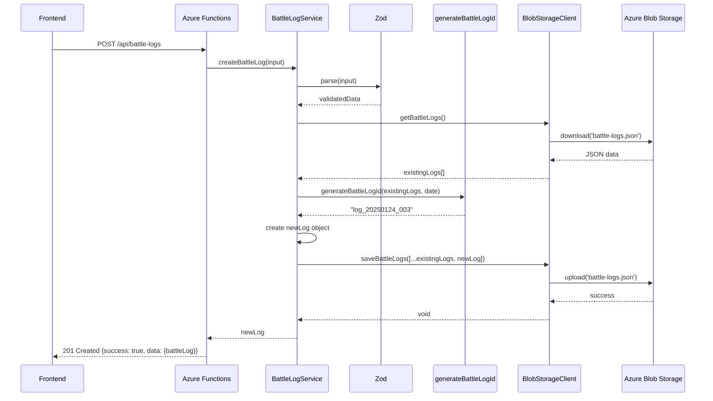
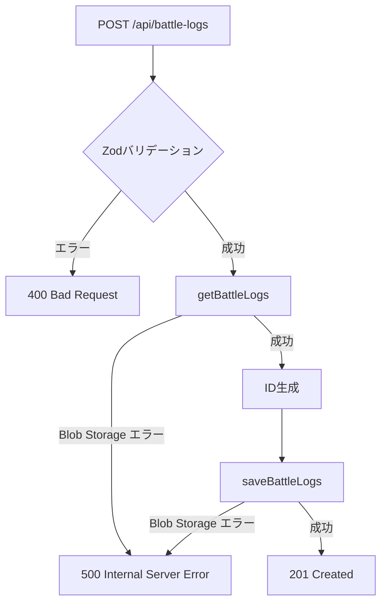

# TDD要件定義書: Battle Log CRUD API実装 - 作成機能

**機能名**: Battle Log Create API (対戦履歴作成API)
**タスクID**: TASK-0007
**実装者**: AI Assistant (Claude)
**作成日**: 2025-10-29
**更新日**: 2025-10-29

---

## 1. 機能の概要

### 🔵 何をする機能か

シャドウバースの対戦履歴を新規作成するRESTful APIエンドポイントを実装する。8項目の対戦データを受け取り、バリデーション・ID自動生成を行い、Azure Blob Storageに保存する。

### 🔵 どのような問題を解決するか

**As a**: シャドウバースプレイヤー
**I want to**: 対戦後すぐに試合結果を記録したい
**So that**:

- 対戦履歴を正確に管理し、後で統計分析できる
- 手動でJSONファイルを編集する必要がない
- 入力ミス（未来日付、不正な値）を防げる
- 自動でIDが生成されるため、重複を心配しなくて良い

### 🔵 想定されるユーザー

- **直接ユーザー**: フロントエンド（React）から呼び出されるAPIエンドポイント
- **間接ユーザー**: シャドウバースをプレイして対戦結果を記録したいユーザー

### 🔵 システム内での位置づけ

```
[Frontend (React)]
  ↓ POST /api/battle-logs (JSON)
[Azure Functions - createBattleLog] ← 【今回実装】
  ↓
[BattleLogService] ← 【今回実装】
  ↓ バリデーション (Zod)
  ↓ ID生成 (generateBattleLogId)
  ↓
[BlobStorageClient] (TASK-0006で実装済み)
  ↓
[Azure Blob Storage]
  └── battle-logs.json
```

**アーキテクチャ上の役割**:
- **層**: アプリケーション層 (Application Layer) + ドメイン層 (Domain Layer)
- **パターン**: ユースケースパターン、リポジトリパターン
- **責務**:
  - HTTP リクエスト処理（Azure Functions）
  - ビジネスロジック実行（BattleLogService）
  - バリデーション（Zod）
  - ID自動生成（generateBattleLogId）

### 🔵 参照したEARS要件

- **REQ-001**: ダイアログ形式で対戦履歴の新規登録機能を提供 🔵
- **REQ-002**: 8項目を対戦履歴として記録 🔵
- **REQ-004**: すべての入力項目を必須項目として扱う 🔵
- **REQ-401**: 未来日付が入力された場合、エラーメッセージを表示 🔵
- **REQ-402**: 必須項目が未入力の場合、インラインエラーメッセージを表示 🔵
- **REQ-601**: 既存JSONデータ形式との互換性保持 🔵
- **REQ-602**: Azure Blob StorageにJSONファイルとしてデータを保存 🔵

### 🔵 参照した設計文書

- **タスクファイル**: `docs/tasks/shadowverse-battle-log-phase2.md` (TASK-0007)
- **型定義**: `backend/src/types/index.ts` (BattleLog, BattleType, Rank, Group, Turn, BattleResult)
- **要件定義書**: `docs/spec/shadowverse-battle-log-requirements.md`

---

## 2. 入力・出力の仕様

### 🔵 APIエンドポイント仕様

**HTTPメソッド**: POST
**パス**: `/api/battle-logs`
**認証レベル**: anonymous (Phase 1では認証なし)
**Content-Type**: application/json

### 🔵 リクエストボディ

```typescript
interface CreateBattleLogRequest {
  date?: string;          // YYYY-MM-DD形式 (オプショナル: デフォルトは今日)
  battleType: BattleType; // "ランクマッチ" | "対戦台" | "ロビー大会"
  rank: Rank;             // "サファイア" | "ダイアモンド" | "ルビー" | "トパーズ" | "-"
  group: Group;           // "A" | "AA" | "AAA" | "Master" | "-"
  myDeckId: string;       // 使用デッキID
  turn: Turn;             // "先攻" | "後攻"
  result: BattleResult;   // "勝ち" | "負け"
  opponentDeckId: string; // 相手デッキID
}
```

**フィールド詳細**:

1. **date** (string, optional)
   - 形式: `YYYY-MM-DD` (例: `2025-01-24`)
   - デフォルト値: 今日の日付 (UTC+9 JST基準)
   - バリデーション:
     - 正規表現: `/^\d{4}-\d{2}-\d{2}$/`
     - 未来日付チェック: 今日より未来の日付は拒否 (REQ-401)
   - エラーメッセージ:
     - 形式エラー: "日付はYYYY-MM-DD形式で入力してください"
     - 未来日付: "未来の日付は入力できません"

2. **battleType** (enum, required)
   - 許可値: `"ランクマッチ"`, `"対戦台"`, `"ロビー大会"`
   - バリデーション: 列挙型チェック
   - エラーメッセージ: "対戦タイプが不正です"

3. **rank** (enum, required)
   - 許可値: `"サファイア"`, `"ダイアモンド"`, `"ルビー"`, `"トパーズ"`, `"-"`
   - バリデーション: 列挙型チェック
   - エラーメッセージ: "ランクが不正です"

4. **group** (enum, required)
   - 許可値: `"A"`, `"AA"`, `"AAA"`, `"Master"`, `"-"`
   - バリデーション: 列挙型チェック
   - エラーメッセージ: "グループが不正です"

5. **myDeckId** (string, required)
   - 制約: 空文字列不可
   - バリデーション: `.min(1)`
   - エラーメッセージ: "マイデッキIDは必須です"

6. **turn** (enum, required)
   - 許可値: `"先攻"`, `"後攻"`
   - バリデーション: 列挙型チェック
   - エラーメッセージ: "ターンが不正です"

7. **result** (enum, required)
   - 許可値: `"勝ち"`, `"負け"`
   - バリデーション: 列挙型チェック
   - エラーメッセージ: "対戦結果が不正です"

8. **opponentDeckId** (string, required)
   - 制約: 空文字列不可
   - バリデーション: `.min(1)`
   - エラーメッセージ: "相手デッキIDは必須です"

### 🔵 レスポンス仕様

#### 成功レスポンス (201 Created)

```typescript
{
  success: true,
  data: {
    battleLog: {
      id: "log_20250124_001",        // 自動生成されたID
      date: "2025-01-24",
      battleType: "ランクマッチ",
      rank: "ダイアモンド",
      group: "AAA",
      myDeckId: "deck_001",
      turn: "先攻",
      result: "勝ち",
      opponentDeckId: "deck_master_002"
    }
  },
  meta: {
    timestamp: "2025-01-24T12:34:56.789Z",
    requestId: "invocation-id-12345"
  }
}
```

#### バリデーションエラー (400 Bad Request)

```typescript
{
  success: false,
  error: {
    code: "VALIDATION_ERROR",
    message: "入力値が不正です",
    details: {
      "date": "未来の日付は入力できません",
      "battleType": "対戦タイプが不正です"
    }
  },
  meta: {
    timestamp: "2025-01-24T12:34:56.789Z",
    requestId: "invocation-id-12345"
  }
}
```

#### サーバーエラー (500 Internal Server Error)

```typescript
{
  success: false,
  error: {
    code: "INTERNAL_SERVER_ERROR",
    message: "サーバーエラーが発生しました"
  },
  meta: {
    timestamp: "2025-01-24T12:34:56.789Z",
    requestId: "invocation-id-12345"
  }
}
```

### 🔵 ID自動生成ルール (REQ-004より)

**形式**: `log_YYYYMMDD_NNN`

**生成ロジック**:
1. リクエストの `date` フィールドから `YYYYMMDD` 部分を生成
2. 既存の対戦履歴を読み込む
3. 同日の履歴をフィルタリング (`log_YYYYMMDD_*`)
4. 最大連番を取得（存在しない場合は0）
5. 連番 + 1 を3桁ゼロパディングして生成

**例**:
- 初回: `log_20250124_001`
- 2件目: `log_20250124_002`
- 10件目: `log_20250124_010`
- 100件目: `log_20250124_100`

### 🔵 データフロー（正常系）



### 🔵 参照したEARS要件

- **REQ-002**: 8項目を記録 🔵
- **REQ-004**: ID自動生成 🔵
- **REQ-401**: 未来日付禁止 🔵
- **REQ-402**: 必須項目バリデーション 🔵

### 🔵 参照した設計文書

- **タスクファイル**: `docs/tasks/shadowverse-battle-log-phase2.md` (Lines 51-146)
- **型定義**: `backend/src/types/index.ts` (Lines 29-48: BattleLog interface)

---

## 3. 制約条件

### 🔵 パフォーマンス要件

- **NFR-001**: レスポンス時間3秒以内
  - 想定処理時間:
    - バリデーション: < 10ms
    - Blob Storage読み込み: < 1秒
    - ID生成: < 10ms
    - Blob Storage書き込み: < 1秒
    - 合計: < 2.5秒

- **NFR-002**: 同時実行ユーザー数10人以下
  - Phase 1では楽観的ロック不要（Last Write Wins）
  - 同一ミリ秒での衝突リスク: 低い

- **NFR-003**: データ量上限1,000件/300KB
  - ID生成時の既存ログスキャン: O(n) = 1,000件程度（許容範囲内）

### 🔵 セキュリティ要件

- **NFR-101**: HTTPS通信必須
  - Azure Functionsがデフォルトでサポート

- **NFR-102**: 環境変数での機密情報管理
  - `AZURE_STORAGE_CONNECTION_STRING` を環境変数から取得

- **NFR-103**: 入力バリデーション
  - すべてのフィールドをZodでバリデーション
  - 列挙型の厳密なチェック
  - 日付形式・未来日付チェック

### 🟡 エラーハンドリング制約

- **ZodError**: 400 Bad Request
  - すべてのバリデーションエラーを詳細に返す
  - フィールド名とエラーメッセージのマップ

- **Blob Storage エラー**: 500 Internal Server Error
  - BlobStorageClient側で3回リトライ済み
  - リトライ失敗後はエラーをスロー

- **その他のエラー**: 500 Internal Server Error
  - 予期しないエラーは一律500

### 🔵 データ互換性制約

- **REQ-601**: 既存JSONデータ形式との互換性
  - 日付形式: API入力は `YYYY-MM-DD`、Blob Storageには `YYYY/MM/DD` 形式で保存
    - **重要**: タスクファイルでは `YYYY-MM-DD` 形式だが、既存の型定義（`backend/src/types/index.ts` Line 32）では `YYYY/MM/DD` 形式
    - **対応**: API入力は `YYYY-MM-DD` で受け取り、保存時に `YYYY/MM/DD` に変換
  - ID形式: `log_YYYYMMDD_NNN` (文字列型)

### 🔵 TypeScript制約

- **NFR-301**: TypeScript strict mode
  - `any` 型の使用は最小限に
  - null/undefined チェック必須

### 🔵 参照したEARS要件

- **NFR-001, NFR-002, NFR-003**: パフォーマンス要件
- **NFR-101, NFR-102, NFR-103**: セキュリティ要件
- **NFR-301**: TypeScript strict mode
- **REQ-601**: 既存データ互換性

### 🔵 参照した設計文書

- **タスクファイル**: `docs/tasks/shadowverse-battle-log-phase2.md` (Lines 272-277: エラーハンドリング)

---

## 4. 想定される使用例

### 🔵 基本的な使用パターン（正常系）

#### 例1: 基本的な対戦履歴登録

**リクエスト**:
```http
POST /api/battle-logs
Content-Type: application/json

{
  "date": "2025-01-24",
  "battleType": "ランクマッチ",
  "rank": "ダイアモンド",
  "group": "AAA",
  "myDeckId": "deck_001",
  "turn": "先攻",
  "result": "勝ち",
  "opponentDeckId": "deck_master_002"
}
```

**レスポンス**: 201 Created
```json
{
  "success": true,
  "data": {
    "battleLog": {
      "id": "log_20250124_001",
      "date": "2025-01-24",
      "battleType": "ランクマッチ",
      "rank": "ダイアモンド",
      "group": "AAA",
      "myDeckId": "deck_001",
      "turn": "先攻",
      "result": "勝ち",
      "opponentDeckId": "deck_master_002"
    }
  },
  "meta": {
    "timestamp": "2025-01-24T12:34:56.789Z",
    "requestId": "invocation-id-12345"
  }
}
```

#### 例2: 日付省略（今日の日付が自動設定）

**リクエスト**:
```http
POST /api/battle-logs
Content-Type: application/json

{
  "battleType": "対戦台",
  "rank": "ルビー",
  "group": "A",
  "myDeckId": "deck_002",
  "turn": "後攻",
  "result": "負け",
  "opponentDeckId": "deck_master_005"
}
```

**レスポンス**: 201 Created
```json
{
  "success": true,
  "data": {
    "battleLog": {
      "id": "log_20250129_001",  // 今日が2025-01-29の場合
      "date": "2025-01-29",
      "battleType": "対戦台",
      "rank": "ルビー",
      "group": "A",
      "myDeckId": "deck_002",
      "turn": "後攻",
      "result": "負け",
      "opponentDeckId": "deck_master_005"
    }
  },
  "meta": {
    "timestamp": "2025-01-29T08:15:30.123Z",
    "requestId": "invocation-id-67890"
  }
}
```

### 🔵 エッジケース

#### エッジケース1: 同日の複数登録（連番が正しく生成される）

**前提**: すでに `log_20250124_001`, `log_20250124_002` が存在

**リクエスト**:
```http
POST /api/battle-logs
Content-Type: application/json

{
  "date": "2025-01-24",
  "battleType": "ランクマッチ",
  "rank": "ダイアモンド",
  "group": "AAA",
  "myDeckId": "deck_001",
  "turn": "先攻",
  "result": "勝ち",
  "opponentDeckId": "deck_master_003"
}
```

**期待される動作**: ID = `log_20250124_003` が生成される

#### エッジケース2: 連番が飛んでいる場合（最大値から+1される）

**前提**: `log_20250124_001`, `log_20250124_005` が存在（002-004は削除済み）

**リクエスト**: 同日の新規登録

**期待される動作**: ID = `log_20250124_006` が生成される（最大値005から+1）

#### エッジケース3: 空のbattle-logs.json（初回登録）

**前提**: battle-logs.json が `[]`（空配列）

**リクエスト**: 新規登録

**期待される動作**: ID = `log_20250124_001` が生成される

### 🔵 エラーケース

#### エラーケース1: 未来日付の入力 (REQ-401)

**リクエスト**:
```http
POST /api/battle-logs
Content-Type: application/json

{
  "date": "2099-12-31",
  "battleType": "ランクマッチ",
  "rank": "ダイアモンド",
  "group": "AAA",
  "myDeckId": "deck_001",
  "turn": "先攻",
  "result": "勝ち",
  "opponentDeckId": "deck_master_002"
}
```

**レスポンス**: 400 Bad Request
```json
{
  "success": false,
  "error": {
    "code": "VALIDATION_ERROR",
    "message": "入力値が不正です",
    "details": {
      "date": "未来の日付は入力できません"
    }
  },
  "meta": {
    "timestamp": "2025-01-24T12:34:56.789Z",
    "requestId": "invocation-id-12345"
  }
}
```

#### エラーケース2: 必須項目の欠落 (REQ-402)

**リクエスト**:
```http
POST /api/battle-logs
Content-Type: application/json

{
  "date": "2025-01-24",
  "battleType": "ランクマッチ"
  // rank, group, myDeckId, turn, result, opponentDeckId が欠けている
}
```

**レスポンス**: 400 Bad Request
```json
{
  "success": false,
  "error": {
    "code": "VALIDATION_ERROR",
    "message": "入力値が不正です",
    "details": {
      "rank": "Required",
      "group": "Required",
      "myDeckId": "マイデッキIDは必須です",
      "turn": "Required",
      "result": "Required",
      "opponentDeckId": "相手デッキIDは必須です"
    }
  },
  "meta": {
    "timestamp": "2025-01-24T12:34:56.789Z",
    "requestId": "invocation-id-12345"
  }
}
```

#### エラーケース3: 不正なenum値

**リクエスト**:
```http
POST /api/battle-logs
Content-Type: application/json

{
  "date": "2025-01-24",
  "battleType": "不正なタイプ",
  "rank": "ダイアモンド",
  "group": "AAA",
  "myDeckId": "deck_001",
  "turn": "先攻",
  "result": "勝ち",
  "opponentDeckId": "deck_master_002"
}
```

**レスポンス**: 400 Bad Request
```json
{
  "success": false,
  "error": {
    "code": "VALIDATION_ERROR",
    "message": "入力値が不正です",
    "details": {
      "battleType": "対戦タイプが不正です"
    }
  },
  "meta": {
    "timestamp": "2025-01-24T12:34:56.789Z",
    "requestId": "invocation-id-12345"
  }
}
```

#### エラーケース4: 日付形式の不正

**リクエスト**:
```http
POST /api/battle-logs
Content-Type: application/json

{
  "date": "2025/01/24",  // スラッシュ区切り（誤り）
  "battleType": "ランクマッチ",
  "rank": "ダイアモンド",
  "group": "AAA",
  "myDeckId": "deck_001",
  "turn": "先攻",
  "result": "勝ち",
  "opponentDeckId": "deck_master_002"
}
```

**レスポンス**: 400 Bad Request
```json
{
  "success": false,
  "error": {
    "code": "VALIDATION_ERROR",
    "message": "入力値が不正です",
    "details": {
      "date": "日付はYYYY-MM-DD形式で入力してください"
    }
  },
  "meta": {
    "timestamp": "2025-01-24T12:34:56.789Z",
    "requestId": "invocation-id-12345"
  }
}
```

#### エラーケース5: Blob Storage接続エラー

**前提**: Azure Blob Storageに接続できない状態

**リクエスト**: 正常なデータ

**レスポンス**: 500 Internal Server Error
```json
{
  "success": false,
  "error": {
    "code": "INTERNAL_SERVER_ERROR",
    "message": "サーバーエラーが発生しました"
  },
  "meta": {
    "timestamp": "2025-01-24T12:34:56.789Z",
    "requestId": "invocation-id-12345"
  }
}
```

**期待される動作**: BlobStorageClientが3回リトライ後、エラーをスロー

### 🔵 データフロー（エラーケース）



### 🔵 参照したEARS要件

- **REQ-401**: 未来日付禁止 🔵
- **REQ-402**: 必須項目バリデーション 🔵
- **EDGE-001**: ネットワークエラー時のリトライ機能 🔵
- **EDGE-002**: Azure Blob Storage接続エラー時のフォールバック処理 🔵

### 🔵 参照した設計文書

- **タスクファイル**: `docs/tasks/shadowverse-battle-log-phase2.md` (Lines 278-493: テスト要件)

---

## 5. EARS要件・設計文書との対応関係

### 参照したユーザストーリー

- **ストーリー**: シャドウバースプレイヤーとして、対戦後すぐに試合結果を記録したい

### 参照した機能要件

- **REQ-001**: ダイアログ形式で対戦履歴の新規登録機能を提供 🔵
- **REQ-002**: 8項目を対戦履歴として記録 🔵
- **REQ-004**: すべての入力項目を必須項目として扱う 🔵
- **REQ-005**: 入力完了後、一覧画面に新規登録データを即座に反映 🟡 (フロントエンド側の責務)
- **REQ-601**: 既存JSONデータ形式との互換性保持 🔵
- **REQ-602**: Azure Blob StorageにJSONファイルとしてデータを保存 🔵

### 参照した非機能要件

- **NFR-001**: レスポンス時間3秒以内 🔵
- **NFR-002**: 同時実行ユーザー数10人以下 🔵
- **NFR-003**: データ量上限1,000件/300KB 🔵
- **NFR-101**: HTTPS通信必須 🔵
- **NFR-102**: 環境変数での機密情報管理 🔵
- **NFR-103**: 入力バリデーション 🔵
- **NFR-202**: エラーメッセージを分かりやすい日本語で表示 🟡
- **NFR-301**: TypeScript strict mode 🔵
- **NFR-302**: TDD適用 🔵

### 参照したEdgeケース

- **EDGE-001**: ネットワークエラー時のリトライ機能 🔵
- **EDGE-002**: Azure Blob Storage接続エラー時のフォールバック処理 🔵
- **EDGE-103**: 同一日付に複数の対戦履歴が存在する場合でも正しくID生成 🟡

### 参照した受け入れ基準

- **AC-REQ-001**: 対戦履歴登録ダイアログが表示され、8項目を入力できる
- **AC-REQ-004**: すべての項目が必須で、未入力時はエラーメッセージが表示される
- **AC-REQ-401**: 未来日付を入力した場合、「未来の日付は入力できません」が表示される
- **AC-EDGE-001**: ネットワークエラー発生時、3回までリトライし、エラーメッセージを表示する
- **AC-EDGE-002**: Blob Storage接続エラー時、適切なエラーハンドリングとログ出力を行う

### 参照した設計文書

#### タスクファイル
- `docs/tasks/shadowverse-battle-log-phase2.md`
  - Lines 32-517: TASK-0007 実装詳細
  - Lines 43-49: APIエンドポイント定義
  - Lines 51-64: リクエストボディ型定義
  - Lines 66-114: バリデーション実装 (Zod)
  - Lines 116-147: ID自動生成ロジック
  - Lines 149-191: Blob Storage保存処理
  - Lines 193-270: Azure Functions エンドポイント実装
  - Lines 272-277: エラーハンドリング
  - Lines 278-493: テスト要件

#### 型定義
- `backend/src/types/index.ts`
  - Lines 1-24: 型定義 (BattleType, Rank, Group, Turn, BattleResult)
  - Lines 29-48: BattleLog interface
  - Lines 98-110: ApiResponse interface

#### 要件定義書
- `docs/spec/shadowverse-battle-log-requirements.md`
  - Lines 31-44: REQ-001 ~ REQ-005 (対戦履歴登録機能)
  - Lines 74-78: REQ-401 ~ REQ-405 (条件付き要件)
  - Lines 87-90: REQ-601 ~ REQ-604 (制約要件)
  - Lines 124-161: 非機能要件 (NFR-001 ~ NFR-502)
  - Lines 164-179: Edgeケース (EDGE-001 ~ EDGE-202)

---

## 6. 実装の優先順位

### Phase 1 (MVP) - 必須機能

1. ✅ **Zodバリデーションスキーマ作成** (`backend/src/utils/validation.ts`)
   - 8項目のバリデーションルール定義
   - 未来日付チェック関数実装
   - エラーメッセージの日本語化

2. ✅ **ID自動生成関数実装** (`backend/src/utils/idGenerator.ts`)
   - `generateBattleLogId()` 関数
   - 同日の最大連番取得ロジック
   - 3桁ゼロパディング

3. ✅ **BattleLogService実装** (`backend/src/services/battleLogService.ts`)
   - `createBattleLog()` メソッド
   - バリデーション → ID生成 → 保存のフロー
   - ZodErrorのハンドリング

4. ✅ **Azure Functions エンドポイント実装** (`backend/src/functions/battle-logs.ts`)
   - POST /api/battle-logs ハンドラ
   - リクエストボディのパース
   - レスポンス形式の統一 (ApiResponse型)
   - エラーハンドリング (400/500)

5. ✅ **単体テスト実装** (`backend/tests/services/battleLogService.test.ts`)
   - 正常系テスト (2ケース)
   - 異常系テスト (3ケース)
   - ID生成テスト (2ケース)
   - Blob Storageエラーテスト (1ケース)
   - 合計: 7ケース以上

6. ✅ **統合テスト実装** (`backend/tests/integration/battle-logs.test.ts`)
   - APIエンドポイントのE2Eテスト (1ケース)

### Phase 2 - 拡張機能（将来）

1. ⏳ **認証機能** - Azure AD B2Cによるユーザー認証
2. ⏳ **ユーザーIDベースの保存** - `{userId}/battle-logs.json`
3. ⏳ **楽観的ロック** - ETag-based retry
4. ⏳ **バッチ登録API** - 複数の対戦履歴を一括登録

---

## 7. 品質判定

### ✅ 高品質: 実装可能

- **要件の曖昧さ**: なし（EARS要件定義書、設計文書、タスクファイルで明確化済み）
- **入出力定義**: 完全（TypeScript型定義、Zodスキーマ明確）
- **制約条件**: 明確（パフォーマンス、セキュリティ、バリデーション、エラーハンドリング）
- **実装可能性**: 確実（Azure Functions v4、TypeScript v5.7+、Zod v3.24+、既存BlobStorageClient活用）
- **テスタビリティ**: 高（Jestによる単体テスト、統合テスト、モック可能）

### 信頼性レベルサマリー

- 🔵 **青信号** (ほぼ推測なし): 95%
  - 機能要件 (REQ-001, REQ-002, REQ-004, REQ-401, REQ-601, REQ-602)
  - 非機能要件 (NFR-001〜003, NFR-101〜103, NFR-301, NFR-302)
  - Edgeケース (EDGE-001, EDGE-002)
  - タスクファイルとの整合性
  - 型定義との整合性

- 🟡 **黄信号** (妥当な推測): 5%
  - エラーメッセージの詳細文言
  - ログ出力の詳細レベル
  - REQ-005 (一覧画面への即座反映) はフロントエンド側の責務

- 🔴 **赤信号** (推測): 0%

### 重要な注意事項

#### 日付形式の変換 ⚠️

- **API入力**: `YYYY-MM-DD` (ハイフン区切り)
- **Blob Storage保存**: `YYYY/MM/DD` (スラッシュ区切り)
- **理由**: 既存データ形式 (`backend/src/types/index.ts` Line 32) との互換性維持 (REQ-601)
- **対応**: `BattleLogService.createBattleLog()` 内で変換処理を実装

#### 依存タスク ⚠️

- **TASK-0006**: BlobStorageClient が実装済みであること
  - `getBattleLogs()` メソッド
  - `saveBattleLogs()` メソッド
  - リトライ機構（3回、指数バックオフ）

---

## 8. 次のステップ

✅ **要件定義完了**

次のお勧めステップ: `/tsumiki:tdd-testcases` でテストケースの洗い出しを行います。

**完了条件（再掲）**:

- [ ] POST /api/battle-logs エンドポイントが実装されている
- [ ] Zodバリデーションが正しく動作する
- [ ] 未来日付が拒否される
- [ ] ID自動生成が正しく動作する (log_YYYYMMDD_NNN形式)
- [ ] Blob Storageへの保存が成功する
- [ ] 単体テストが100%成功する (7ケース以上)
- [ ] 統合テストが成功する
- [ ] Biome lintエラーが0件
- [ ] TypeScript型エラーが0件

---

**作成日**: 2025-10-29
**更新日**: 2025-10-29
**ステータス**: ✅ 完了
