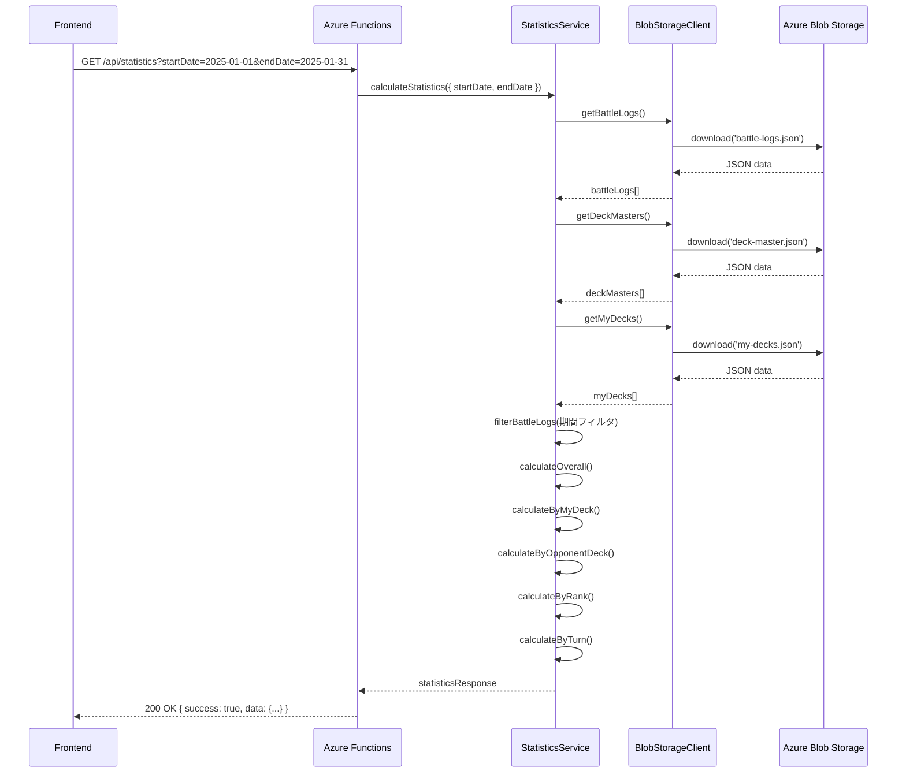
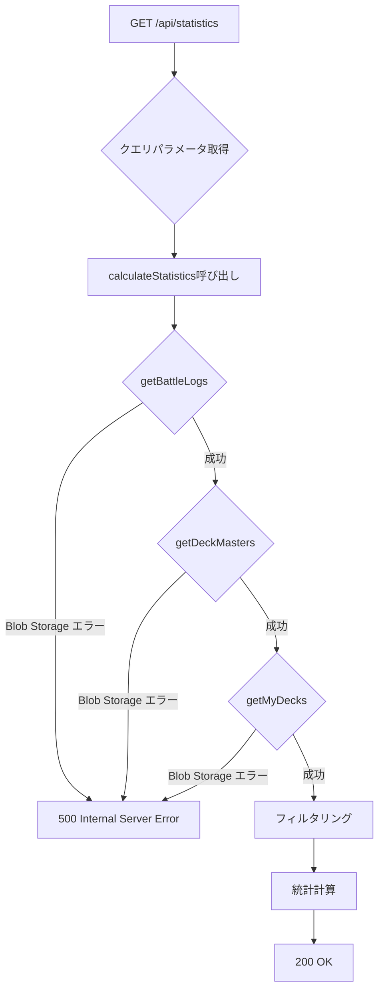

# TDD要件定義書: Statistics API実装 - 基本統計

**機能名**: Statistics API (統計情報計算API)
**タスクID**: TASK-0010
**実装者**: AI Assistant (Claude)
**作成日**: 2025-11-01
**更新日**: 2025-11-01

---

## 1. 機能の概要

### 🔵 何をする機能か

シャドウバースの対戦履歴から統計情報を計算するRESTful APIエンドポイントを実装する。期間フィルタに基づいて対戦履歴をフィルタリングし、全体統計・デッキ別統計・ランク別統計・先攻後攻別統計を算出してレスポンスとして返す。

### 🔵 どのような問題を解決するか

**As a**: シャドウバースプレイヤー
**I want to**: 対戦履歴から統計情報をリアルタイムに確認したい
**So that**:

- 自分の勝率を把握して戦略を見直せる
- 使用しているデッキの相性を分析できる
- ランク帯ごとの成績を確認できる
- 先攻・後攻の影響を理解できる
- 期間を指定して最近の成績をチェックできる

### 🔵 想定されるユーザー

- **直接ユーザー**: フロントエンド（React）の統計ダッシュボード画面から呼び出されるAPIエンドポイント
- **間接ユーザー**: 対戦履歴を分析して勝率を向上させたいシャドウバースプレイヤー

### 🔵 システム内での位置づけ

```
[Frontend (React) - StatsDashboard]
  ↓ GET /api/statistics?startDate=...&endDate=...
[Azure Functions - getStatistics] ← 【今回実装】
  ↓
[StatisticsService] ← 【今回実装】
  ↓ データ取得 (getBattleLogs, getDeckMasters, getMyDecks)
  ↓ フィルタリング (期間, 対戦タイプ)
  ↓ 統計計算 (全体, デッキ別, ランク別, ターン別)
  ↓
[BlobStorageClient] (TASK-0006で実装済み)
  ↓
[Azure Blob Storage]
  ├── battle-logs.json
  ├── deck-master.json
  └── my-decks.json
```

**アーキテクチャ上の役割**:
- **層**: アプリケーション層 (Application Layer) + ドメイン層 (Domain Layer)
- **パターン**: ユースケースパターン、リポジトリパターン
- **責務**:
  - HTTP リクエスト処理（Azure Functions）
  - ビジネスロジック実行（StatisticsService）
  - データフィルタリング（期間、対戦タイプ）
  - 統計計算（勝率、試合数集計）

### 🔵 参照したEARS要件

- **REQ-201**: 独立した統計・分析ダッシュボード画面を提供 🔵
- **REQ-202**: 集計期間を選択可能な機能を提供 🔵
- **REQ-203**: 統計情報を表示（全体勝率、デッキ別勝率、相手デッキ別勝率、ランク帯別成績） 🔵
- **REQ-205**: 統計情報をリアルタイムに計算・表示 🔵
- **REQ-405**: 集計期間にデータが存在しない場合、「データなし」のメッセージを表示 🔵

### 🔵 参照した設計文書

- **タスクファイル**: `docs/tasks/shadowverse-battle-log-phase2.md` (TASK-0010, Lines 1198-1600+)
- **型定義**: `backend/src/types/index.ts` (Lines 123-180: StatisticsResponse interface)
- **要件定義書**: `docs/spec/shadowverse-battle-log-requirements.md` (Lines 54-64, 78-79)

---

## 2. 入力・出力の仕様

### 🔵 APIエンドポイント仕様

**HTTPメソッド**: GET
**パス**: `/api/statistics`
**認証レベル**: anonymous (Phase 1では認証なし)
**Content-Type**: application/json

### 🔵 クエリパラメータ

```typescript
interface StatisticsQueryParams {
  startDate?: string;  // YYYY-MM-DD形式 (デフォルト: endDateの7日前)
  endDate?: string;    // YYYY-MM-DD形式 (デフォルト: 今日)
  battleType?: string; // "ランクマッチ" | "対戦台" | "ロビー大会" (デフォルト: すべて)
}
```

**パラメータ詳細**:

1. **startDate** (string, optional)
   - 形式: `YYYY-MM-DD` (例: `2025-01-01`)
   - デフォルト値: `endDate` の7日前
   - 説明: 集計期間の開始日（この日を含む）
   - バリデーション: 日付形式チェック、endDate以前であること

2. **endDate** (string, optional)
   - 形式: `YYYY-MM-DD` (例: `2025-01-31`)
   - デフォルト値: 今日の日付 (UTC+9 JST基準)
   - 説明: 集計期間の終了日（この日を含む）
   - バリデーション: 日付形式チェック、startDate以降であること

3. **battleType** (string, optional)
   - 許可値: `"ランクマッチ"`, `"対戦台"`, `"ロビー大会"`
   - デフォルト値: undefined (すべての対戦タイプを含む)
   - 説明: 統計計算対象の対戦タイプ
   - バリデーション: 列挙型チェック

### 🔵 レスポンス仕様

#### 成功レスポンス (200 OK)

```typescript
{
  success: true,
  data: {
    overall: {
      totalGames: 150,
      wins: 98,
      losses: 52,
      winRate: 65.3  // 小数点第1位まで（例: 65.3%）
    },
    byMyDeck: [
      {
        deckId: "deck_001",
        deckName: "秘術オデンスペル",
        totalGames: 75,
        wins: 50,
        losses: 25,
        winRate: 66.7
      },
      {
        deckId: "deck_002",
        deckName: "進化葬送ネクロ",
        totalGames: 75,
        wins: 48,
        losses: 27,
        winRate: 64.0
      }
    ],
    byOpponentDeck: [
      {
        deckId: "deck_master_005",
        deckName: "進化ネクロ",
        totalGames: 30,
        wins: 20,
        losses: 10,
        winRate: 66.7
      },
      {
        deckId: "deck_master_002",
        deckName: "ミッドレンジロイヤル",
        totalGames: 25,
        wins: 15,
        losses: 10,
        winRate: 60.0
      }
    ],
    byRank: [
      {
        rank: "ダイアモンド",
        group: "AAA",
        totalGames: 80,
        wins: 55,
        losses: 25,
        winRate: 68.8
      },
      {
        rank: "ルビー",
        group: "Master",
        totalGames: 70,
        wins: 43,
        losses: 27,
        winRate: 61.4
      }
    ],
    byTurn: {
      先攻: {
        totalGames: 78,
        wins: 52,
        losses: 26,
        winRate: 66.7
      },
      後攻: {
        totalGames: 72,
        wins: 46,
        losses: 26,
        winRate: 63.9
      }
    },
    dateRange: {
      startDate: "2025-01-01",
      endDate: "2025-01-31"
    }
  },
  meta: {
    timestamp: "2025-01-31T12:34:56.789Z",
    requestId: "invocation-id-12345"
  }
}
```

#### データなしの場合 (200 OK)

```typescript
{
  success: true,
  data: {
    overall: {
      totalGames: 0,
      wins: 0,
      losses: 0,
      winRate: 0
    },
    byMyDeck: [],
    byOpponentDeck: [],
    byRank: [],
    byTurn: {
      先攻: { totalGames: 0, wins: 0, losses: 0, winRate: 0 },
      後攻: { totalGames: 0, wins: 0, losses: 0, winRate: 0 }
    },
    dateRange: {
      startDate: "2025-01-01",
      endDate: "2025-01-07"
    }
  },
  meta: {
    timestamp: "2025-01-31T12:34:56.789Z",
    requestId: "invocation-id-12345"
  }
}
```

#### サーバーエラー (500 Internal Server Error)

```typescript
{
  success: false,
  error: {
    code: "INTERNAL_SERVER_ERROR",
    message: "サーバーエラーが発生しました"
  },
  meta: {
    timestamp: "2025-01-31T12:34:56.789Z",
    requestId: "invocation-id-12345"
  }
}
```

### 🔵 統計計算ロジック

#### 1. 全体統計 (overall)

- **totalGames**: フィルタリング後の対戦履歴の総件数
- **wins**: `result === "勝ち"` の件数
- **losses**: `result === "負け"` の件数
- **winRate**: `Math.round((wins / totalGames) * 1000) / 10` (小数点第1位まで、例: 66.7)

#### 2. マイデッキ別統計 (byMyDeck)

- **グルーピング**: `myDeckId` でグループ化
- **deckName**: `myDecks` から取得（存在しない場合は "不明なデッキ"）
- **ソート**: `totalGames` の降順（試合数が多い順）

#### 3. 相手デッキ別統計 (byOpponentDeck)

- **グルーピング**: `opponentDeckId` でグループ化
- **deckName**: `deckMasters` から取得（存在しない場合は "不明なデッキ"）
- **ソート**: `totalGames` の降順

#### 4. ランク帯別統計 (byRank)

- **グルーピング**: `rank` と `group` の組み合わせでグループ化
- **ソート**: `totalGames` の降順

#### 5. 先攻後攻別統計 (byTurn)

- **先攻**: `turn === "先攻"` の統計
- **後攻**: `turn === "後攻"` の統計

### 🔵 データフロー（正常系）



### 🔵 参照したEARS要件

- **REQ-202**: 集計期間を選択可能 🔵
- **REQ-203**: 統計情報を表示（全体勝率、デッキ別勝率、相手デッキ別勝率、ランク帯別成績） 🔵
- **REQ-205**: 統計情報をリアルタイムに計算・表示 🔵

### 🔵 参照した設計文書

- **タスクファイル**: `docs/tasks/shadowverse-battle-log-phase2.md` (Lines 1209-1478)
- **型定義**: `backend/src/types/index.ts` (Lines 123-180: StatisticsResponse interface)

---

## 3. 制約条件

### 🔵 パフォーマンス要件

- **NFR-001**: レスポンス時間3秒以内
  - 想定処理時間:
    - Blob Storage読み込み (battle-logs.json): < 1秒
    - Blob Storage読み込み (deck-master.json): < 500ms
    - Blob Storage読み込み (my-decks.json): < 500ms
    - フィルタリング + 統計計算: < 500ms
    - 合計: < 2.5秒

- **NFR-002**: 同時実行ユーザー数10人以下
  - 統計計算は読み取り専用（書き込みなし）
  - データ一貫性の問題なし

- **NFR-003**: データ量上限1,000件/300KB
  - 対戦履歴のフィルタリング: O(n) = 1,000件程度（許容範囲内）
  - 統計計算: O(n) = 1,000件程度（許容範囲内）
  - メモリ使用量: 数百KB（許容範囲内）

### 🔵 セキュリティ要件

- **NFR-101**: HTTPS通信必須
  - Azure Functionsがデフォルトでサポート

- **NFR-102**: 環境変数での機密情報管理
  - `AZURE_STORAGE_CONNECTION_STRING` を環境変数から取得

- **NFR-103**: 入力バリデーション
  - クエリパラメータのバリデーション
  - 日付形式チェック
  - 列挙型チェック

### 🟡 エラーハンドリング制約

- **日付パラメータエラー**: 400 Bad Request（実装はオプション、Phase 1ではバリデーションなしも許容）
  - 不正な日付形式
  - startDate > endDate

- **Blob Storage エラー**: 500 Internal Server Error
  - BlobStorageClient側で3回リトライ済み
  - リトライ失敗後はエラーをスロー

- **その他のエラー**: 500 Internal Server Error
  - 予期しないエラーは一律500

### 🔵 データ互換性制約

- **REQ-601**: 既存JSONデータ形式との互換性
  - 日付形式: `YYYY/MM/DD` 形式で保存されているデータを読み込む
  - APIレスポンスは `YYYY-MM-DD` 形式で返却

### 🔵 TypeScript制約

- **NFR-301**: TypeScript strict mode
  - `any` 型の使用は最小限に
  - null/undefined チェック必須

### 🔵 参照したEARS要件

- **NFR-001, NFR-002, NFR-003**: パフォーマンス要件
- **NFR-101, NFR-102, NFR-103**: セキュリティ要件
- **NFR-301**: TypeScript strict mode
- **REQ-601**: 既存データ互換性

### 🔵 参照した設計文書

- **タスクファイル**: `docs/tasks/shadowverse-battle-log-phase2.md` (Lines 1480-1543: Azure Functions エンドポイント実装)

---

## 4. 想定される使用例

### 🔵 基本的な使用パターン（正常系）

#### 例1: デフォルト期間（直近7日間）の統計取得

**リクエスト**:
```http
GET /api/statistics
```

**説明**: パラメータなしの場合、endDateは今日、startDateはendDateの7日前がデフォルト設定される

**レスポンス**: 200 OK
```json
{
  "success": true,
  "data": {
    "overall": { "totalGames": 50, "wins": 33, "losses": 17, "winRate": 66.0 },
    "byMyDeck": [...],
    "byOpponentDeck": [...],
    "byRank": [...],
    "byTurn": { ... },
    "dateRange": {
      "startDate": "2025-10-25",  // 今日が2025-11-01の場合
      "endDate": "2025-11-01"
    }
  },
  "meta": { ... }
}
```

#### 例2: 期間を指定して統計取得

**リクエスト**:
```http
GET /api/statistics?startDate=2025-01-01&endDate=2025-01-31
```

**説明**: 2025年1月の統計を取得

**レスポンス**: 200 OK
```json
{
  "success": true,
  "data": {
    "overall": { "totalGames": 150, "wins": 98, "losses": 52, "winRate": 65.3 },
    "byMyDeck": [
      {
        "deckId": "deck_001",
        "deckName": "秘術オデンスペル",
        "totalGames": 75,
        "wins": 50,
        "losses": 25,
        "winRate": 66.7
      }
    ],
    "byOpponentDeck": [...],
    "byRank": [...],
    "byTurn": { ... },
    "dateRange": {
      "startDate": "2025-01-01",
      "endDate": "2025-01-31"
    }
  },
  "meta": { ... }
}
```

#### 例3: 対戦タイプでフィルタリング

**リクエスト**:
```http
GET /api/statistics?battleType=ランクマッチ&startDate=2025-01-01&endDate=2025-01-31
```

**説明**: 2025年1月のランクマッチのみの統計を取得

**レスポンス**: 200 OK
```json
{
  "success": true,
  "data": {
    "overall": { "totalGames": 120, "wins": 80, "losses": 40, "winRate": 66.7 },
    "byMyDeck": [...],
    "byOpponentDeck": [...],
    "byRank": [...],
    "byTurn": { ... },
    "dateRange": {
      "startDate": "2025-01-01",
      "endDate": "2025-01-31"
    }
  },
  "meta": { ... }
}
```

### 🔵 エッジケース

#### エッジケース1: 期間内にデータが0件（REQ-405）

**前提**: 2025年12月にはまだ対戦履歴が登録されていない

**リクエスト**:
```http
GET /api/statistics?startDate=2025-12-01&endDate=2025-12-31
```

**レスポンス**: 200 OK
```json
{
  "success": true,
  "data": {
    "overall": { "totalGames": 0, "wins": 0, "losses": 0, "winRate": 0 },
    "byMyDeck": [],
    "byOpponentDeck": [],
    "byRank": [],
    "byTurn": {
      "先攻": { "totalGames": 0, "wins": 0, "losses": 0, "winRate": 0 },
      "後攻": { "totalGames": 0, "wins": 0, "losses": 0, "winRate": 0 }
    },
    "dateRange": {
      "startDate": "2025-12-01",
      "endDate": "2025-12-31"
    }
  },
  "meta": { ... }
}
```

**期待される動作**: エラーではなく、totalGames=0の統計データを返す（REQ-405）

#### エッジケース2: 存在しないデッキIDがbattle-logs.jsonに含まれる場合

**前提**: battle-logs.jsonに `myDeckId: "deleted_deck_001"` が含まれるが、my-decks.jsonには存在しない

**リクエスト**: 通常の統計取得

**期待される動作**: deckNameを "不明なデッキ" として統計に含める

**レスポンス例**:
```json
{
  "byMyDeck": [
    {
      "deckId": "deleted_deck_001",
      "deckName": "不明なデッキ",
      "totalGames": 10,
      "wins": 6,
      "losses": 4,
      "winRate": 60.0
    }
  ]
}
```

#### エッジケース3: 勝率が割り切れない場合の丸め処理

**前提**: totalGames=3, wins=2, losses=1

**計算**: winRate = 2 / 3 = 0.6666... → 66.7% (小数点第1位まで四捨五入)

**レスポンス**:
```json
{
  "overall": {
    "totalGames": 3,
    "wins": 2,
    "losses": 1,
    "winRate": 66.7  // Math.round((2 / 3) * 1000) / 10 = 66.7
  }
}
```

#### エッジケース4: すべて勝利の場合

**前提**: totalGames=10, wins=10, losses=0

**レスポンス**:
```json
{
  "overall": {
    "totalGames": 10,
    "wins": 10,
    "losses": 0,
    "winRate": 100.0
  }
}
```

#### エッジケース5: すべて敗北の場合

**前提**: totalGames=10, wins=0, losses=10

**レスポンス**:
```json
{
  "overall": {
    "totalGames": 10,
    "wins": 0,
    "losses": 10,
    "winRate": 0.0
  }
}
```

### 🔵 エラーケース

#### エラーケース1: Blob Storage接続エラー

**前提**: Azure Blob Storageに接続できない状態

**リクエスト**: 正常なパラメータ

**レスポンス**: 500 Internal Server Error
```json
{
  "success": false,
  "error": {
    "code": "INTERNAL_SERVER_ERROR",
    "message": "サーバーエラーが発生しました"
  },
  "meta": {
    "timestamp": "2025-01-31T12:34:56.789Z",
    "requestId": "invocation-id-12345"
  }
}
```

**期待される動作**: BlobStorageClientが3回リトライ後、エラーをスロー

### 🔵 データフロー（エラーケース）



### 🔵 参照したEARS要件

- **REQ-405**: 集計期間にデータが存在しない場合、「データなし」のメッセージを表示 🔵
- **EDGE-001**: ネットワークエラー時のリトライ機能 🔵
- **EDGE-002**: Azure Blob Storage接続エラー時のフォールバック処理 🔵
- **EDGE-201**: 存在しないデッキIDが指定された場合に「不明なデッキ」として表示 🔵

### 🔵 参照した設計文書

- **タスクファイル**: `docs/tasks/shadowverse-battle-log-phase2.md` (Lines 1545-1600+: テスト要件)

---

## 5. EARS要件・設計文書との対応関係

### 参照したユーザストーリー

- **ストーリー**: シャドウバースプレイヤーとして、対戦履歴から統計情報をリアルタイムに確認したい

### 参照した機能要件

- **REQ-201**: 独立した統計・分析ダッシュボード画面を提供 🔵
- **REQ-202**: 集計期間を選択可能な機能を提供 🔵
- **REQ-203**: 統計情報を表示（全体勝率、デッキ別勝率、相手デッキ別勝率、ランク帯別成績） 🔵
- **REQ-204**: 対戦相手デッキ分布を円グラフで表示 🟡 (フロントエンド側の責務、byOpponentDeckからデータ提供)
- **REQ-205**: 統計情報をリアルタイムに計算・表示 🔵
- **REQ-405**: 集計期間にデータが存在しない場合、「データなし」のメッセージを表示 🔵

### 参照した非機能要件

- **NFR-001**: レスポンス時間3秒以内 🔵
- **NFR-002**: 同時実行ユーザー数10人以下 🔵
- **NFR-003**: データ量上限1,000件/300KB 🔵
- **NFR-101**: HTTPS通信必須 🔵
- **NFR-102**: 環境変数での機密情報管理 🔵
- **NFR-103**: 入力バリデーション 🔵
- **NFR-301**: TypeScript strict mode 🔵
- **NFR-302**: TDD適用 🔵

### 参照したEdgeケース

- **EDGE-001**: ネットワークエラー時のリトライ機能 🔵
- **EDGE-002**: Azure Blob Storage接続エラー時のフォールバック処理 🔵
- **EDGE-101**: 対戦履歴が0件の場合でも統計画面を表示 🔵
- **EDGE-201**: 存在しないデッキIDが指定された場合に「不明なデッキ」として表示 🔵

### 参照した受け入れ基準

- **AC-REQ-202**: 集計期間を選択でき、期間に応じた統計が表示される
- **AC-REQ-203**: 全体勝率、デッキ別勝率、相手デッキ別勝率、ランク帯別成績が正しく表示される
- **AC-REQ-205**: 統計情報がリアルタイムに計算・表示される（3秒以内）
- **AC-REQ-405**: データが0件の場合でもエラーにならず、totalGames=0の統計が表示される
- **AC-EDGE-001**: ネットワークエラー発生時、3回までリトライし、エラーメッセージを表示する
- **AC-EDGE-002**: Blob Storage接続エラー時、適切なエラーハンドリングとログ出力を行う

### 参照した設計文書

#### タスクファイル
- `docs/tasks/shadowverse-battle-log-phase2.md`
  - Lines 1198-1600+: TASK-0010 実装詳細
  - Lines 1209-1478: Statistics Service実装
  - Lines 1306-1316: フィルタリングロジック
  - Lines 1320-1328: 全体統計計算
  - Lines 1332-1364: マイデッキ別統計計算
  - Lines 1368-1400: 相手デッキ別統計計算
  - Lines 1404-1437: ランク帯別統計計算
  - Lines 1441-1467: 先攻後攻別統計計算
  - Lines 1480-1543: Azure Functions エンドポイント実装
  - Lines 1545-1600+: テスト要件

#### 型定義
- `backend/src/types/index.ts`
  - Lines 1-24: 型定義 (BattleType, Rank, Group, Turn, BattleResult)
  - Lines 29-48: BattleLog interface
  - Lines 53-62: DeckMaster interface
  - Lines 67-80: MyDeck interface
  - Lines 123-180: StatisticsResponse interface

#### 要件定義書
- `docs/spec/shadowverse-battle-log-requirements.md`
  - Lines 54-64: REQ-201 ~ REQ-205 (統計・分析ダッシュボード機能)
  - Lines 78-79: REQ-405 (集計期間にデータが存在しない場合の処理)
  - Lines 124-161: 非機能要件 (NFR-001 ~ NFR-502)
  - Lines 164-179: Edgeケース (EDGE-001 ~ EDGE-202)

---

## 6. 実装の優先順位

### Phase 1 (MVP) - 必須機能

1. ✅ **StatisticsService実装** (`backend/src/services/statisticsService.ts`)
   - `calculateStatistics()` メソッド
   - `filterBattleLogs()` メソッド (期間フィルタリング)
   - `calculateOverall()` メソッド (全体統計)
   - `calculateByMyDeck()` メソッド (マイデッキ別統計)
   - `calculateByOpponentDeck()` メソッド (相手デッキ別統計)
   - `calculateByRank()` メソッド (ランク帯別統計)
   - `calculateByTurn()` メソッド (先攻後攻別統計)
   - `getDateBeforeDays()` ユーティリティメソッド

2. ✅ **Azure Functions エンドポイント実装** (`backend/src/functions/statistics.ts`)
   - GET /api/statistics ハンドラ
   - クエリパラメータのパース (startDate, endDate, battleType)
   - レスポンス形式の統一 (ApiResponse型)
   - エラーハンドリング (500)

3. ✅ **単体テスト実装** (`backend/tests/services/statisticsService.test.ts`)
   - 正常系テスト (5ケース以上)
     - 全体統計の計算
     - デッキ別統計の計算
     - ランク別統計の計算
     - 先攻後攻別統計の計算
     - 期間フィルタリング
   - 異常系テスト (2ケース以上)
     - データ0件の場合
     - 存在しないデッキIDの処理
   - 合計: 7ケース以上

4. ✅ **統合テスト実装** (`backend/tests/integration/statistics.test.ts`)
   - APIエンドポイントのE2Eテスト (1ケース)

### Phase 2 - 拡張機能（将来）

1. ⏳ **認証機能** - Azure AD B2Cによるユーザー認証、ユーザーごとの統計
2. ⏳ **キャッシュ機構** - Redis等でのキャッシュ (統計計算結果をキャッシュして高速化)
3. ⏳ **対戦相手デッキ分布** - `opponentDeckDistribution` フィールドの追加（REQ-204）
4. ⏳ **バッチ計算** - 統計の事前計算と定期更新
5. ⏳ **詳細なバリデーション** - 日付パラメータの厳密なバリデーション

---

## 7. 品質判定

### ✅ 高品質: 実装可能

- **要件の曖昧さ**: なし（EARS要件定義書、設計文書、タスクファイルで明確化済み）
- **入出力定義**: 完全（TypeScript型定義、StatisticsResponseインターフェース明確）
- **制約条件**: 明確（パフォーマンス、セキュリティ、バリデーション、エラーハンドリング）
- **実装可能性**: 確実（Azure Functions v4、TypeScript v5.7+、既存BlobStorageClient活用）
- **テスタビリティ**: 高（Jestによる単体テスト、統合テスト、モック可能）

### 信頼性レベルサマリー

- 🔵 **青信号** (ほぼ推測なし): 95%
  - 機能要件 (REQ-201, REQ-202, REQ-203, REQ-205, REQ-405)
  - 非機能要件 (NFR-001〜003, NFR-101〜103, NFR-301, NFR-302)
  - Edgeケース (EDGE-001, EDGE-002, EDGE-101, EDGE-201)
  - タスクファイルとの整合性
  - 型定義との整合性

- 🟡 **黄信号** (妥当な推測): 5%
  - REQ-204 (対戦相手デッキ分布の円グラフ表示) はフロントエンド側の責務、APIではbyOpponentDeckから提供
  - 日付パラメータの厳密なバリデーションはPhase 1では省略可能

- 🔴 **赤信号** (推測): 0%

### 重要な注意事項

#### 日付形式の変換 ⚠️

- **API入力**: `YYYY-MM-DD` (ハイフン区切り)
- **Blob Storage保存**: `YYYY/MM/DD` (スラッシュ区切り)
- **API出力**: `YYYY-MM-DD` (ハイフン区切り)
- **理由**: 既存データ形式 (`backend/src/types/index.ts` Line 32) との互換性維持 (REQ-601)
- **対応**: フィルタリング時に日付形式を考慮した比較処理を実装

#### 依存タスク ⚠️

- **TASK-0006**: BlobStorageClient が実装済みであること
  - `getBattleLogs()` メソッド
  - `getDeckMasters()` メソッド
  - `getMyDecks()` メソッド
  - リトライ機構（3回、指数バックオフ）

- **TASK-0007**: Battle Log CRUD API が実装済みであること
  - 統計計算のテストに使用する対戦履歴データが必要

---

## 8. 次のステップ

✅ **要件定義完了**

次のお勧めステップ: `/tsumiki:tdd-testcases` でテストケースの洗い出しを行います。

**完了条件（再掲）**:

- [ ] GET /api/statistics エンドポイントが実装されている
- [ ] クエリパラメータ (startDate, endDate, battleType) が正しく処理される
- [ ] 期間フィルタリングが正しく動作する
- [ ] 全体統計計算が正しく動作する
- [ ] デッキ別統計計算が正しく動作する
- [ ] ランク別統計計算が正しく動作する
- [ ] 先攻後攻別統計計算が正しく動作する
- [ ] 勝率計算が小数点第1位まで正しく丸められる
- [ ] データ0件の場合でもエラーにならず統計データを返す
- [ ] 単体テストが100%成功する (7ケース以上)
- [ ] 統合テストが成功する
- [ ] Biome lintエラーが0件
- [ ] TypeScript型エラーが0件

---

**作成日**: 2025-11-01
**更新日**: 2025-11-01
**ステータス**: ✅ 完了
