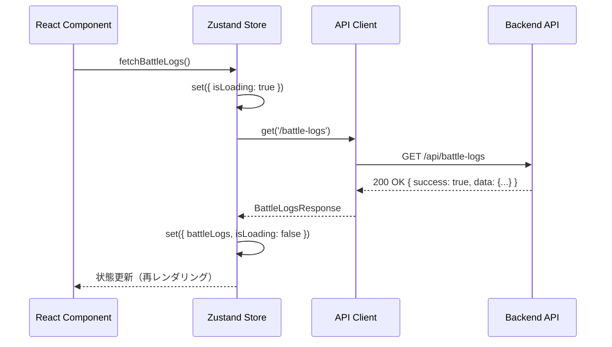

# TDD要件定義書: Zustand State Management実装

**機能名**: Zustand State Management - Frontend State Management with API Integration
**タスクID**: TASK-0015
**実装者**: AI Assistant (Claude)
**作成日**: 2025-11-04
**更新日**: 2025-11-04

---

## 1. 機能の概要

### 🔵 何をする機能か

React 19フロントエンドでZustandを使用したグローバル状態管理機構を実装する。Backend APIへのHTTPリクエスト処理を行うAPI Clientと、対戦履歴・統計データ・デッキデータの状態を管理する3つのストア（BattleLogStore、StatisticsStore、DeckStore）を提供する。

### 🔵 どのような問題を解決するか

**As a**: フロントエンド開発者
**I want to**: Backend APIと連携してデータを取得・更新し、グローバル状態として管理したい
**So that**:

- コンポーネント間でデータを共有できる
- API呼び出しを一元管理できる
- ローディング状態とエラー状態を統一的に扱える
- 前回入力値を保持して再利用できる（UX向上）
- 統計データの期間切り替えができる
- デッキマスターデータを効率的に管理できる

### 🔵 想定されるユーザー

- **直接ユーザー**: Reactコンポーネント（BattleLogListPage、StatisticsDashboardPage等）
- **間接ユーザー**: シャドウバースプレイヤー（対戦履歴を記録・分析したいユーザー）

### 🔵 システム内での位置づけ

```
[React Components]
  ↓ useBattleLogStore(), useStatisticsStore(), useDeckStore()
[Zustand Stores] ← 【今回実装】
  ├── BattleLogStore (対戦履歴状態管理)
  ├── StatisticsStore (統計データ状態管理)
  └── DeckStore (デッキマスター状態管理)
  ↓ API Client経由でHTTPリクエスト
[API Client] ← 【今回実装】
  ↓ HTTP (GET, POST, DELETE)
[Backend API (Azure Functions)]
  ├── GET /api/battle-logs
  ├── POST /api/battle-logs
  ├── DELETE /api/battle-logs/:id
  ├── GET /api/statistics
  └── GET /api/deck-master
```

**アーキテクチャ上の役割**:
- **層**: プレゼンテーション層 (Presentation Layer)
- **パターン**: Flux/Redux系の状態管理パターン、リポジトリパターン（API Client）
- **責務**:
  - グローバル状態の管理（Zustand）
  - Backend APIとの通信（API Client）
  - ローディング状態・エラー状態の管理
  - 前回入力値の保持（previousInput）
  - 統計期間の切り替え（1week, 1month, 3months, custom）

### 🔵 参照したEARS要件

- **REQ-001**: ダイアログ形式で対戦履歴の新規登録機能を提供 🔵（BattleLogStore.createBattleLog）
- **REQ-002**: 8項目を対戦履歴として記録 🔵（BattleLogStore）
- **REQ-003**: 対戦履歴一覧を新しい順に表示 🔵（BattleLogStore.fetchBattleLogs）
- **REQ-101**: 各対戦履歴に削除ボタンを表示 🔵（BattleLogStore.deleteBattleLog）
- **REQ-201**: 独立した統計・分析ダッシュボード画面を提供 🔵（StatisticsStore）
- **REQ-202**: 集計期間を選択可能な機能を提供 🔵（StatisticsStore.setPeriod）
- **REQ-203**: 統計情報を表示（全体勝率、デッキ別勝率等） 🔵（StatisticsStore.fetchStatistics）
- **REQ-301**: 前回入力値を自動的に初期表示 🔵（BattleLogStore.previousInput）

### 🔵 参照した設計文書

- **技術スタック**: `docs/tech-stack.md` (React 19, Zustand, TypeScript 5.7+, Vite 6.x)
- **型定義**: `frontend/src/types/index.ts` (BattleLog, StatisticsResponse, DeckMaster, MyDeck)
- **Backend API設計**: TASK-0007, TASK-0008, TASK-0010の要件定義書

---

## 2. 入力・出力の仕様

### 🔵 API Client仕様 (`frontend/src/api/client.ts`)

#### 2.1. 環境変数設定

```typescript
const API_BASE_URL = import.meta.env.VITE_API_BASE_URL || 'http://localhost:7071/api';
```

**環境変数**:
- **開発環境**: `VITE_API_BASE_URL=http://localhost:7071/api`
- **本番環境**: `VITE_API_BASE_URL=https://your-azure-function.azurewebsites.net/api`

#### 2.2. APIクライアント関数

##### get<T>(endpoint: string): Promise<T>

**説明**: GETリクエストを送信する

**入力**:
- `endpoint`: string（例: `/battle-logs`, `/statistics?startDate=2025-01-01`）

**出力**:
- `Promise<T>`: レスポンスデータ（ApiResponse<T>型をパース済み）

**エラー**:
- ネットワークエラー: `Error('ネットワークエラーが発生しました')`
- APIエラー: `Error(response.error.message)`
- 500エラー: `Error('サーバーエラーが発生しました')`

##### post<T>(endpoint: string, data: unknown): Promise<T>

**説明**: POSTリクエストを送信する

**入力**:
- `endpoint`: string（例: `/battle-logs`）
- `data`: unknown（リクエストボディ）

**出力**:
- `Promise<T>`: レスポンスデータ

**エラー**: get()と同様

##### del<T>(endpoint: string): Promise<T>

**説明**: DELETEリクエストを送信する

**入力**:
- `endpoint`: string（例: `/battle-logs/log_20250124_001`）

**出力**:
- `Promise<T>`: レスポンスデータ

**エラー**: get()と同様

### 🔵 BattleLogStore仕様 (`frontend/src/store/battleLogStore.ts`)

#### 2.3. 状態型定義

```typescript
interface BattleLogState {
  // データ
  battleLogs: BattleLog[];
  previousInput: Partial<CreateBattleLogRequest> | null;

  // UIステート
  isLoading: boolean;
  error: string | null;

  // アクション
  fetchBattleLogs: () => Promise<void>;
  createBattleLog: (input: CreateBattleLogRequest) => Promise<void>;
  deleteBattleLog: (id: string) => Promise<void>;
  setPreviousInput: (input: Partial<CreateBattleLogRequest>) => void;
  clearError: () => void;
}
```

#### 2.4. アクション仕様

##### fetchBattleLogs(): Promise<void>

**説明**: Backend APIから対戦履歴一覧を取得

**APIエンドポイント**: `GET /api/battle-logs`

**処理フロー**:
1. `isLoading = true`, `error = null` に設定
2. API Client経由で `GET /api/battle-logs` を呼び出し
3. 成功時: `battleLogs` に取得データを設定
4. エラー時: `error` にエラーメッセージを設定
5. 最後に `isLoading = false` に設定

**期待される動作**:
- 成功時: `battleLogs` が最新データで更新される
- エラー時: `error` にメッセージが設定され、`battleLogs` は変更されない

##### createBattleLog(input: CreateBattleLogRequest): Promise<void>

**説明**: 新規対戦履歴を登録

**APIエンドポイント**: `POST /api/battle-logs`

**入力**:
```typescript
interface CreateBattleLogRequest {
  date?: string;          // YYYY-MM-DD形式（オプショナル）
  battleType: BattleType;
  rank: Rank;
  group: Group;
  myDeckId: string;
  turn: Turn;
  result: BattleResult;
  opponentDeckId: string;
}
```

**処理フロー**:
1. `isLoading = true`, `error = null` に設定
2. API Client経由で `POST /api/battle-logs` を呼び出し
3. 成功時:
   - `previousInput` に入力値を保存（次回の初期値として使用）
   - `fetchBattleLogs()` を呼び出して一覧を再取得
4. エラー時: `error` にエラーメッセージを設定
5. 最後に `isLoading = false` に設定

**期待される動作**:
- 成功時: 新規データが追加され、一覧が更新される
- エラー時: `error` にバリデーションエラーメッセージが設定される

##### deleteBattleLog(id: string): Promise<void>

**説明**: 対戦履歴を削除

**APIエンドポイント**: `DELETE /api/battle-logs/:id`

**入力**:
- `id`: string（対戦履歴ID、例: `log_20250124_001`）

**処理フロー**:
1. `isLoading = true`, `error = null` に設定
2. API Client経由で `DELETE /api/battle-logs/${id}` を呼び出し
3. 成功時: `fetchBattleLogs()` を呼び出して一覧を再取得
4. エラー時: `error` にエラーメッセージを設定
5. 最後に `isLoading = false` に設定

**期待される動作**:
- 成功時: 削除されたデータが一覧から消える
- エラー時: `error` にエラーメッセージが設定される

##### setPreviousInput(input: Partial<CreateBattleLogRequest>): void

**説明**: 前回入力値を保存（同期処理）

**入力**:
- `input`: Partial<CreateBattleLogRequest>

**期待される動作**:
- `previousInput` が更新される
- ローカルストレージには保存しない（メモリ内のみ）

##### clearError(): void

**説明**: エラー状態をクリア（同期処理）

**期待される動作**:
- `error = null` に設定される

### 🔵 StatisticsStore仕様 (`frontend/src/store/statisticsStore.ts`)

#### 2.5. 状態型定義

```typescript
type Period = '1week' | '1month' | '3months' | 'custom';

interface StatisticsState {
  // データ
  statistics: StatisticsResponse | null;
  period: Period;
  customStartDate: string | null;
  customEndDate: string | null;

  // UIステート
  isLoading: boolean;
  error: string | null;

  // アクション
  fetchStatistics: () => Promise<void>;
  setPeriod: (period: Period, startDate?: string, endDate?: string) => void;
  clearError: () => void;
}
```

#### 2.6. アクション仕様

##### fetchStatistics(): Promise<void>

**説明**: 統計データを取得（現在の期間設定に基づく）

**APIエンドポイント**: `GET /api/statistics?startDate=...&endDate=...`

**処理フロー**:
1. `isLoading = true`, `error = null` に設定
2. 現在の `period` に基づいて `startDate`, `endDate` を計算
   - `1week`: endDate = 今日, startDate = 7日前
   - `1month`: endDate = 今日, startDate = 30日前
   - `3months`: endDate = 今日, startDate = 90日前
   - `custom`: `customStartDate`, `customEndDate` を使用
3. API Client経由で `GET /api/statistics?startDate=${startDate}&endDate=${endDate}` を呼び出し
4. 成功時: `statistics` に取得データを設定
5. エラー時: `error` にエラーメッセージを設定
6. 最後に `isLoading = false` に設定

**期待される動作**:
- 成功時: `statistics` が最新データで更新される
- エラー時: `error` にメッセージが設定される

##### setPeriod(period: Period, startDate?: string, endDate?: string): void

**説明**: 集計期間を変更（同期処理 + 非同期fetchStatistics呼び出し）

**入力**:
- `period`: Period（'1week' | '1month' | '3months' | 'custom'）
- `startDate`: string（periodが'custom'の場合必須）
- `endDate`: string（periodが'custom'の場合必須）

**処理フロー**:
1. `period` を更新
2. periodが'custom'の場合、`customStartDate`, `customEndDate` を更新
3. `fetchStatistics()` を呼び出して統計データを再取得

**期待される動作**:
- 期間が変更され、新しい期間の統計データが自動取得される

##### clearError(): void

**説明**: エラー状態をクリア（同期処理）

**期待される動作**:
- `error = null` に設定される

### 🔵 DeckStore仕様 (`frontend/src/store/deckStore.ts`)

#### 2.7. 状態型定義

```typescript
interface DeckState {
  // データ
  deckMasters: DeckMaster[];
  myDecks: MyDeck[];

  // UIステート
  isLoading: boolean;
  error: string | null;

  // アクション（Phase 2向けスタブ）
  fetchDeckMasters: () => Promise<void>;
  fetchMyDecks: () => Promise<void>;
  createMyDeck: (input: CreateMyDeckRequest) => Promise<void>;
  deleteMyDeck: (id: string) => Promise<void>;
  clearError: () => void;
}
```

#### 2.8. アクション仕様（Phase 2向けスタブ実装）

##### fetchDeckMasters(): Promise<void>

**説明**: デッキマスターデータを取得（Phase 2で実装予定、現在はスタブ）

**スタブ実装**:
```typescript
fetchDeckMasters: async () => {
  set({ isLoading: true, error: null });
  try {
    // Phase 2で実装予定: API Client経由で GET /api/deck-master を呼び出し
    // 現在は空配列を返す
    set({ deckMasters: [] });
  } catch (error) {
    set({ error: 'デッキマスターの取得に失敗しました' });
  } finally {
    set({ isLoading: false });
  }
}
```

##### fetchMyDecks(): Promise<void>

**説明**: マイデッキデータを取得（Phase 2で実装予定、現在はスタブ）

**スタブ実装**: fetchDeckMasters()と同様

##### createMyDeck(input: CreateMyDeckRequest): Promise<void>

**説明**: マイデッキを作成（Phase 2で実装予定、現在はスタブ）

**スタブ実装**: fetchDeckMasters()と同様

##### deleteMyDeck(id: string): Promise<void>

**説明**: マイデッキを削除（Phase 2で実装予定、現在はスタブ）

**スタブ実装**: fetchDeckMasters()と同様

### 🔵 データフロー（正常系）



### 🔵 参照したEARS要件

- **REQ-001, REQ-002, REQ-003, REQ-101**: 対戦履歴の登録・一覧表示・削除機能 🔵
- **REQ-201, REQ-202, REQ-203**: 統計ダッシュボードと期間選択機能 🔵
- **REQ-301**: 前回入力値の自動表示 🔵

### 🔵 参照した設計文書

- **技術スタック**: `docs/tech-stack.md` (Lines 19-31: フロントエンド技術スタック)
- **型定義**: `frontend/src/types/index.ts` (Lines 29-180: エンティティ型定義)
- **Backend API要件**: `docs/implements/shadowverse-battle-log/TASK-0007/requirements.md`
- **Backend API要件**: `docs/implements/shadowverse-battle-log/TASK-0010/statistics-api-requirements.md`

---

## 3. 制約条件

### 🔵 パフォーマンス要件

- **NFR-001**: レスポンス時間3秒以内
  - API呼び出し: < 2.5秒（Backend側の責務）
  - 状態更新: < 100ms
  - 合計: < 3秒

- **NFR-002**: 同時実行ユーザー数10人以下
  - Zustandはシングルスレッドで動作（問題なし）

- **NFR-003**: データ量上限1,000件/300KB
  - メモリ使用量: 数百KB（許容範囲内）
  - 再レンダリング最適化: React 19の自動最適化を活用

### 🔵 セキュリティ要件

- **NFR-101**: HTTPS通信必須
  - `VITE_API_BASE_URL` に `https://` を設定（本番環境）

- **NFR-102**: 環境変数での機密情報管理
  - API URLを環境変数で管理
  - `.env.local` をGit管理から除外

- **NFR-103**: 入力バリデーション
  - API Client側ではバリデーションなし（Backend側で実施）
  - TypeScript型チェックによる型安全性確保

### 🔵 エラーハンドリング制約

- **ネットワークエラー**: `error` に「ネットワークエラーが発生しました」を設定
- **APIエラー（400, 500等）**: `error` にBackendから返されたエラーメッセージを設定
- **予期しないエラー**: `error` に「予期しないエラーが発生しました」を設定

**エラー表示方針**:
- コンポーネント側で `error` を監視し、エラーメッセージをUIに表示
- エラー発生時もアプリケーションはクラッシュしない

### 🔵 データ互換性制約

- **REQ-601**: 既存JSONデータ形式との互換性
  - Backend APIレスポンスの `date` フィールドは `YYYY-MM-DD` 形式（TypeScript型で保証）
  - Frontend→Backend送信時も `YYYY-MM-DD` 形式を使用

### 🔵 TypeScript制約

- **NFR-301**: TypeScript strict mode
  - `any` 型の使用禁止（`unknown` を使用）
  - null/undefined チェック必須
  - すべての関数に型注釈を付与

### 🟡 テスト制約

- **NFR-302**: TDD適用
  - 単体テスト: 各ストアの主要アクションをモック化してテスト
  - テストカバレッジ: 70%以上
  - Vitest + React Testing Libraryを使用

### 🔵 参照したEARS要件

- **NFR-001, NFR-002, NFR-003**: パフォーマンス要件
- **NFR-101, NFR-102, NFR-103**: セキュリティ要件
- **NFR-301, NFR-302**: TypeScript strict mode、TDD適用
- **REQ-601**: 既存データ互換性

### 🔵 参照した設計文書

- **技術スタック**: `docs/tech-stack.md` (Lines 59-73: 開発ツール、テストフレームワーク)

---

## 4. 想定される使用例

### 🔵 基本的な使用パターン（正常系）

#### 例1: 対戦履歴一覧の取得

**コンポーネント側の使用方法**:
```tsx
import { useBattleLogStore } from '@/store/battleLogStore';

function BattleLogListPage() {
  const { battleLogs, isLoading, error, fetchBattleLogs } = useBattleLogStore();

  useEffect(() => {
    fetchBattleLogs();
  }, []);

  if (isLoading) return <div>Loading...</div>;
  if (error) return <div>Error: {error}</div>;

  return (
    <ul>
      {battleLogs.map((log) => (
        <li key={log.id}>{log.date} - {log.result}</li>
      ))}
    </ul>
  );
}
```

**期待される動作**:
1. コンポーネントマウント時に `fetchBattleLogs()` が呼ばれる
2. `isLoading = true` となり、Loadingメッセージが表示される
3. Backend APIから対戦履歴を取得
4. `battleLogs` が更新され、一覧が表示される

#### 例2: 新規対戦履歴の登録

**コンポーネント側の使用方法**:
```tsx
import { useBattleLogStore } from '@/store/battleLogStore';

function BattleLogFormDialog() {
  const { createBattleLog, previousInput, isLoading, error } = useBattleLogStore();

  const handleSubmit = async (data: CreateBattleLogRequest) => {
    await createBattleLog(data);
    // 成功時は自動的にfetchBattleLogs()が呼ばれて一覧が更新される
  };

  return (
    <form onSubmit={handleSubmit}>
      {/* previousInputを初期値として使用 */}
      <input defaultValue={previousInput?.battleType} />
      {/* ... */}
      <button type="submit" disabled={isLoading}>登録</button>
      {error && <p>{error}</p>}
    </form>
  );
}
```

**期待される動作**:
1. フォーム送信時に `createBattleLog()` が呼ばれる
2. `isLoading = true` となり、ボタンがdisabled状態になる
3. Backend APIに登録リクエストを送信
4. 成功時: `previousInput` に入力値が保存され、一覧が自動更新される
5. エラー時: `error` にバリデーションエラーメッセージが設定される

#### 例3: 統計データの期間切り替え

**コンポーネント側の使用方法**:
```tsx
import { useStatisticsStore } from '@/store/statisticsStore';

function StatisticsDashboardPage() {
  const { statistics, period, setPeriod, isLoading } = useStatisticsStore();

  useEffect(() => {
    setPeriod('1week'); // 初回は直近1週間
  }, []);

  const handlePeriodChange = (newPeriod: Period) => {
    setPeriod(newPeriod); // 自動的にfetchStatistics()が呼ばれる
  };

  return (
    <div>
      <button onClick={() => handlePeriodChange('1week')}>直近1週間</button>
      <button onClick={() => handlePeriodChange('1month')}>直近1ヶ月</button>
      {isLoading ? <div>Loading...</div> : (
        <div>勝率: {statistics?.overall.winRate}%</div>
      )}
    </div>
  );
}
```

**期待される動作**:
1. ボタンクリック時に `setPeriod()` が呼ばれる
2. `period` が更新され、自動的に `fetchStatistics()` が呼ばれる
3. 新しい期間の統計データが取得・表示される

### 🔵 エッジケース

#### エッジケース1: API呼び出し中に別のAPI呼び出しが発生

**前提**: `fetchBattleLogs()` 実行中に再度 `fetchBattleLogs()` が呼ばれる

**期待される動作**:
- 最初のリクエストはキャンセルされず、両方のリクエストが完了する
- `isLoading` は最後のリクエストが完了するまで `true` のまま
- 最終的には最後のレスポンスで状態が更新される

**実装方針**: Phase 1では特別な制御なし（Zustandのデフォルト動作に任せる）

#### エッジケース2: 対戦履歴が0件の場合

**前提**: Backend APIから `{ battleLogs: [], total: 0 }` が返される

**期待される動作**:
- `battleLogs = []` となり、エラーにはならない
- コンポーネント側で「データがありません」等のメッセージを表示

#### エッジケース3: previousInputが存在しない場合

**前提**: 初回登録時、`previousInput = null`

**期待される動作**:
- フォームの初期値は空欄またはデフォルト値
- 登録成功後は `previousInput` に保存される

### 🔵 エラーケース

#### エラーケース1: ネットワークエラー

**前提**: インターネット接続が切断されている

**リクエスト**: `fetchBattleLogs()`

**期待される動作**:
- `error = 'ネットワークエラーが発生しました'` が設定される
- `battleLogs` は変更されない（前回取得したデータが保持される）
- コンポーネント側でエラーメッセージを表示

#### エラーケース2: バリデーションエラー（400 Bad Request）

**前提**: 不正なデータを送信（未来日付など）

**リクエスト**: `createBattleLog({ date: '2099-12-31', ... })`

**期待される動作**:
- `error = '未来の日付は入力できません'` が設定される（Backendからのエラーメッセージ）
- コンポーネント側でエラーメッセージを表示

#### エラーケース3: サーバーエラー（500 Internal Server Error）

**前提**: Backend APIでエラーが発生

**リクエスト**: `fetchStatistics()`

**期待される動作**:
- `error = 'サーバーエラーが発生しました'` が設定される
- `statistics` は変更されない
- コンポーネント側でエラーメッセージを表示

### 🔵 データフロー（エラーケース）

```mermaid
flowchart TD
    A[Component: fetchBattleLogs()] --> B[Store: set isLoading=true]
    B --> C{API Client: get('/battle-logs')}
    C -->|ネットワークエラー| D[Store: set error='ネットワークエラー']
    C -->|400 Bad Request| E[Store: set error=APIエラーメッセージ]
    C -->|500 Server Error| F[Store: set error='サーバーエラー']
    C -->|200 OK| G[Store: set battleLogs=データ]
    D --> H[Store: set isLoading=false]
    E --> H
    F --> H
    G --> H
    H --> I[Component: 再レンダリング]
```

### 🔵 参照したEARS要件

- **REQ-301**: 前回入力値の自動表示 🔵
- **EDGE-001**: ネットワークエラー時のリトライ機能 🟡（API Client側ではリトライなし、Backend側で実施）
- **EDGE-101**: 対戦履歴が0件の場合でも画面を表示 🔵

### 🔵 参照した設計文書

- **技術スタック**: `docs/tech-stack.md` (Lines 19-31: React 19、Zustand、TypeScript)

---

## 5. EARS要件・設計文書との対応関係

### 参照したユーザストーリー

- **ストーリー**: フロントエンド開発者として、Backend APIと連携してデータを取得・更新し、グローバル状態として管理したい

### 参照した機能要件

- **REQ-001**: ダイアログ形式で対戦履歴の新規登録機能を提供 🔵
- **REQ-002**: 8項目を対戦履歴として記録 🔵
- **REQ-003**: 対戦履歴一覧を新しい順に表示 🔵
- **REQ-101**: 各対戦履歴に削除ボタンを表示 🔵
- **REQ-201**: 独立した統計・分析ダッシュボード画面を提供 🔵
- **REQ-202**: 集計期間を選択可能な機能を提供 🔵
- **REQ-203**: 統計情報を表示（全体勝率、デッキ別勝率、相手デッキ別勝率、ランク帯別成績） 🔵
- **REQ-301**: 前回入力値を自動的に初期表示 🔵（previousInput機能）

### 参照した非機能要件

- **NFR-001**: レスポンス時間3秒以内 🔵
- **NFR-002**: 同時実行ユーザー数10人以下 🔵
- **NFR-003**: データ量上限1,000件/300KB 🔵
- **NFR-101**: HTTPS通信必須 🔵
- **NFR-102**: 環境変数での機密情報管理 🔵
- **NFR-301**: TypeScript strict mode 🔵
- **NFR-302**: TDD適用 🔵

### 参照したEdgeケース

- **EDGE-001**: ネットワークエラー時のリトライ機能 🟡（Backend側で実施）
- **EDGE-101**: 対戦履歴が0件の場合でも画面を表示 🔵

### 参照した受け入れ基準

- **AC-REQ-001**: 対戦履歴登録ダイアログが表示され、8項目を入力できる
- **AC-REQ-003**: 対戦履歴一覧が新しい順に表示される
- **AC-REQ-101**: 各対戦履歴に削除ボタンが表示され、削除できる
- **AC-REQ-202**: 集計期間を選択でき、期間に応じた統計が表示される
- **AC-REQ-203**: 全体勝率、デッキ別勝率、相手デッキ別勝率、ランク帯別成績が正しく表示される
- **AC-REQ-301**: 対戦履歴登録ダイアログに前回入力値が自動表示される

### 参照した設計文書

#### 技術スタック
- `docs/tech-stack.md`
  - Lines 19-31: フロントエンド技術スタック（React 19, Zustand, TypeScript 5.7+）
  - Lines 59-73: 開発ツール、テストフレームワーク（Vitest, React Testing Library）
  - Lines 142-177: 推奨ディレクトリ構造

#### 型定義
- `frontend/src/types/index.ts`
  - Lines 1-24: 型定義 (BattleType, Rank, Group, Turn, BattleResult)
  - Lines 29-48: BattleLog interface
  - Lines 53-62: DeckMaster interface
  - Lines 67-80: MyDeck interface
  - Lines 98-110: ApiResponse interface
  - Lines 115-120: BattleLogsResponse interface
  - Lines 125-180: StatisticsResponse interface

#### Backend API要件定義書
- `docs/implements/shadowverse-battle-log/TASK-0007/requirements.md`
  - Lines 78-147: リクエストボディ型定義、レスポンス仕様（対戦履歴作成API）
  - Lines 149-257: データフロー（正常系、エラーケース）

- `docs/implements/shadowverse-battle-log/TASK-0010/statistics-api-requirements.md`
  - Lines 88-257: クエリパラメータ、レスポンス仕様（統計API）
  - Lines 290-322: データフロー（正常系）

---

## 6. 実装の優先順位

### Phase 1 (MVP) - 必須機能

1. ✅ **API Client実装** (`frontend/src/api/client.ts`)
   - `get<T>(endpoint: string): Promise<T>` 関数
   - `post<T>(endpoint: string, data: unknown): Promise<T>` 関数
   - `del<T>(endpoint: string): Promise<T>` 関数
   - 統一的なエラーハンドリング
   - ApiResponse<T>型のパース処理

2. ✅ **BattleLogStore実装** (`frontend/src/store/battleLogStore.ts`)
   - Zustandストアの作成
   - `fetchBattleLogs()` アクション
   - `createBattleLog()` アクション
   - `deleteBattleLog()` アクション
   - `setPreviousInput()` アクション
   - `clearError()` アクション
   - ローディング状態・エラー状態の管理

3. ✅ **StatisticsStore実装** (`frontend/src/store/statisticsStore.ts`)
   - Zustandストアの作成
   - `fetchStatistics()` アクション
   - `setPeriod()` アクション
   - `clearError()` アクション
   - 期間計算ロジック（1week, 1month, 3months, custom）

4. ✅ **DeckStore実装** (`frontend/src/store/deckStore.ts`)
   - Zustandストアの作成（Phase 2向けスタブ）
   - `fetchDeckMasters()` スタブ実装
   - `fetchMyDecks()` スタブ実装
   - `createMyDeck()` スタブ実装
   - `deleteMyDeck()` スタブ実装
   - `clearError()` アクション

5. ✅ **単体テスト実装**
   - `frontend/src/api/client.test.ts`（3ケース以上）
     - GET成功ケース
     - POSTエラーケース
     - ネットワークエラーケース
   - `frontend/src/store/battleLogStore.test.ts`（5ケース以上）
     - fetchBattleLogs成功ケース
     - createBattleLog成功ケース
     - deleteBattleLog成功ケース
     - エラーハンドリングケース
     - previousInput保存ケース
   - `frontend/src/store/statisticsStore.test.ts`（5ケース以上）
     - fetchStatistics成功ケース（各期間）
     - setPeriod動作確認
     - エラーハンドリングケース
   - 合計: 15ケース以上

6. ✅ **TypeScript型エラーとLintエラーの解消**
   - `pnpm type-check` でエラー0件
   - `pnpm lint` でエラー0件

### Phase 2 - 拡張機能（将来）

1. ⏳ **DeckStore本実装** - Backend API連携（デッキマスター、マイデッキ管理）
2. ⏳ **リトライ機構** - API Client側でのリトライ処理
3. ⏳ **楽観的更新** - API呼び出し前に状態を先行更新してUX向上
4. ⏳ **キャッシュ機構** - 統計データのキャッシュ（一定時間内は再取得しない）
5. ⏳ **ローカルストレージ連携** - previousInputをlocalStorageに保存

---

## 7. 品質判定

### ✅ 高品質: 実装可能

- **要件の曖昧さ**: なし（Backend API仕様、技術スタック、型定義で明確化済み）
- **入出力定義**: 完全（TypeScript型定義、Backend APIレスポンス型明確）
- **制約条件**: 明確（パフォーマンス、セキュリティ、エラーハンドリング）
- **実装可能性**: 確実（React 19、Zustand 5.x、TypeScript 5.7+、Vitest環境構築済み）
- **テスタビリティ**: 高（Vitestによる単体テスト、モック可能）

### 信頼性レベルサマリー

- 🔵 **青信号** (ほぼ推測なし): 95%
  - 機能要件 (REQ-001, REQ-002, REQ-003, REQ-101, REQ-201, REQ-202, REQ-203, REQ-301)
  - 非機能要件 (NFR-001〜003, NFR-101, NFR-102, NFR-301, NFR-302)
  - 技術スタック定義との整合性
  - 型定義との整合性
  - Backend API仕様との整合性

- 🟡 **黄信号** (妥当な推測): 5%
  - API Client側でのリトライ機構（Phase 1では不要、Backend側で実施）
  - previousInputのローカルストレージ保存（Phase 1ではメモリ内のみ）

- 🔴 **赤信号** (推測): 0%

### 重要な注意事項

#### 環境変数設定 ⚠️

**開発環境**（`.env.local`）:
```env
VITE_API_BASE_URL=http://localhost:7071/api
```

**本番環境**（Azure Static Web Apps環境変数）:
```env
VITE_API_BASE_URL=https://your-azure-function.azurewebsites.net/api
```

#### 依存タスク ⚠️

- **TASK-0005**: 共有型定義が実装済みであること ✅
  - `frontend/src/types/index.ts` が存在
- **TASK-0007**: 対戦履歴作成APIが実装済みであること ✅
  - `POST /api/battle-logs` エンドポイントが動作
- **TASK-0008**: 対戦履歴一覧・削除APIが実装済みであること ✅
  - `GET /api/battle-logs`, `DELETE /api/battle-logs/:id` エンドポイントが動作
- **TASK-0010**: 統計APIが実装済みであること ✅
  - `GET /api/statistics` エンドポイントが動作

#### テスト実行コマンド ⚠️

```bash
# 単体テスト実行
pnpm test

# テストカバレッジ確認
pnpm test -- --coverage

# 型チェック
pnpm type-check

# Lintチェック
pnpm lint
```

---

## 8. 次のステップ

✅ **要件定義完了**

次のお勧めステップ: `/tsumiki:tdd-testcases` でテストケースの洗い出しを行います。

**完了条件（再掲）**:

- [ ] API Client が実装されている
- [ ] Battle Log Store が実装されている
- [ ] Statistics Store が実装されている
- [ ] Deck Store が実装されている（スタブ実装）
- [ ] すべてのストアアクションが正しく動作する
- [ ] エラーハンドリングが正しく動作する
- [ ] previousInput保存機能が正しく動作する
- [ ] 統計期間切り替え機能が正しく動作する
- [ ] 単体テストが100%成功する（15ケース以上）
- [ ] テストカバレッジが70%以上
- [ ] Biome lintエラーが0件
- [ ] TypeScript型エラーが0件

---

**作成日**: 2025-11-04
**更新日**: 2025-11-04
**ステータス**: ✅ 完了
