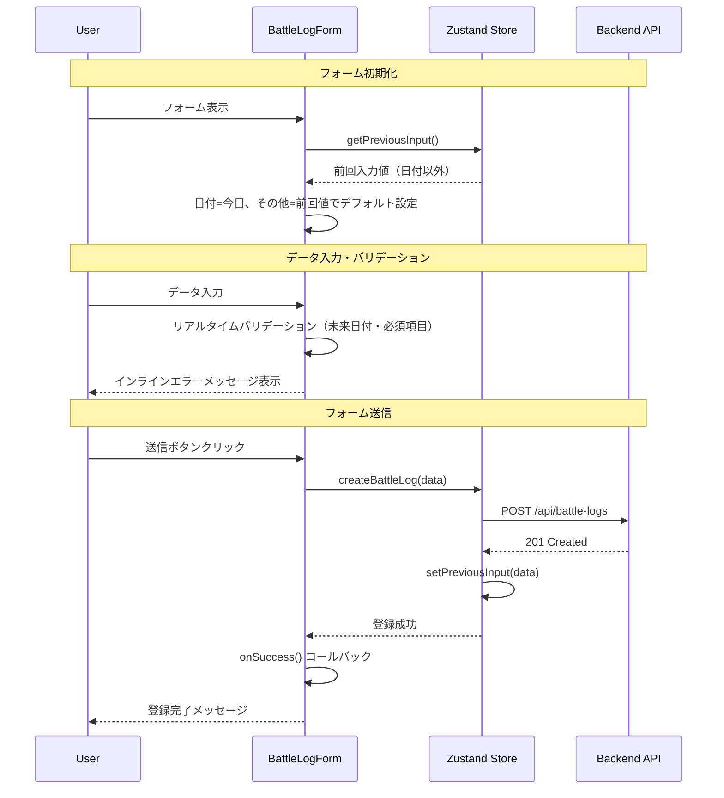

# TDD要件定義: Battle Log登録フォーム実装

**タスクID**: TASK-0016
**タスク名**: Battle Log登録フォーム実装
**実装タイプ**: TDD Process
**作成日**: 2025-11-07
**ステータス**: 要件定義完了

---

## 1. 機能の概要（EARS要件定義書・設計文書ベース）

### 🔵 何をする機能か
Battle Log登録フォーム（BattleLogForm）は、ユーザーが対戦履歴を入力し、バックエンドAPIに送信して登録するためのReactコンポーネントです。

### 🔵 どのような問題を解決するか
- **REQ-001**: 対戦履歴の登録機能を提供（ユーザーが対戦結果を記録できる）
- **REQ-003**: 前回入力値の引き継ぎ（日付以外）により、連続入力時の効率化を実現
- **REQ-030**: 未来日付の入力禁止により、データの整合性を保証
- **REQ-031**: インラインエラーメッセージによる、ユーザーフレンドリーなバリデーションフィードバック

### 🔵 想定されるユーザー
- **個人ユーザー**: シャドウバースプレイヤー（Phase 1は単一ユーザー）
- **使用シーン**: 対戦終了後、即座に対戦結果を記録

### 🔵 システム内での位置づけ
- **階層**: プレゼンテーション層（Frontend - React Component）
- **依存関係**:
  - **TASK-0015**: Zustand State Management（`useBattleLogStore`）
  - **TASK-0007**: Backend API（`POST /api/battle-logs`）
  - **共有型定義**: `frontend/src/types/index.ts`

### 参照した要件・設計文書
- **参照したEARS要件**: REQ-001, REQ-002, REQ-003, REQ-030, REQ-031
- **参照した設計文書**:
  - `docs/design/shadowverse-battle-log/architecture.md` - フロントエンドコンポーネント構成
  - `docs/design/shadowverse-battle-log/dataflow.md` - Phase 1: 対戦履歴登録フロー
  - `docs/design/shadowverse-battle-log/api-endpoints.md` - 1.2 対戦履歴登録エンドポイント

---

## 2. 入力・出力の仕様（EARS機能要件・TypeScript型定義ベース）

### 🔵 入力パラメータ

#### プロップス型定義

```typescript
interface BattleLogFormProps {
  /** フォーム送信成功時のコールバック関数 */
  onSuccess?: () => void;
  /** フォームキャンセル時のコールバック関数 */
  onCancel?: () => void;
}
```

#### フォーム入力フィールド

| フィールド名 | 型 | 必須 | デフォルト値 | バリデーション | 信頼性 |
|------------|---|-----|-------------|--------------|-------|
| `date` | string | No | 今日の日付 | YYYY-MM-DD形式、未来日付禁止 | 🔵 REQ-002, REQ-030 |
| `battleType` | BattleType | Yes | 前回値 | "ランクマッチ" \| "対戦台" \| "ロビー大会" | 🔵 REQ-002 |
| `rank` | Rank | Yes | 前回値 | "サファイア" \| "ダイアモンド" \| "ルビー" \| "トパーズ" \| "-" | 🔵 REQ-002 |
| `group` | Group | Yes | 前回値 | "A" \| "AA" \| "AAA" \| "Master" \| "-" | 🔵 REQ-002 |
| `myDeckId` | string | Yes | 前回値 | マイデッキ選択肢から選択 | 🔵 REQ-002 |
| `turn` | Turn | Yes | 前回値 | "先攻" \| "後攻" | 🔵 REQ-002 |
| `result` | BattleResult | Yes | 前回値 | "勝ち" \| "負け" | 🔵 REQ-002 |
| `opponentDeckId` | string | Yes | 前回値 | デッキマスター選択肢から選択 | 🔵 REQ-002 |

**前回値引き継ぎの仕様（REQ-003）**:
- **日付フィールド**: 常に今日の日付（前回値を引き継がない）
- **その他7フィールド**: Zustand Store の `previousInput` から前回値を取得し、デフォルト値として設定

### 🔵 出力値

#### 送信データ型

```typescript
type CreateBattleLogRequest = {
  date?: string;           // YYYY-MM-DD形式（省略時は今日）
  battleType: BattleType;
  rank: Rank;
  group: Group;
  myDeckId: string;
  turn: Turn;
  result: BattleResult;
  opponentDeckId: string;
}
```

#### API レスポンス（成功時）

```typescript
{
  success: true,
  data: {
    battleLog: BattleLog // 登録された対戦履歴
  },
  meta: {
    timestamp: string,
    requestId: string
  }
}
```

#### UI イベント

- **`onSuccess`コールバック**: フォーム送信成功時に呼び出される（フォームをクローズする等の処理に使用）
- **`onCancel`コールバック**: キャンセルボタンクリック時に呼び出される

### 🔵 入出力の関係性



### 🔵 データフロー

**参照した設計文書**: `docs/design/shadowverse-battle-log/dataflow.md` - Phase 1: 対戦履歴登録フロー

**型定義**: `frontend/src/types/index.ts` - `CreateBattleLogRequest`, `BattleLog`

---

## 3. 制約条件（EARS非機能要件・アーキテクチャ設計ベース）

### 🔵 バリデーション要件

| 項目 | 制約 | エラーメッセージ | 信頼性 |
|------|------|---------------|-------|
| 日付 | 未来日付禁止 | "未来の日付は入力できません" | 🔵 REQ-030 |
| 日付 | YYYY-MM-DD形式 | "日付形式が不正です（YYYY-MM-DD形式で入力してください）" | 🔵 REQ-002 |
| 必須項目 | 全8項目必須（date除く） | "{フィールド名}は必須です" | 🔵 REQ-002 |
| myDeckId | 存在するデッキID | "存在しないデッキIDです" | 🟡 データ整合性から妥当な推測 |
| opponentDeckId | 存在するデッキマスターID | "存在しないデッキIDです" | 🟡 データ整合性から妥当な推測 |

### 🔵 UI/UX要件

| 項目 | 制約 | 信頼性 |
|------|------|-------|
| レスポンシブデザイン | モバイルファースト（スマホ・タブレット・PC対応） | 🔵 REQ-603, architecture.md |
| インラインエラー | 各フィールドの下にエラーメッセージを表示 | 🔵 REQ-031 |
| ローディング状態 | 送信中はボタンを無効化し、ローディングスピナー表示 | 🟡 一般的なUXパターンから |
| フォーカス管理 | 最初のエラーフィールドにフォーカス移動 | 🟡 アクセシビリティ要件から |

### 🔵 パフォーマンス要件

| 項目 | 制約 | 信頼性 |
|------|------|-------|
| 初期表示 | 300ms以内 | 🟡 architecture.md - パフォーマンス設計より |
| フォーム送信 | 500ms以内（APIレスポンス含む） | 🔵 api-endpoints.md - POST /battle-logs 目標300ms |
| バリデーション | リアルタイム（入力時・Blur時） | 🟡 一般的なフォームUXから |

### 🔵 アーキテクチャ制約

| 項目 | 制約 | 信頼性 |
|------|------|-------|
| 状態管理 | Zustand Store（`useBattleLogStore`）を使用 | 🔵 TASK-0015, architecture.md |
| スタイリング | Tailwind CSS v4 を使用 | 🔵 tech-stack.md |
| TypeScript strict mode | 有効化必須 | 🔵 CLAUDE.md |
| `any`型の使用 | 禁止 | 🔵 CLAUDE.md |

### 参照した要件・設計文書
- **参照したEARS要件**: REQ-030, REQ-031, REQ-603
- **参照した設計文書**:
  - `docs/design/shadowverse-battle-log/architecture.md` - パフォーマンス設計、フロントエンドコンポーネント構成
  - `docs/design/shadowverse-battle-log/api-endpoints.md` - パフォーマンス要件
  - `docs/tech-stack.md` - フロントエンド技術スタック

---

## 4. 想定される使用例（EARSEdgeケース・データフローベース）

### 🔵 基本的な使用パターン

#### ユースケース1: 初回登録

```typescript
// Given: ユーザーが初めて対戦履歴を登録する
// When: フォームを開く
// Then:
// - 日付: 今日の日付
// - その他フィールド: 空（previousInput が null のため）

// Given: ユーザーがフォームに入力
const input = {
  date: "2025-11-07",
  battleType: "ランクマッチ",
  rank: "ダイアモンド",
  group: "AAA",
  myDeckId: "deck_001",
  turn: "先攻",
  result: "勝ち",
  opponentDeckId: "deck_master_002"
};

// When: 送信ボタンクリック
// Then:
// - API: POST /api/battle-logs が呼ばれる
// - Store: previousInput に入力値が保存される
// - UI: onSuccess コールバックが呼ばれる
```

#### ユースケース2: 連続登録（前回値引き継ぎ）

```typescript
// Given: 1回目の登録が完了し、2回目のフォームを開く
// When: フォームを開く
// Then:
// - 日付: 今日の日付（前回値を引き継がない）
// - battleType: "ランクマッチ"（前回値）
// - rank: "ダイアモンド"（前回値）
// - group: "AAA"（前回値）
// - myDeckId: "deck_001"（前回値）
// - turn: "先攻"（前回値）
// - result: "勝ち"（前回値）
// - opponentDeckId: "deck_master_002"（前回値）

// Given: ユーザーが変更するのは「相手デッキ」と「結果」のみ
const input = {
  ...previousInput,
  date: "2025-11-07", // 今日
  result: "負け",      // 変更
  opponentDeckId: "deck_master_005" // 変更
};
```

### 🔵 エッジケース

#### EDGE-001: 未来日付の入力

```typescript
// Given: ユーザーが未来の日付を入力
const input = {
  date: "2099-12-31", // 未来日付
  // ...その他フィールド
};

// When: Blurまたは送信ボタンクリック
// Then:
// - バリデーションエラー: "未来の日付は入力できません"
// - 送信ボタン: 無効化
// - フォーカス: 日付フィールドに移動
```

#### EDGE-002: 必須項目の未入力

```typescript
// Given: ユーザーが必須項目を未入力
const input = {
  date: "2025-11-07",
  battleType: "", // 未入力
  // ...その他フィールド
};

// When: 送信ボタンクリック
// Then:
// - バリデーションエラー: "対戦タイプは必須です"
// - 送信ボタン: 無効化
// - フォーカス: battleTypeフィールドに移動
```

#### EDGE-003: APIエラー（ネットワークエラー）

```typescript
// Given: ユーザーがフォームを送信
// When: Backend APIがネットワークエラーを返す
// Then:
// - Store: error に "ネットワークエラーが発生しました" を設定
// - UI: エラーメッセージ表示（フォーム上部）
// - ローディング状態: 解除
// - フォーム: クローズしない（再送信可能）
```

#### EDGE-004: APIエラー（バリデーションエラー）

```typescript
// Given: ユーザーがフォームを送信
// When: Backend APIがバリデーションエラーを返す
// Then:
// - Store: error に "入力値が不正です" を設定
// - UI: エラー詳細（detailsフィールド）をインラインエラーとして表示
// - ローディング状態: 解除
// - フォーム: クローズしない（修正可能）
```

### 🔵 エラーケース

#### エラーケース1: 日付形式不正

```typescript
// Given: ユーザーが不正な日付形式を入力
const input = {
  date: "2025/11/07", // スラッシュ区切り（不正）
  // ...
};

// Then: "日付形式が不正です（YYYY-MM-DD形式で入力してください）"
```

#### エラーケース2: マイデッキID不正

```typescript
// Given: マイデッキが1つも登録されていない
// When: フォームを開く
// Then:
// - myDeckIdフィールド: 選択肢なし（"マイデッキを登録してください"メッセージ表示）
// - 送信ボタン: 無効化
```

### 参照した要件・設計文書
- **参照したEARS要件**: REQ-001, REQ-002, REQ-003, REQ-030
- **参照したEdgeケース**: EDGE-001 (ネットワークエラー), EDGE-002 (Blob Storage エラー)
- **参照した設計文書**:
  - `docs/design/shadowverse-battle-log/dataflow.md` - Phase 1: 対戦履歴登録フロー

---

## 5. EARS要件・設計文書との対応関係

### 参照したユーザストーリー
- **ストーリー**: 対戦履歴を簡単に記録したい

### 参照した機能要件
- **REQ-001**: 対戦履歴の登録機能
- **REQ-002**: 8項目の入力フィールド（date, battleType, rank, group, myDeckId, turn, result, opponentDeckId）
- **REQ-003**: 前回入力値の引き継ぎ（日付以外）
- **REQ-030**: 未来日付の入力禁止
- **REQ-031**: インラインエラーメッセージ

### 参照した非機能要件
- **REQ-603**: レスポンシブデザイン（モバイルファースト）
- **NFR-101**: HTTPS通信必須
- **NFR-103**: 入力バリデーション（フロントエンド + バックエンド両方）

### 参照したEdgeケース
- **EDGE-001**: ネットワークエラー時のリトライボタン表示
- **EDGE-002**: Blob Storage アクセス失敗時の3回リトライ

### 参照した受け入れ基準
- 対戦履歴が正常に登録できること
- 前回入力値が引き継がれること（日付以外）
- 未来日付が入力できないこと
- インラインエラーメッセージが表示されること
- モバイル・タブレット・PCで正しく表示されること

### 参照した設計文書

#### アーキテクチャ
- **architecture.md**:
  - フロントエンドコンポーネント構成（`components/battle-log/BattleLogForm`）
  - 主要な設計パターン（React 19.x, TypeScript 5.7+, Zustand, Tailwind CSS v4）
  - パフォーマンス設計（初期ロード最小化、クライアント側キャッシュ）

#### データフロー
- **dataflow.md**:
  - Phase 1: 対戦履歴登録フロー（ダイアログ表示 → データ入力 → API送信 → 画面更新）
  - フロントエンド ⇔ Zustand Store ⇔ Backend API の相互作用

#### 型定義
- **types/index.ts**:
  - `CreateBattleLogRequest`（フォーム送信データ型）
  - `BattleLog`（登録された対戦履歴の型）
  - `BattleType`, `Rank`, `Group`, `Turn`, `BattleResult`（enum型）

#### API仕様
- **api-endpoints.md**:
  - 1.2 対戦履歴登録（`POST /api/battle-logs`）
  - リクエストボディ、レスポンス例、バリデーションエラー例
  - パフォーマンス要件（目標300ms、最大500ms）

---

## 6. コンポーネント設計

### 🔵 コンポーネント構造

```
BattleLogForm
├── フォームタイトル
├── エラーメッセージ表示エリア（グローバルエラー）
├── 日付入力フィールド (date)
│   ├── ラベル: "対戦日"
│   ├── input type="date"
│   └── インラインエラー表示
├── 対戦タイプ選択 (battleType)
│   ├── ラベル: "対戦タイプ"
│   ├── select ドロップダウン
│   └── インラインエラー表示
├── ランク選択 (rank)
│   ├── ラベル: "ランク"
│   ├── select ドロップダウン
│   └── インラインエラー表示
├── グループ選択 (group)
│   ├── ラベル: "グループ"
│   ├── select ドロップダウン
│   └── インラインエラー表示
├── マイデッキ選択 (myDeckId)
│   ├── ラベル: "使用デッキ"
│   ├── select ドロップダウン
│   └── インラインエラー表示
├── ターン選択 (turn)
│   ├── ラベル: "先攻後攻"
│   ├── Radio ボタン（先攻 / 後攻）
│   └── インラインエラー表示
├── 対戦結果選択 (result)
│   ├── ラベル: "対戦結果"
│   ├── Radio ボタン（勝ち / 負け）
│   └── インラインエラー表示
├── 相手デッキ選択 (opponentDeckId)
│   ├── ラベル: "相手デッキ"
│   ├── select ドロップダウン
│   └── インラインエラー表示
└── フォームアクション
    ├── キャンセルボタン
    └── 登録ボタン（ローディング状態対応）
```

### 🔵 状態管理

```typescript
// ローカル状態（React useState）
const [formData, setFormData] = useState<CreateBattleLogRequest>(initialValues);
const [validationErrors, setValidationErrors] = useState<Record<string, string>>({});

// グローバル状態（Zustand Store）
const {
  previousInput,
  isLoading,
  error,
  createBattleLog,
  clearError
} = useBattleLogStore();
```

### 🔵 バリデーション戦略

**クライアント側バリデーション**:
1. **リアルタイムバリデーション**: 各フィールドのBlur時にバリデーション実行
2. **送信時バリデーション**: 送信ボタンクリック時に全フィールドをバリデーション
3. **バリデーションライブラリ**: Zod（Backend APIと同じスキーマを使用）

**バリデーションタイミング**:
- **onChange**: 日付フィールドのみ（未来日付チェック）
- **onBlur**: 全フィールド（必須項目・形式チェック）
- **onSubmit**: 全フィールド（最終確認）

### 🔵 アクセシビリティ（a11y）

| 項目 | 対応 | 信頼性 |
|------|------|-------|
| `<label>` for属性 | すべてのフィールドに設定 | 🟡 アクセシビリティ要件から |
| `aria-invalid` | バリデーションエラー時に設定 | 🟡 アクセシビリティ要件から |
| `aria-describedby` | エラーメッセージとフィールドを関連付け | 🟡 アクセシビリティ要件から |
| キーボードナビゲーション | Tab / Shift+Tab でフォーカス移動 | 🟡 アクセシビリティ要件から |
| Enterキー送信 | フォーム内でEnterキー押下時に送信 | 🟡 一般的なフォームUXから |
| Escキー閉じる | Escキー押下時にフォームクローズ | 🟡 一般的なフォームUXから |

---

## 7. 品質判定

### ✅ 高品質

- **要件の曖昧さ**: なし（REQ-001, REQ-002, REQ-003, REQ-030, REQ-031を完全参照）
- **入出力定義**: 完全（`CreateBattleLogRequest`型、API レスポンス型が明確）
- **制約条件**: 明確（バリデーション要件、UI/UX要件、パフォーマンス要件が具体的）
- **実装可能性**: 確実（TASK-0015のZustandストア、TASK-0007のBackend APIが既に完成）

---

## 8. 次のステップ

次のお勧めステップ: `/tsumiki:tdd-testcases` でテストケースの洗い出しを行います。

---

## 更新履歴

- **2025-11-07**: 初版作成（TDD要件定義完了）
  - EARS要件定義書（REQ-001, REQ-002, REQ-003, REQ-030, REQ-031）を参照
  - 設計文書（architecture.md, dataflow.md, api-endpoints.md）を参照
  - Zustand Store（TASK-0015）、Backend API（TASK-0007）との連携を明確化
  - コンポーネント設計、状態管理、バリデーション戦略を具体化
