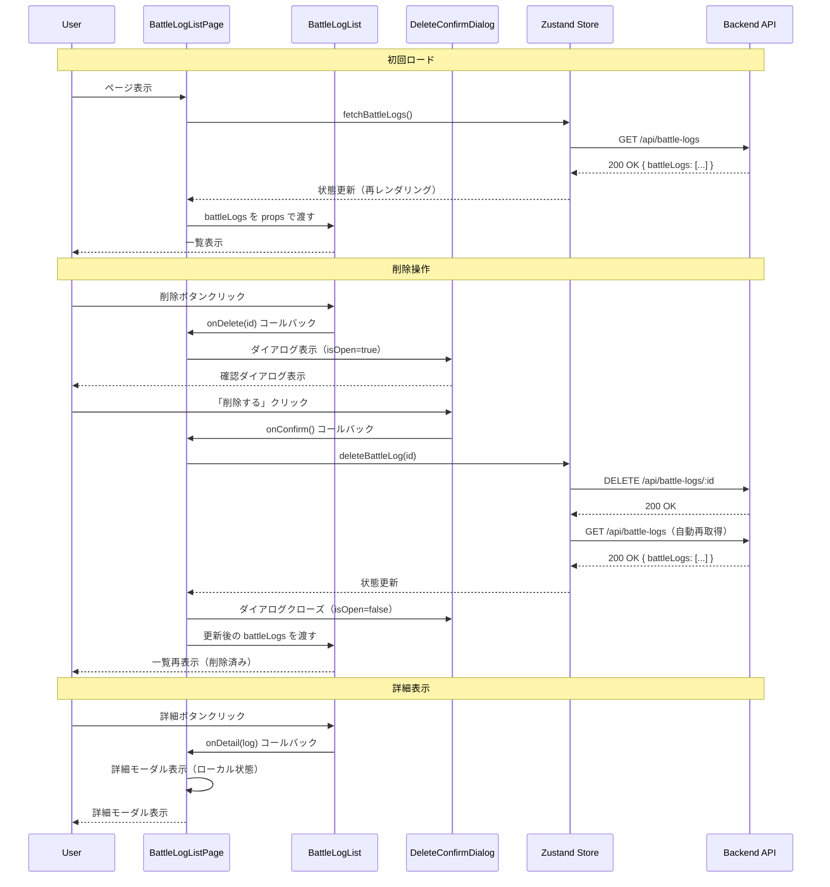

# TDD要件定義: Battle Log一覧画面実装

**タスクID**: TASK-0017
**タスク名**: Battle Log一覧画面実装
**実装タイプ**: TDD Process
**作成日**: 2025-11-08
**ステータス**: 要件定義完了

---

## 1. 機能の概要（EARS要件定義書・設計文書ベース）

### 🔵 何をする機能か

Battle Log一覧画面（BattleLogListPage）は、ユーザーが登録した対戦履歴を一覧表示し、削除・詳細表示・新規登録の操作を提供するReact Pageコンポーネントです。以下の主要コンポーネントから構成されます：

1. **BattleLogListPage** - ページコンテナ（ヘッダー、フォームトリガー、一覧表示）
2. **BattleLogList** - テーブル形式の一覧表示（ソート、削除、詳細ボタン）
3. **DeleteConfirmDialog** - 削除確認モーダル
4. **Loading/Error States** - ローディング・エラー表示
5. **Responsive Design** - モバイル対応レイアウト（テーブル → カード）

### 🔵 どのような問題を解決するか

- **REQ-009**: 対戦履歴一覧表示機能（ユーザーが過去の対戦を確認できる）
- **REQ-010**: 削除機能（不要な対戦履歴を削除できる）
- **REQ-011**: 詳細表示機能（個別の対戦履歴詳細を確認できる）
- **REQ-032**: ローディング状態表示（データ取得中の待機状態を明示）
- **REQ-033**: エラー状態表示（API エラーをユーザーフレンドリーに表示）
- **REQ-034**: レスポンシブデザイン（モバイル・タブレット・PCで最適表示）
- **REQ-103**: ソート機能（日付降順がデフォルト）

### 🔵 想定されるユーザー

- **個人ユーザー**: シャドウバースプレイヤー（Phase 1は単一ユーザー）
- **使用シーン**: 対戦履歴を確認・分析する際に頻繁にアクセス
- **操作頻度**: 高頻度（毎日複数回）

### 🔵 システム内での位置づけ

- **階層**: プレゼンテーション層（Frontend - React Page Component）
- **ルーティング**: `/battle-logs` （React Router v7）
- **依存関係**:
  - **TASK-0015**: Zustand State Management（`useBattleLogStore`）✅ 完了
  - **TASK-0008**: Backend API（`GET /api/battle-logs`, `DELETE /api/battle-logs/:id`）✅ 完了
  - **TASK-0016**: Battle Log Form（`BattleLogForm`）✅ 完了
  - **共有型定義**: `frontend/src/types/index.ts`

### 参照した要件・設計文書

- **参照したEARS要件**: REQ-009, REQ-010, REQ-011, REQ-032, REQ-033, REQ-034, REQ-103
- **参照した設計文書**:
  - `docs/design/shadowverse-battle-log/architecture.md` - フロントエンドコンポーネント構成
  - `docs/design/shadowverse-battle-log/dataflow.md` - Phase 1: 対戦履歴一覧表示フロー
  - `docs/implements/shadowverse-battle-log/TASK-0008/battle-log-list-delete-requirements.md` - Backend API仕様

---

## 2. 入力・出力の仕様（EARS機能要件・TypeScript型定義ベース）

### 🔵 入力パラメータ

#### BattleLogListPageコンポーネント

**プロップス**: なし（ルーティングされたページコンポーネント）

**Zustand Storeからの入力**:

```typescript
const {
  battleLogs,      // BattleLog[] - 対戦履歴一覧
  isLoading,       // boolean - ローディング状態
  error,           // string | null - エラーメッセージ
  fetchBattleLogs, // () => Promise<void> - 一覧取得アクション
  deleteBattleLog, // (id: string) => Promise<void> - 削除アクション
  clearError,      // () => void - エラークリアアクション
} = useBattleLogStore();
```

#### BattleLogListコンポーネント

```typescript
interface BattleLogListProps {
  /** 対戦履歴一覧データ */
  battleLogs: BattleLog[];
  /** 削除ボタンクリック時のコールバック関数 */
  onDelete: (id: string) => void;
  /** 詳細ボタンクリック時のコールバック関数 */
  onDetail: (log: BattleLog) => void;
}
```

#### DeleteConfirmDialogコンポーネント

```typescript
interface DeleteConfirmDialogProps {
  /** ダイアログ表示状態 */
  isOpen: boolean;
  /** 削除対象の対戦履歴 */
  targetLog: BattleLog | null;
  /** ローディング状態 */
  isLoading: boolean;
  /** 削除実行時のコールバック関数 */
  onConfirm: () => void;
  /** キャンセル時のコールバック関数 */
  onCancel: () => void;
}
```

### 🔵 表示データ型（BattleLog）

```typescript
interface BattleLog {
  id: string;                    // log_YYYYMMDD_NNN形式
  date: string;                  // YYYY/MM/DD形式
  battleType: BattleType;        // "ランクマッチ" | "対戦台" | "ロビー大会"
  rank: Rank;                    // "サファイア" | "ダイアモンド" | "ルビー" | "トパーズ" | "-"
  group: Group;                  // "A" | "AA" | "AAA" | "Master" | "-"
  myDeckId: string;              // マイデッキID
  turn: Turn;                    // "先攻" | "後攻"
  result: BattleResult;          // "勝ち" | "負け"
  opponentDeckId: string;        // 相手デッキID
  myDeckName?: string;           // マイデッキ名（Backend API でjoin済み）
  opponentDeckName?: string;     // 相手デッキ名（Backend API でjoin済み）
}
```

### 🔵 出力形式（UIコンポーネント）

#### テーブル表示（デスクトップ）

| 列名 | データ | 表示形式 | 信頼性 |
|------|--------|---------|-------|
| 対戦日 | `date` | YYYY/MM/DD | 🔵 REQ-009 |
| 対戦タイプ | `battleType` | "ランクマッチ" 等 | 🔵 REQ-009 |
| ランク | `rank` | "ダイアモンド" 等 | 🔵 REQ-009 |
| グループ | `group` | "AAA" 等 | 🔵 REQ-009 |
| 使用デッキ | `myDeckName` | "テストデッキ1" 等 | 🔵 REQ-009, REQ-106 |
| 先攻後攻 | `turn` | "先攻" | "後攻" | 🔵 REQ-009 |
| 対戦結果 | `result` | "勝ち" | "負け" | 🔵 REQ-009 |
| 相手デッキ | `opponentDeckName` | "相手デッキ1" 等 | 🔵 REQ-009, REQ-106 |
| アクション | - | 詳細ボタン、削除ボタン | 🔵 REQ-010, REQ-011 |

#### カード表示（モバイル）

```
┌─────────────────────────────────┐
│ 2025/11/08 | 勝ち              │
│ ランクマッチ | ダイアモンド AAA │
│ 使用デッキ: テストデッキ1        │
│ 相手デッキ: 相手デッキ1          │
│ [詳細] [削除]                   │
└─────────────────────────────────┘
```

### 🔵 入出力の関係性（データフロー）



### 🔵 データフロー（参照した設計文書）

**参照した設計文書**: `docs/design/shadowverse-battle-log/dataflow.md` - Phase 1: 対戦履歴一覧表示フロー

**型定義**: `frontend/src/types/index.ts` - `BattleLog`, `BattleLogsResponse`

---

## 3. 制約条件（EARS非機能要件・アーキテクチャ設計ベース）

### 🔵 UI/UX要件

| 項目 | 制約 | 信頼性 |
|------|------|-------|
| レスポンシブデザイン | デスクトップ（1024px以上）：テーブル表示<br>タブレット（768px〜1023px）：縮小テーブル表示<br>モバイル（767px以下）：カード表示 | 🔵 REQ-034, REQ-603 |
| ソート機能 | 日付降順がデフォルト（最新順） | 🔵 REQ-103 |
| 空データ表示 | 対戦履歴が0件の場合、"データがありません"メッセージを表示 | 🔵 EDGE-204 |
| ローディング状態 | データ取得中は"読み込み中..."スピナーを表示 | 🔵 REQ-032 |
| エラー状態 | エラー発生時はユーザーフレンドリーなメッセージを表示 | 🔵 REQ-033 |
| 削除確認ダイアログ | 削除前に確認ダイアログを表示（誤削除防止） | 🟡 一般的なUXパターンから |

### 🔵 パフォーマンス要件

| 項目 | 制約 | 信頼性 |
|------|------|-------|
| 初期表示 | 300ms以内（Zustand キャッシュあり） | 🟡 architecture.md - パフォーマンス設計より |
| データ取得 | 500ms以内（APIレスポンス含む） | 🔵 api-endpoints.md - GET /battle-logs 目標300ms |
| 削除操作 | 500ms以内（APIレスポンス含む） | 🔵 api-endpoints.md - DELETE /battle-logs/:id 目標300ms |
| レンダリング | 100ms以内（React 19 自動最適化） | 🟡 architecture.md - パフォーマンス設計より |

### 🔵 アーキテクチャ制約

| 項目 | 制約 | 信頼性 |
|------|------|-------|
| 状態管理 | Zustand Store（`useBattleLogStore`）を使用 | 🔵 TASK-0015, architecture.md |
| スタイリング | Tailwind CSS v4 を使用 | 🔵 tech-stack.md |
| ルーティング | React Router v7 を使用 | 🔵 tech-stack.md |
| TypeScript strict mode | 有効化必須 | 🔵 CLAUDE.md |
| `any`型の使用 | 禁止 | 🔵 CLAUDE.md |

### 🔵 アクセシビリティ要件

| 項目 | 制約 | 信頼性 |
|------|------|-------|
| `role="table"` | テーブルコンポーネントに設定 | 🟡 アクセシビリティ要件から |
| `aria-label` | 削除・詳細ボタンに設定 | 🟡 アクセシビリティ要件から |
| キーボードナビゲーション | Tab / Shift+Tab でフォーカス移動 | 🟡 アクセシビリティ要件から |
| Enterキー操作 | ボタンフォーカス時にEnterキーで実行 | 🟡 一般的なアクセシビリティパターンから |

### 参照した要件・設計文書

- **参照したEARS要件**: REQ-032, REQ-033, REQ-034, REQ-103, REQ-603, EDGE-204
- **参照した設計文書**:
  - `docs/design/shadowverse-battle-log/architecture.md` - パフォーマンス設計、フロントエンドコンポーネント構成
  - `docs/design/shadowverse-battle-log/api-endpoints.md` - パフォーマンス要件
  - `docs/tech-stack.md` - フロントエンド技術スタック

---

## 4. 想定される使用例（EARSEdgeケース・データフローベース）

### 🔵 基本的な使用パターン

#### ユースケース1: 初回ロード（対戦履歴あり）

```typescript
// Given: ユーザーが一覧ページにアクセス
// When: BattleLogListPage がマウントされる
// Then:
// - fetchBattleLogs() が自動実行される
// - isLoading = true となり、ローディングスピナー表示
// - Backend API から対戦履歴を取得
// - battleLogs が更新され、テーブル表示（日付降順）
```

**期待される動作**:
1. ローディングスピナー表示（"読み込み中..."）
2. Backend API から対戦履歴を取得（3件を想定）
3. テーブルに3件表示（最新順）
4. 各行に「詳細」「削除」ボタンが表示される

#### ユースケース2: 削除操作（確認ダイアログ → 削除実行）

```typescript
// Given: 対戦履歴一覧が表示されている
// When: ユーザーが「削除」ボタンをクリック
// Then:
// - 削除確認ダイアログが表示される
// - ダイアログには対象の対戦日・対戦結果が表示される

// Given: 削除確認ダイアログが表示されている
// When: ユーザーが「削除する」ボタンをクリック
// Then:
// - deleteBattleLog(id) が実行される
// - isLoading = true となり、ダイアログのボタンが無効化
// - Backend API に削除リクエスト送信
// - 削除成功後、fetchBattleLogs() が自動実行される
// - ダイアログがクローズされる
// - 一覧から削除された対戦履歴が消える
```

**期待される動作**:
1. 削除ボタンクリック → ダイアログ表示
2. "本当に削除しますか？" メッセージ表示
3. "削除する" ボタンクリック → API 呼び出し
4. 削除成功 → ダイアログクローズ → 一覧更新
5. 削除された対戦履歴が一覧から消える

#### ユースケース3: 詳細表示

```typescript
// Given: 対戦履歴一覧が表示されている
// When: ユーザーが「詳細」ボタンをクリック
// Then:
// - 詳細モーダルが表示される
// - 選択した対戦履歴の全フィールドが表示される
// - "閉じる"ボタンが表示される

// Given: 詳細モーダルが表示されている
// When: ユーザーが「閉じる」ボタンをクリック
// Then:
// - 詳細モーダルがクローズされる
// - 一覧画面に戻る
```

**期待される動作**:
1. 詳細ボタンクリック → モーダル表示
2. 対戦日、対戦タイプ、ランク、グループ、使用デッキ、先攻後攻、対戦結果、相手デッキが表示される
3. "閉じる"ボタンクリック → モーダルクローズ

#### ユースケース4: 新規登録トリガー

```typescript
// Given: 対戦履歴一覧が表示されている
// When: ユーザーが「新規登録」ボタンをクリック
// Then:
// - BattleLogForm コンポーネントがモーダルで表示される
// - 前回入力値が引き継がれる（日付以外）

// Given: BattleLogForm で対戦履歴を登録
// When: 登録成功
// Then:
// - BattleLogForm がクローズされる
// - fetchBattleLogs() が自動実行される（Zustand Store経由）
// - 一覧に新規登録された対戦履歴が追加される
```

**期待される動作**:
1. "新規登録"ボタンクリック → BattleLogForm モーダル表示
2. フォーム送信成功 → モーダルクローズ
3. 一覧に新規データが追加される（最上位に表示）

### 🔵 エッジケース

#### EDGE-001: 対戦履歴が0件

```typescript
// Given: Backend API から空配列が返される
// When: BattleLogListPage がマウントされる
// Then:
// - battleLogs = [] となる
// - "データがありません"メッセージが表示される
// - テーブル/カードは表示されない
```

**期待される動作**:
- "対戦履歴がありません。「新規登録」ボタンから対戦履歴を追加してください。" メッセージ表示
- テーブルは表示されない

#### EDGE-002: APIエラー（ネットワークエラー）

```typescript
// Given: Backend API がネットワークエラーを返す
// When: fetchBattleLogs() が実行される
// Then:
// - error = "ネットワークエラーが発生しました" が設定される
// - エラーメッセージが画面上部に表示される
// - "再試行"ボタンが表示される

// Given: エラーメッセージが表示されている
// When: ユーザーが"再試行"ボタンをクリック
// Then:
// - fetchBattleLogs() が再実行される
// - エラーがクリアされる（clearError()）
```

**期待される動作**:
1. ネットワークエラー発生 → エラーメッセージ表示
2. "再試行"ボタン表示
3. 再試行ボタンクリック → fetchBattleLogs() 再実行
4. 成功時はエラーメッセージクリア → 一覧表示

#### EDGE-003: 削除中にエラー発生

```typescript
// Given: ユーザーが削除を実行
// When: Backend API が404エラーを返す（対象が既に削除済み等）
// Then:
// - error = "対戦履歴が見つかりません" が設定される
// - ダイアログがクローズされる
// - エラーメッセージが画面上部に表示される
// - fetchBattleLogs() が実行され、最新状態に同期される
```

**期待される動作**:
1. 削除実行 → 404エラー発生
2. ダイアログクローズ
3. エラーメッセージ表示："対戦履歴が見つかりません"
4. 一覧が最新状態に更新される

#### EDGE-004: レスポンシブ切り替え

```typescript
// Given: デスクトップ（1024px以上）でテーブル表示
// When: ウィンドウサイズをモバイル（767px以下）に変更
// Then:
// - テーブル表示 → カード表示に切り替わる
// - 各対戦履歴がカード形式で表示される
// - "詳細"・"削除"ボタンはカード内に配置される
```

**期待される動作**:
1. デスクトップ → テーブル表示（横スクロールなし）
2. タブレット → 縮小テーブル表示（一部列を省略）
3. モバイル → カード表示（縦スクロール）

### 🔵 エラーケース

#### エラーケース1: 削除確認ダイアログのキャンセル

```typescript
// Given: 削除確認ダイアログが表示されている
// When: ユーザーが「キャンセル」ボタンをクリック
// Then:
// - ダイアログがクローズされる
// - deleteBattleLog() は実行されない
// - 一覧画面に戻る（対戦履歴は削除されない）
```

**期待される動作**:
1. "キャンセル"ボタンクリック → ダイアログクローズ
2. 一覧画面に戻る
3. 対戦履歴は削除されない

#### エラーケース2: 詳細モーダルのEscキークローズ

```typescript
// Given: 詳細モーダルが表示されている
// When: ユーザーが Esc キーを押す
// Then:
// - 詳細モーダルがクローズされる
// - 一覧画面に戻る
```

**期待される動作**:
1. Escキー押下 → モーダルクローズ
2. 一覧画面に戻る

### 参照した要件・設計文書

- **参照したEARS要件**: REQ-009, REQ-010, REQ-011, REQ-032, REQ-033, REQ-103
- **参照したEdgeケース**: EDGE-001 (ネットワークエラー), EDGE-204 (空データ)
- **参照した設計文書**:
  - `docs/design/shadowverse-battle-log/dataflow.md` - Phase 1: 対戦履歴一覧表示フロー

---

## 5. EARS要件・設計文書との対応関係

### 参照したユーザストーリー

- **ストーリー**: 対戦履歴を一覧で確認・管理したい

### 参照した機能要件

- **REQ-009**: 対戦履歴一覧表示機能（日付降順ソート）
- **REQ-010**: 削除機能（確認ダイアログ付き）
- **REQ-011**: 詳細表示機能（モーダルで全フィールド表示）
- **REQ-032**: ローディング状態表示
- **REQ-033**: エラー状態表示（ユーザーフレンドリーなメッセージ）
- **REQ-034**: レスポンシブデザイン（モバイルファースト）
- **REQ-103**: ソート機能（日付降順がデフォルト）
- **REQ-106**: デッキ名表示（IDではなく、人間が読める名前）

### 参照した非機能要件

- **REQ-603**: レスポンシブデザイン（モバイル・タブレット・PC対応）
- **NFR-101**: HTTPS通信必須
- **NFR-103**: 入力バリデーション（フロントエンド + バックエンド両方）

### 参照したEdgeケース

- **EDGE-001**: ネットワークエラー時のリトライボタン表示
- **EDGE-204**: 空データ時のメッセージ表示

### 参照した受け入れ基準

- テーブル形式の一覧表示が実装されている
- 日付降順ソートが動作する
- 削除機能が動作する（確認ダイアログ付き）
- 詳細表示が動作する
- ローディング状態が表示される
- エラー状態が表示される
- 空データ時のメッセージが表示される
- レスポンシブデザインが動作する（テーブル → カード）

### 参照した設計文書

#### アーキテクチャ

- **architecture.md**:
  - フロントエンドコンポーネント構成（`pages/BattleLogListPage`, `components/battle-log/BattleLogList`）
  - 主要な設計パターン（React 19.x, TypeScript 5.7+, Zustand, Tailwind CSS v4, React Router v7）
  - パフォーマンス設計（初期ロード最小化、クライアント側キャッシュ）

#### データフロー

- **dataflow.md**:
  - Phase 1: 対戦履歴一覧表示フロー（ページ表示 → API取得 → テーブル描画）
  - 削除フロー（削除ボタン → 確認ダイアログ → API削除 → 一覧更新）
  - フロントエンド ⇔ Zustand Store ⇔ Backend API の相互作用

#### 型定義

- **types/index.ts**:
  - `BattleLog`（対戦履歴エンティティ型）
  - `BattleLogsResponse`（Backend API レスポンス型）
  - `BattleType`, `Rank`, `Group`, `Turn`, `BattleResult`（enum型）

#### Backend API仕様

- **TASK-0008/battle-log-list-delete-requirements.md**:
  - GET /api/battle-logs（一覧取得エンドポイント）
  - DELETE /api/battle-logs/:id（削除エンドポイント）
  - リクエスト・レスポンス仕様、バリデーションエラー例
  - パフォーマンス要件（目標300ms、最大500ms）

---

## 6. コンポーネント設計

### 🔵 コンポーネント構造

```
BattleLogListPage (ページコンテナ)
├── Header (ヘッダー)
│   ├── ページタイトル: "対戦履歴一覧"
│   └── 新規登録ボタン
├── ErrorDisplay (エラーメッセージ表示エリア)
│   ├── エラーメッセージ
│   └── 再試行ボタン
├── LoadingSpinner (ローディング表示)
│   └── "読み込み中..." スピナー
├── EmptyMessage (空データメッセージ)
│   └── "データがありません" メッセージ
├── BattleLogList (一覧表示)
│   ├── テーブル (デスクトップ)
│   │   ├── ヘッダー行 (対戦日, 対戦タイプ, ランク, グループ, 使用デッキ, 先攻後攻, 対戦結果, 相手デッキ, アクション)
│   │   └── データ行
│   │       ├── 詳細ボタン
│   │       └── 削除ボタン
│   └── カード (モバイル)
│       ├── カード1 (対戦履歴1件分)
│       │   ├── 対戦日・対戦結果
│       │   ├── 対戦タイプ・ランク・グループ
│       │   ├── 使用デッキ・相手デッキ
│       │   └── 詳細ボタン、削除ボタン
│       └── カード2 ...
├── DetailModal (詳細モーダル)
│   ├── モーダルタイトル: "対戦履歴詳細"
│   ├── 全フィールド表示
│   └── 閉じるボタン
├── DeleteConfirmDialog (削除確認ダイアログ)
│   ├── ダイアログタイトル: "削除確認"
│   ├── 確認メッセージ: "本当に削除しますか？"
│   ├── 対象の対戦日・対戦結果
│   ├── キャンセルボタン
│   └── 削除するボタン (ローディング対応)
└── BattleLogFormModal (新規登録フォーム)
    └── BattleLogForm コンポーネント
```

### 🔵 状態管理

```typescript
// グローバル状態（Zustand Store）
const {
  battleLogs,      // BattleLog[] - 対戦履歴一覧
  isLoading,       // boolean - ローディング状態
  error,           // string | null - エラーメッセージ
  fetchBattleLogs, // () => Promise<void> - 一覧取得アクション
  deleteBattleLog, // (id: string) => Promise<void> - 削除アクション
  clearError,      // () => void - エラークリアアクション
} = useBattleLogStore();

// ローカル状態（React useState）
const [isFormOpen, setIsFormOpen] = useState<boolean>(false); // 新規登録フォーム表示状態
const [isDeleteDialogOpen, setIsDeleteDialogOpen] = useState<boolean>(false); // 削除確認ダイアログ表示状態
const [targetLog, setTargetLog] = useState<BattleLog | null>(null); // 削除対象の対戦履歴
const [detailLog, setDetailLog] = useState<BattleLog | null>(null); // 詳細表示対象の対戦履歴
```

### 🔵 レスポンシブデザイン戦略

**Tailwind CSS ブレークポイント**:

```typescript
// Tailwind CSS デフォルトブレークポイント
// sm: 640px  (スマホ)
// md: 768px  (タブレット)
// lg: 1024px (デスクトップ)

// テーブル表示（lg以上）
<table className="hidden lg:table">
  {/* テーブル表示 */}
</table>

// カード表示（lg未満）
<div className="lg:hidden">
  {/* カード表示 */}
</div>
```

**レイアウトパターン**:
- **デスクトップ（1024px以上）**: 横幅いっぱいのテーブル表示
- **タブレット（768px〜1023px）**: カード表示（2列レイアウト）
- **モバイル（767px以下）**: カード表示（1列レイアウト）

### 🔵 アクセシビリティ（a11y）

| 項目 | 対応 | 信頼性 |
|------|------|-------|
| `role="table"` | テーブルコンポーネントに設定 | 🟡 アクセシビリティ要件から |
| `aria-label` | 削除・詳細ボタンに設定 | 🟡 アクセシビリティ要件から |
| `aria-describedby` | エラーメッセージとフィールドを関連付け | 🟡 アクセシビリティ要件から |
| キーボードナビゲーション | Tab / Shift+Tab でフォーカス移動 | 🟡 アクセシビリティ要件から |
| Enterキー操作 | ボタンフォーカス時にEnterキーで実行 | 🟡 一般的なアクセシビリティパターンから |
| Escキー閉じる | モーダル・ダイアログでEscキー押下時にクローズ | 🟡 一般的なアクセシビリティパターンから |

---

## 7. 品質判定

### ✅ 高品質

- **要件の曖昧さ**: なし（REQ-009, REQ-010, REQ-011, REQ-032, REQ-033, REQ-034を完全参照）
- **入出力定義**: 完全（`BattleLog`型、`BattleLogsResponse`型、Backend API仕様が明確）
- **制約条件**: 明確（レスポンシブデザイン、ソート、ローディング・エラー表示要件が具体的）
- **実装可能性**: 確実（TASK-0015のZustandストア、TASK-0008のBackend API、TASK-0016のBattleLogFormが既に完成）

---

## 8. 次のステップ

次のお勧めステップ: `/tsumiki:tdd-testcases` でテストケースの洗い出しを行います。

**完了条件**:

- [ ] BattleLogListPage が実装されている
- [ ] BattleLogList が実装されている（テーブル・カード両対応）
- [ ] DeleteConfirmDialog が実装されている
- [ ] テーブル形式の一覧表示が実装されている
- [ ] 日付降順ソートが動作する
- [ ] 削除機能が動作する（確認ダイアログ付き）
- [ ] 詳細表示が動作する
- [ ] ローディング状態が表示される
- [ ] エラー状態が表示される
- [ ] 空データ時のメッセージが表示される
- [ ] レスポンシブデザインが動作する（テーブル → カード）
- [ ] コンポーネントテストが成功する（15ケース以上）
- [ ] Biome lintエラーが0件
- [ ] TypeScript型エラーが0件

---

## 更新履歴

- **2025-11-08**: 初版作成（TDD要件定義完了）
  - EARS要件定義書（REQ-009, REQ-010, REQ-011, REQ-032, REQ-033, REQ-034, REQ-103, REQ-106）を参照
  - 設計文書（architecture.md, dataflow.md, TASK-0008要件定義書）を参照
  - Zustand Store（TASK-0015）、Backend API（TASK-0008）、BattleLogForm（TASK-0016）との連携を明確化
  - コンポーネント設計、状態管理、レスポンシブデザイン戦略を具体化
