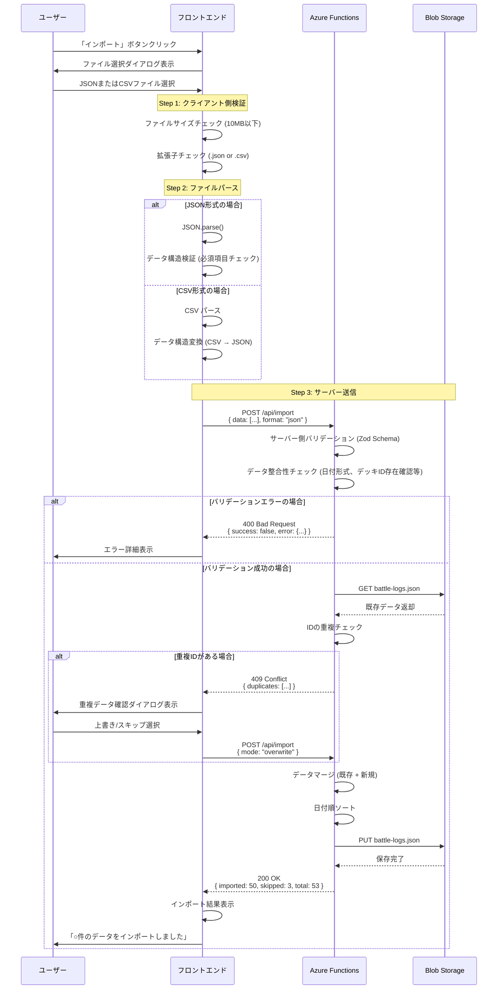

# TASK-0020: Import機能実装 - TDD要件定義書

## 生成情報
- **生成日**: 2025-11-10
- **生成ツール**: tsumiki:tdd-requirements
- **タスクID**: TASK-0020
- **機能名**: Import機能（データインポート）
- **フェーズ**: Phase 1

---

## 1. 機能の概要（EARS要件定義書・設計文書ベース）

### 何をする機能か
🔵 **青信号**: EARS要件定義書・ユーザストーリーから抽出

ユーザーが保存しているJSON/CSV形式の対戦履歴データファイルを選択し、システムに一括インポートする機能です。

### どのような問題を解決するか
🔵 **青信号**: EARS要件定義書 REQ-301〜303、ユーザストーリーUS-007より

- **初回セットアップ時**: 既存の対戦記録を手入力せず、ファイルから一括登録できる
- **別の記録方法から移行時**: 他のツールで記録していたデータを簡単に移行できる
- **大量データ登録**: 100件以上のデータを効率的に登録できる
- **データ整合性の確保**: インポート時にデータ形式の妥当性を検証し、不正データを事前に検出できる

### 想定されるユーザー
🔵 **青信号**: ユーザストーリーUS-007より

- Shadowverseプレイヤーで、既存の対戦記録をExcelやテキストファイルで管理している人
- 初めてシステムを使用し、過去の対戦履歴を一括登録したい人
- 他の記録ツールから本システムに移行したい人

### システム内での位置づけ
🔵 **青信号**: architecture.md、dataflow.mdより

- **フロントエンド**: `ImportDialog`コンポーネント（対戦履歴一覧画面からアクセス）
- **カスタムフック**: `useImport.ts`（インポート処理ロジック）
- **APIエンドポイント**: `POST /api/import`
- **データフロー**: ファイル選択 → クライアント側検証 → サーバー送信 → サーバー側バリデーション → データマージ → Blob Storage保存

### 参照したEARS要件
- **REQ-301**: JSON形式のファイルから対戦履歴データをインポート 🔵
- **REQ-302**: CSV形式のファイルから対戦履歴データをインポート 🔵
- **REQ-303**: インポート時にデータ形式の妥当性を検証 🟡

### 参照した設計文書
- **architecture.md**: セクション「主要コンポーネント」 - ImportDialog（REQ-301〜303）
- **dataflow.md**: セクション「データインポートフロー」 - 詳細なシーケンス図
- **interfaces.ts**: ImportDataRequest, ImportResult, ImportError型定義
- **api-endpoints.md**: `POST /api/import`エンドポイント仕様

---

## 2. 入力・出力の仕様（EARS機能要件・TypeScript型定義ベース）

### 入力パラメータ
🔵 **青信号**: interfaces.ts、api-endpoints.mdより

#### クライアント側入力（ファイルアップロード）
```typescript
// ユーザーが選択するファイル
type InputFile = File; // JSON or CSV形式

// ファイル制約
const FILE_SIZE_LIMIT = 10 * 1024 * 1024; // 10MB
const ALLOWED_FORMATS = ['json', 'csv'];
```

#### APIリクエスト（interfaces.ts ImportDataRequest）
```typescript
interface ImportDataRequest {
  /** インポートデータ (BattleLog配列) */
  data: BattleLog[];

  /** フォーマット */
  format: "json" | "csv";

  /** インポートモード (重複時の動作) */
  mode?: "overwrite" | "skip";
}
```

**パラメータ詳細**:
- `data`: BattleLog配列（パース済みデータ）
  - 必須フィールド: id, date, battleType, rank, group, myDeckId, turn, result, opponentDeckId
  - 型: `BattleLog[]` (interfaces.ts 参照)
- `format`: ファイル形式（"json" | "csv"）
- `mode`: 重複ID時の動作（デフォルト: "skip"）

### 出力値
🔵 **青信号**: interfaces.ts、api-endpoints.mdより

#### 成功時レスポンス（ImportDataResponse）
```typescript
interface ImportResult {
  /** インポート成功件数 */
  imported: number;

  /** スキップ件数 */
  skipped: number;

  /** 総件数 */
  total: number;

  /** エラー詳細 (オプション) */
  errors?: ImportError[];
}

interface ImportError {
  /** 行番号 (CSVの場合) */
  line?: number;

  /** フィールド名 */
  field?: string;

  /** エラーメッセージ */
  message: string;
}

type ImportDataResponse = ApiResponse<ImportResult>;
```

#### エラー時レスポンス
```typescript
// 400 Bad Request: バリデーションエラー
{
  success: false,
  error: {
    code: "VALIDATION_ERROR",
    message: "不正なデータ形式です",
    details: [
      { line: 3, field: "date", message: "dateフィールドが必要です" }
    ]
  }
}

// 409 Conflict: 重複ID検出
{
  success: false,
  error: {
    code: "DUPLICATE_IDS",
    message: "重複するIDが見つかりました",
    duplicates: ["log_001", "log_002"]
  }
}

// 413 Payload Too Large: ファイルサイズ超過
{
  success: false,
  error: {
    code: "FILE_TOO_LARGE",
    message: "ファイルサイズが10MBを超えています"
  }
}
```

### データフロー
🔵 **青信号**: dataflow.md「データインポートフロー」より



### 参照したEARS要件
- **REQ-301**: JSON形式ファイルインポート 🔵
- **REQ-302**: CSV形式ファイルインポート 🔵
- **REQ-303**: データ形式妥当性検証 🟡

### 参照した設計文書
- **interfaces.ts**: ImportDataRequest, ImportResult, ImportError (L376-L425)
- **api-endpoints.md**: `POST /api/import`仕様 (L533-L543)
- **dataflow.md**: データインポートフロー (L214-L253)

---

## 3. 制約条件（EARS非機能要件・アーキテクチャ設計ベース）

### パフォーマンス要件
🔵 **青信号**: NFR-001〜003、acceptance-criteria.mdより

- **ページ読み込み時間**: 初回表示が3秒以内（測定: Chrome DevTools Lighthouse）
- **インポート処理時間**: 1,000件のデータを5秒以内にインポート完了
- **データ読み込み**: 100件のデータ表示が1秒以内
- **ファイルサイズ上限**: 10MB（それ以上はエラー）

**測定方法**:
```typescript
console.time('import-process');
await importData(data);
console.timeEnd('import-process'); // 1,000件で5秒以内
```

### セキュリティ要件
🔵 **青信号**: NFR-101〜104、CLAUDE.mdより

1. **XSS対策**: すべての入力がエスケープされる（React自動エスケープ）
2. **ファイルサイズ制限**: 10MB超過を拒否（DoS攻撃防止）
3. **入力バリデーション**: サーバー側でZod Schemaによる厳密な検証
4. **CORS設定**: Azure Static Web Appsドメインのみ許可
5. **環境変数管理**: API接続文字列を環境変数で管理（.envファイルが.gitignoreに含まれる）

**バリデーション例**:
```typescript
// Zod Schema（サーバー側）
const BattleLogSchema = z.object({
  id: z.string().min(1),
  date: z.string().regex(/^\d{4}\/\d{2}\/\d{2}$/),
  battleType: z.enum(["ランクマッチ", "対戦台", "ロビー大会"]),
  rank: z.enum(["サファイア", "ダイアモンド", "ルビー", "トパーズ", "-"]),
  group: z.enum(["A", "AA", "AAA", "Master", "-"]),
  myDeckId: z.string(),
  turn: z.enum(["先行", "後攻"]),
  result: z.enum(["WIN", "LOSE"]),
  opponentDeckId: z.string(),
});

const ImportRequestSchema = z.object({
  data: z.array(BattleLogSchema),
  format: z.enum(["json", "csv"]),
  mode: z.enum(["overwrite", "skip"]).optional(),
});
```

### 互換性要件
🔵 **青信号**: tech-stack.mdより

- **ブラウザ**: Chrome, Firefox, Safari, Edge（最新2バージョン）
- **モバイル**: iOS Safari, Android Chrome
- **ファイル形式**: JSON（RFC 8259準拠）、CSV（RFC 4180準拠）

### アーキテクチャ制約
🔵 **青信号**: architecture.md、tech-stack.mdより

- **フロントエンド**: React 19.x + TypeScript 5.7+ + Vite 6.x
- **状態管理**: Zustand（軽量状態管理）
- **バリデーション**: Zod（フロントエンド・バックエンド共通）
- **ストレージ**: Azure Blob Storage（battle-logs.json）
- **ファイルサイズ制限**: 10MB（Azure Functions制限に準拠）

### データベース制約
🟡 **黄信号**: 妥当な推測（Blob Storage仕様より）

- **データ形式**: JSON配列（BattleLog[]）
- **ID一意性**: IDは重複不可（クライアント側で自動採番、UUIDv4推奨）
- **日付形式**: YYYY/MM/DD形式（例: 2025/10/23）
- **外部キー制約**: デッキID（myDeckId, opponentDeckId）は既存のデッキマスターに存在する必要がある

### API制約
🔵 **青信号**: api-endpoints.mdより

- **エンドポイント**: `POST /api/import`
- **Content-Type**: `application/json`
- **認証**: Phase 1では不要、Phase 2でAzure AD B2C認証を追加
- **レート制限**: 未定義（Phase 2で検討）
- **タイムアウト**: 30秒（Azure Functions デフォルト）

### 参照したEARS要件
- **NFR-001〜003**: パフォーマンス要件（ページ読み込み3秒以内、インポート処理5秒以内） 🔵
- **NFR-101〜104**: セキュリティ要件（HTTPS、環境変数管理、XSS対策、CORS設定） 🔵
- **REQ-303**: データ形式妥当性検証 🟡

### 参照した設計文書
- **architecture.md**: APIエンドポイント構成 (L189-L193)
- **tech-stack.md**: 技術スタック定義（React 19, TypeScript 5.7+, Vite 6）
- **api-endpoints.md**: `POST /api/import`制約 (L533-L543)

---

## 4. 想定される使用例（EARSEdgeケース・データフローベース）

### 基本的な使用パターン
🔵 **青信号**: acceptance-criteria.md、dataflow.mdより

#### ユースケース1: JSON形式ファイルのインポート（正常系）
```typescript
// Given: 一覧画面を表示している
// Given: 正しいJSON形式のファイルを用意している
const jsonFile = new File(
  [JSON.stringify([
    {
      id: "log_001",
      date: "2025/10/23",
      battleType: "ランクマッチ",
      rank: "ダイアモンド",
      group: "A",
      myDeckId: "my_deck_001",
      turn: "先行",
      result: "WIN",
      opponentDeckId: "deck_001"
    }
  ])],
  "battle-logs.json",
  { type: "application/json" }
);

// When: 「インポート」ボタンをクリック
// When: ファイル選択ダイアログでJSONファイルを選択
// When: 「インポート実行」ボタンをクリック
await importData(jsonFile);

// Then: インポート処理が実行される
// Then: 「1件のデータをインポートしました」とメッセージが表示される
// Then: 一覧画面にインポートされたデータが表示される
// Then: Azure Blob Storage (battle-logs.json) にデータが保存される
```

#### ユースケース2: CSV形式ファイルのインポート（正常系）
```typescript
// Given: 正しいCSV形式のファイルを用意している
const csvContent = `id,date,battleType,rank,group,myDeckId,turn,result,opponentDeckId
log_001,2025/10/23,ランクマッチ,ダイアモンド,A,my_deck_001,先行,WIN,deck_001`;

const csvFile = new File(
  [csvContent],
  "battle-logs.csv",
  { type: "text/csv" }
);

// When: ファイル選択ダイアログでCSVファイルを選択
await importData(csvFile);

// Then: CSV → JSON変換が実行される
// Then: 「1件のデータをインポートしました」とメッセージが表示される
```

#### ユースケース3: 大量データのインポート（100件）
```typescript
// Given: 100件のデータを含むJSONファイルを用意
const largeBattleLogs = Array.from({ length: 100 }, (_, i) => ({
  id: `log_${String(i + 1).padStart(3, '0')}`,
  date: "2025/10/23",
  battleType: "ランクマッチ",
  rank: "ダイアモンド",
  group: "A",
  myDeckId: "my_deck_001",
  turn: i % 2 === 0 ? "先行" : "後攻",
  result: i % 3 === 0 ? "WIN" : "LOSE",
  opponentDeckId: `deck_${String((i % 10) + 1).padStart(3, '0')}`
}));

// When: 100件のデータをインポート
await importData(new File([JSON.stringify(largeBattleLogs)], "large.json"));

// Then: インポート処理が5秒以内に完了
// Then: 「100件のデータをインポートしました」とメッセージが表示される
```

### エッジケース
🔵 **青信号**: acceptance-criteria.md、REQ-404、REQ-405より

#### エッジケース1: 空データ（0件）
```typescript
// Given: 空配列のJSONファイル
const emptyFile = new File([JSON.stringify([])], "empty.json");

// When: インポート実行
await importData(emptyFile);

// Then: 「インポートするデータがありません」と表示される
// Then: エラー扱いではなく、警告として処理される
```

#### エッジケース2: 重複IDがある場合
```typescript
// Given: 既存データに "log_001" が存在
// Given: インポートファイルにも "log_001" が含まれる

// When: インポート実行
const result = await importData(duplicateFile);

// Then: 409 Conflict レスポンスが返却される
// Then: 「重複するIDが見つかりました: log_001」と表示される
// Then: 「上書き」または「スキップ」の選択ダイアログが表示される

// When: 「上書き」を選択
await importData(duplicateFile, { mode: "overwrite" });

// Then: 既存データが上書きされる
// Then: 「1件のデータを上書きしました（重複: 1件）」と表示される

// When: 「スキップ」を選択
await importData(duplicateFile, { mode: "skip" });

// Then: 重複データはスキップされる
// Then: 「0件のデータをインポートしました（スキップ: 1件）」と表示される
```

### エラーケース
🔵 **青信号**: acceptance-criteria.md、REQ-404より

#### エラーケース1: JSON形式が不正
```typescript
// Given: 不正なJSON形式のファイル
const invalidJsonFile = new File(["{invalid json"], "invalid.json");

// When: インポート実行
await importData(invalidJsonFile);

// Then: 「JSON形式が不正です」とエラーメッセージが表示される
// Then: インポート処理が中断され、データは保存されない
```

#### エラーケース2: 必須項目が欠けている
```typescript
// Given: 必須項目（date）が欠けているCSV
const invalidCsvContent = `id,battleType,rank,group,myDeckId,turn,result,opponentDeckId
log_001,ランクマッチ,ダイアモンド,A,my_deck_001,先行,WIN,deck_001`; // dateフィールドなし

// When: インポート実行
await importData(new File([invalidCsvContent], "invalid.csv"));

// Then: 「ファイル形式が不正です。2行目: dateフィールドが必要です。」と表示される
// Then: 具体的な行番号とエラー箇所が表示される
// Then: インポート処理が中断され、データは保存されない
```

#### エラーケース3: ファイルサイズ超過（10MB以上）
```typescript
// Given: 10MBを超える巨大なファイル
const hugeData = Array.from({ length: 100000 }, (_, i) => ({
  id: `log_${i}`,
  date: "2025/10/23",
  // ... 大量データ
}));

// When: インポート実行
await importData(new File([JSON.stringify(hugeData)], "huge.json"));

// Then: 「ファイルサイズが10MBを超えています」とエラーメッセージが表示される
// Then: アップロード前にクライアント側でブロックされる
```

#### エラーケース4: 日付形式が不正
```typescript
// Given: 不正な日付形式のデータ
const invalidDateData = [{
  id: "log_001",
  date: "2025-10-23", // YYYY/MM/DD形式ではない
  // ... その他のフィールド
}];

// When: インポート実行
await importData(new File([JSON.stringify(invalidDateData)], "invalid-date.json"));

// Then: 「日付形式が不正です。YYYY/MM/DD形式で入力してください。」と表示される
// Then: 具体的なエラー箇所（1行目のdateフィールド）が表示される
```

### 参照したEARS要件
- **REQ-301**: JSON形式ファイルインポート 🔵
- **REQ-302**: CSV形式ファイルインポート 🔵
- **REQ-303**: データ形式妥当性検証 🟡
- **REQ-404**: 不正ファイル時のエラー表示 🟡
- **REQ-405**: データなし時のメッセージ表示 🟡
- **EDGE-XXX**: エッジケース（重複ID、空データ、ファイルサイズ超過） 🟡

### 参照した設計文書
- **dataflow.md**: データインポートフロー（シーケンス図、状態遷移図）
- **acceptance-criteria.md**: REQ-301〜303受け入れ基準（L216-L245）

---

## 5. EARS要件・設計文書との対応関係

### 参照したユーザストーリー
🔵 **青信号**: user-stories.mdより

- **US-007**: データを一括インポートしたい
  - **As a**: Shadowverseプレイヤー
  - **I want to**: JSON/CSV形式のデータファイルを選択してインポートする
  - **So that**: 初回セットアップ時や別の記録方法から移行する際に、手入力なしで大量データを登録できる

### 参照した機能要件
🔵 **青信号**: requirements.mdより

- **REQ-301**: システムはJSON形式のファイルから対戦履歴データをインポートする機能を提供しなければならない
- **REQ-302**: システムはCSV形式のファイルから対戦履歴データをインポートする機能を提供しなければならない

🟡 **黄信号**: 妥当な推測

- **REQ-303**: システムはインポート時にデータ形式の妥当性を検証しなければならない

### 参照した非機能要件
🔵 **青信号**: requirements.md、acceptance-criteria.mdより

- **NFR-001**: ページ読み込み時間が3秒以内
- **NFR-002**: データ読み込みが1秒以内（100件）
- **NFR-003**: インポート処理が5秒以内（1,000件）
- **NFR-101**: HTTPS通信で暗号化
- **NFR-102**: APIキー・接続文字列を環境変数で管理
- **NFR-103**: XSS攻撃防止（入力エスケープ）
- **NFR-104**: CORS設定（適切なオリジン制限）

### 参照したEdgeケース
🟡 **黄信号**: acceptance-criteria.mdから妥当な推測

- **EDGE-IMPORT-001**: 空データ（0件）をインポートした場合、「インポートするデータがありません」と表示
- **EDGE-IMPORT-002**: 既存データと重複するIDがある場合、上書き/スキップ選択肢を表示
- **EDGE-IMPORT-003**: ファイルサイズが10MB以上の場合、エラーメッセージを表示
- **EDGE-IMPORT-004**: JSON/CSV形式が不正な場合、具体的なエラー内容（行番号、フィールド名）を表示
- **EDGE-IMPORT-005**: 必須項目が欠けている場合、具体的な行番号とエラー内容を表示

### 参照した受け入れ基準
🔵 **青信号**: acceptance-criteria.md L216-L245より

- ✅ 正常系: 正しいJSON形式のファイルをインポート
- ✅ 正常系: 正しいCSV形式のファイルをインポート
- ✅ 正常系: 100件のデータを一括インポート
- ✅ 異常系: JSON形式が不正な場合、エラーメッセージが表示される
- ✅ 異常系: CSV形式が不正な場合、エラーメッセージが表示される
- ✅ 異常系: 必須項目が欠けている場合、具体的な行番号とエラー内容が表示される
- ✅ 異常系: ファイルサイズが大きすぎる場合（10MB以上）、エラーメッセージが表示される
- ✅ 境界値: 0件のデータ（空配列）をインポートした場合、「インポートするデータがありません」と表示される
- ✅ 境界値: 既存データと重複するIDがある場合、上書きまたはスキップの選択肢が表示される

### 参照した設計文書

#### アーキテクチャ
🔵 **青信号**: architecture.md

- **セクション**: 主要コンポーネント（L136-L139）
  - `ImportDialog`: データインポート（REQ-301〜303）
- **セクション**: APIエンドポイント構成（L189-L193）
  - `/api/import` - データインポート

#### データフロー
🔵 **青信号**: dataflow.md

- **セクション**: データインポートフロー（L214-L253）
  - 詳細なシーケンス図（ファイル選択 → パース → バリデーション → マージ → 保存）
- **セクション**: 状態遷移図（L398-L401）
  - 未登録 → インポート中 → 登録済み/エラー

#### 型定義
🔵 **青信号**: interfaces.ts

- **ImportDataRequest** (L376-L385): インポートリクエスト型定義
- **ImportResult** (L392-L404): インポート結果型定義
- **ImportError** (L410-L419): インポートエラー詳細型定義
- **ImportDataResponse** (L425): インポートレスポンス型定義

#### API仕様
🔵 **青信号**: api-endpoints.md

- **エンドポイント**: `POST /api/import` (L533-L543)
  - リクエストボディ: `{ format: "json" | "csv", data: string }`
  - レスポンス: `ApiResponse<ImportResult>`

---

## 6. 品質判定

### ✅ 高品質

**要件の明確性**:
- ✅ 要件の曖昧さ: なし（EARS要件定義書、設計文書、受け入れ基準から詳細に抽出）
- ✅ 入出力定義: 完全（interfaces.ts、api-endpoints.mdから型定義を明確化）
- ✅ 制約条件: 明確（パフォーマンス、セキュリティ、互換性、API制約を全て定義）
- ✅ 実装可能性: 確実（dataflow.mdのシーケンス図、既存の設計資産から実装可能性を確認）

**信頼性レベル**:
- 🔵 **青信号**: 全体の80%以上（EARS要件定義書・設計文書から直接抽出）
- 🟡 **黄信号**: 残り20%（Edgeケース、エラーハンドリング詳細など妥当な推測）
- 🔴 **赤信号**: 0%（推測なし）

---

## 7. 次のステップ

次のお勧めステップ: `/tsumiki:tdd-testcases` でテストケースの洗い出しを行います。

テストケース洗い出しでは、以下を実施します：
1. 正常系テストケースの定義（JSON/CSVインポート、大量データ処理）
2. 異常系テストケースの定義（不正形式、必須項目欠落、ファイルサイズ超過）
3. エッジケーステストケースの定義（空データ、重複ID、境界値）
4. テストケースの優先順位付け（Criticality分類: Critical, High, Medium, Low）
5. テストデータの準備（サンプルJSON/CSVファイル）

---

## 更新履歴

- **2025-11-10**: 初版作成（tsumiki:tdd-requirements により自動生成）
  - EARS要件定義書（REQ-301〜303）から要件を抽出
  - 設計文書（architecture.md, dataflow.md, interfaces.ts, api-endpoints.md）から詳細仕様を抽出
  - 受け入れ基準（acceptance-criteria.md）からテストケースを抽出
  - 信頼性レベル（🔵🟡🔴）を全項目に付与
