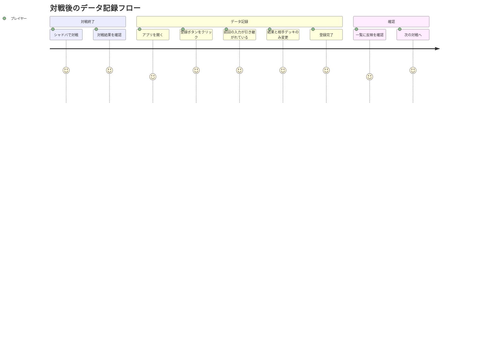
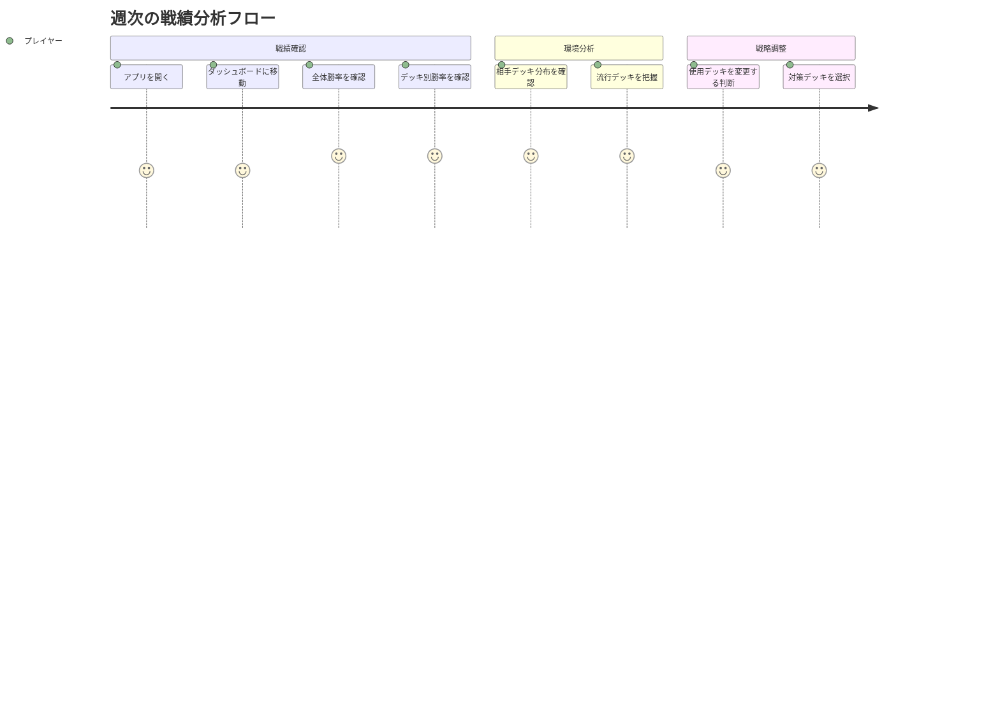

# シャドウバース対戦履歴管理 ユーザストーリー

## 概要

このドキュメントはシャドウバース対戦履歴管理アプリケーションの詳細なユーザストーリーを記載します。

## ユーザー種別の定義

### プライマリユーザー

- **シャドウバースプレイヤー**: シャドウバースをプレイし、自分の対戦履歴を記録・分析したい個人ユーザー
  - 対戦後に結果を記録する
  - 過去の対戦履歴を振り返る
  - 勝率や傾向を分析してデッキ構築や戦略に活かす
  - 主にPC・スマートフォンでアプリを利用

### セカンダリユーザー

- **システム管理者**: アプリケーションの運用・保守を行う開発者（個人）
  - データのバックアップ・復元
  - エラー監視・障害対応
  - 機能追加・改善

## ユーザストーリー

**【信頼性レベル凡例】**:
- 🔵 **青信号**: EARS要件定義書・設計文書・ユーザヒアリングを参考にした確実なストーリー
- 🟡 **黄信号**: EARS要件定義書・設計文書・ユーザヒアリングから妥当な推測によるストーリー
- 🔴 **赤信号**: EARS要件定義書・設計文書・ユーザヒアリングにない推測によるストーリー

---

## フェーズ1: 基本機能

### 📚 エピック1: 対戦履歴の記録 🔵 *ユーザヒアリング2025-10-23より*

#### ストーリー1.1: 対戦結果を素早く記録したい 🔵 *README.md・ユーザヒアリングより*

**ユーザストーリー**:
- **私は** シャドウバースプレイヤー **として**
- **対戦が終了した直後に**
- **結果を素早く記録したい**
- **そうすることで** 記憶が鮮明なうちに正確なデータを残し、後から分析に活用できる

**詳細説明**:
- **背景**: 対戦後すぐに記録しないと、デッキや結果を忘れてしまう可能性がある
- **前提条件**: アプリが起動しており、対戦履歴一覧画面を表示している
- **利用シーン**:
  - ランクマッチ後、次の対戦に入る前に記録
  - 複数連戦した後にまとめて記録
- **期待する体験**:
  - ワンクリックで入力ダイアログが開く
  - 前回の入力値が引き継がれているため、変更箇所のみ修正すれば良い
  - 数秒で入力完了できる

**関連要件**: REQ-001, REQ-002, REQ-003, REQ-004

**優先度**: 高

**見積もり**: 5ストーリーポイント

---

#### ストーリー1.2: 前回と同じデッキ・ランクで連戦している場合の入力を簡略化したい 🔵 *ユーザヒアリング2025-10-23より*

**ユーザストーリー**:
- **私は** シャドウバースプレイヤー **として**
- **同じデッキで連戦しているときに**
- **前回の入力内容を引き継いで、変更箇所だけ修正したい**
- **そうすることで** 入力の手間を省き、より多くの対戦に集中できる

**詳細説明**:
- **背景**: ランクマッチで連戦する場合、デッキ・グループ・ランクはほぼ変わらない
- **前提条件**: 既に1件以上の対戦履歴が登録されている
- **利用シーン**:
  - ランクマッチで10連戦しているとき
  - 同じデッキで勝率を検証しているとき
- **期待する体験**:
  - 登録ダイアログを開くと、前回入力した「マイデッキ」「グループ」「ランク」「ターン」が自動入力されている
  - 「日付」「結果」「相手デッキ」のみ変更すれば登録完了
  - 対戦タイプを変更した場合は、グループ・ランクもリセットされる

**関連要件**: REQ-003

**優先度**: 高

**見積もり**: 3ストーリーポイント

---

#### ストーリー1.3: 入力ミスを防ぎたい 🔵 *ユーザヒアリング2025-10-23より*

**ユーザストーリー**:
- **私は** シャドウバースプレイヤー **として**
- **データを入力する際に**
- **必須項目の入力漏れや未来日付の入力を防ぎたい**
- **そうすることで** 正確なデータを記録し、後からの修正作業を減らせる

**詳細説明**:
- **背景**: 手動入力のため、入力ミスや未入力の可能性がある
- **前提条件**: 登録ダイアログを開いている
- **利用シーン**:
  - 必須項目を未入力のまま登録しようとしたとき
  - 誤って未来の日付を入力したとき
- **期待する体験**:
  - 必須項目が未入力の場合、その項目の横に赤文字で「入力してください」と表示される
  - 未来日付を入力した場合、日付フィールドの横に「未来の日付は入力できません」と表示される
  - 登録ボタンが無効化され、誤って登録されるのを防ぐ

**関連要件**: REQ-004, REQ-401, REQ-402

**優先度**: 中

**見積もり**: 3ストーリーポイント

---

### 📚 エピック2: 対戦履歴の閲覧・管理 🔵 *ユーザヒアリング2025-10-23より*

#### ストーリー2.1: 最近の対戦履歴を一覧で確認したい 🔵 *README.md・ユーザヒアリングより*

**ユーザストーリー**:
- **私は** シャドウバースプレイヤー **として**
- **アプリを開いたときに**
- **直近1週間の対戦履歴を一覧で確認したい**
- **そうすることで** 最近の戦績を把握し、デッキの調子や傾向を確認できる

**詳細説明**:
- **背景**: 直近の対戦結果を振り返ることで、デッキの強さやメタゲームの変化を感じ取れる
- **前提条件**: アプリを起動している
- **利用シーン**:
  - 朝にアプリを開いて前日の戦績を確認
  - 連勝・連敗の流れを把握
- **期待する体験**:
  - 一覧画面を開くと、最新の対戦が上に表示されている
  - 日付、デッキ、相手デッキ、結果がひと目で分かる
  - 最大100件までスムーズにスクロール表示できる

**関連要件**: REQ-101, REQ-102, REQ-103, REQ-106

**優先度**: 高

**見積もり**: 5ストーリーポイント

---

#### ストーリー2.2: 特定の対戦の詳細を確認したい 🔵 *ユーザヒアリング2025-10-23より*

**ユーザストーリー**:
- **私は** シャドウバースプレイヤー **として**
- **一覧から気になる対戦を選んだときに**
- **その対戦の詳細情報を確認したい**
- **そうすることで** 対戦時の状況（先行/後攻、ランク帯など）を思い出し、戦略を振り返れる

**詳細説明**:
- **背景**: 一覧では表示しきれない詳細情報を確認したい場合がある
- **前提条件**: 対戦履歴一覧を表示している
- **利用シーン**:
  - 「この対戦は後攻だったかな？」と確認したいとき
  - 特定のデッキ対戦の詳細を振り返りたいとき
- **期待する体験**:
  - 一覧の行をクリックすると、詳細情報がモーダルで表示される
  - すべての項目（日付、対戦タイプ、グループ、ランク、マイデッキ、ターン、結果、相手デッキ）が表示される
  - モーダルを閉じると一覧画面に戻る

**関連要件**: REQ-104

**優先度**: 中

**見積もり**: 3ストーリーポイント

---

#### ストーリー2.3: 誤って登録した対戦履歴を削除したい 🔵 *ユーザヒアリング2025-10-23より*

**ユーザストーリー**:
- **私は** シャドウバースプレイヤー **として**
- **誤って登録してしまった対戦履歴があるときに**
- **その履歴を削除したい**
- **そうすることで** 正確なデータのみを保持し、統計分析の精度を保てる

**詳細説明**:
- **背景**: 入力ミスや重複登録で不要なデータが混入する可能性がある
- **前提条件**: 対戦履歴一覧を表示している
- **利用シーン**:
  - 同じ対戦を2回登録してしまったとき
  - デッキを間違えて登録してしまったとき
- **期待する体験**:
  - 一覧の各行に削除ボタンがある
  - 削除ボタンをクリックすると確認ダイアログが表示される
  - 「削除する」を選択すると、即座に一覧から削除される

**関連要件**: REQ-105, REQ-403

**優先度**: 中

**見積もり**: 3ストーリーポイント

---

### 📚 エピック3: 統計・分析による戦績把握 🔵 *ユーザヒアリング2025-10-23より*

#### ストーリー3.1: 全体の勝率を把握したい 🔵 *ユーザヒアリング2025-10-23より*

**ユーザストーリー**:
- **私は** シャドウバースプレイヤー **として**
- **統計ダッシュボードを開いたときに**
- **自分の全体勝率を確認したい**
- **そうすることで** デッキやプレイスキルの調子を客観的に把握できる

**詳細説明**:
- **背景**: 勝率は自分の実力やデッキの強さを測る重要な指標
- **前提条件**: 複数の対戦履歴が登録されている
- **利用シーン**:
  - 今週の調子を確認したいとき
  - 新しいデッキに変更した後の勝率を確認したいとき
- **期待する体験**:
  - ダッシュボードのトップに「全体勝率: 55% (WIN: 11, LOSE: 9)」のように表示される
  - 期間を変更すると、勝率が再計算される

**関連要件**: REQ-201, REQ-203, REQ-205

**優先度**: 高

**見積もり**: 3ストーリーポイント

---

#### ストーリー3.2: デッキタイプ別の勝率を比較したい 🔵 *ユーザヒアリング2025-10-23より*

**ユーザストーリー**:
- **私は** シャドウバースプレイヤー **として**
- **統計ダッシュボードで**
- **自分が使用したデッキタイプごとの勝率を比較したい**
- **そうすることで** どのデッキが強いか、どのデッキで練習が必要かを判断できる

**詳細説明**:
- **背景**: 複数のデッキを試している場合、どれが一番勝てるかを知りたい
- **前提条件**: 複数のマイデッキで対戦履歴が記録されている
- **利用シーン**:
  - デッキAとデッキBのどちらを使うか迷っているとき
  - 新デッキの勝率が安定してきたか確認したいとき
- **期待する体験**:
  - デッキタイプごとに「デッキ名: 勝率, 試合数」が一覧表示される
  - 勝率が高い順にソートされている
  - 視覚的に比較しやすい表示

**関連要件**: REQ-203

**優先度**: 高

**見積もり**: 5ストーリーポイント

---

#### ストーリー3.3: 対戦相手のデッキ分布を確認したい 🔵 *ユーザヒアリング2025-10-23より*

**ユーザストーリー**:
- **私は** シャドウバースプレイヤー **として**
- **統計ダッシュボードで**
- **対戦した相手のデッキタイプの分布を円グラフで確認したい**
- **そうすることで** 現在の環境（メタゲーム）を把握し、デッキ選択に活かせる

**詳細説明**:
- **背景**: 環境に多いデッキタイプに有利なデッキを選ぶことが重要
- **前提条件**: 複数の対戦履歴が登録されている
- **利用シーン**:
  - 今週はどのデッキが流行っているか確認したいとき
  - 対策デッキを選ぶ参考にしたいとき
- **期待する体験**:
  - 円グラフで各デッキタイプの割合が色分けされて表示される
  - 凡例にデッキ名と対戦回数が表示される
  - グラフが見やすくカラフルに表示される

**関連要件**: REQ-204

**優先度**: 高

**見積もり**: 5ストーリーポイント

---

#### ストーリー3.4: ランク帯ごとの成績を確認したい 🔵 *ユーザヒアリング2025-10-23より*

**ユーザストーリー**:
- **私は** シャドウバースプレイヤー **として**
- **統計ダッシュボードで**
- **ランク帯（サファイア/ダイアモンド/ルビー）ごとの成績を確認したい**
- **そうすることで** ランクが上がるにつれて勝率がどう変化しているかを把握できる

**詳細説明**:
- **背景**: ランク帯によって相手の強さが変わるため、成績も変動する
- **前提条件**: 複数のランク帯で対戦履歴が記録されている
- **利用シーン**:
  - 「ダイアモンドに上がったら勝てなくなった」ことを数値で確認したいとき
  - ランク帯ごとのデッキの相性を分析したいとき
- **期待する体験**:
  - ランク帯ごとに「グループ名: 勝率, 試合数」が表示される
  - サファイア、ダイアモンド、ルビーが分かりやすく分類されている

**関連要件**: REQ-203

**優先度**: 中

**見積もり**: 3ストーリーポイント

---

#### ストーリー3.5: 分析期間を自由に変更したい 🔵 *ユーザヒアリング2025-10-23より*

**ユーザストーリー**:
- **私は** シャドウバースプレイヤー **として**
- **統計ダッシュボードで**
- **集計期間を自由に選択したい（1週間/1ヶ月/全期間など）**
- **そうすることで** 短期的な調子と長期的な傾向の両方を分析できる

**詳細説明**:
- **背景**: 直近の調子と全体の実力は異なる場合がある
- **前提条件**: 複数の期間にわたる対戦履歴が記録されている
- **利用シーン**:
  - 今週の勝率が悪いが、全期間では良い場合の確認
  - 新パッチ後の成績変化を確認したいとき
- **期待する体験**:
  - ダッシュボード上部に期間選択のドロップダウンがある（1週間/1ヶ月/3ヶ月/全期間）
  - 期間を変更すると、すべての統計が即座に再計算される
  - カスタム期間（開始日〜終了日）も選択できる

**関連要件**: REQ-202

**優先度**: 中

**見積もり**: 5ストーリーポイント

---

### 📚 エピック4: データの移行・初期設定 🔵 *ユーザヒアリング2025-10-23より*

#### ストーリー4.1: 既存のデータをインポートしたい 🔵 *ユーザヒアリング2025-10-23より*

**ユーザストーリー**:
- **私は** シャドウバースプレイヤー **として**
- **アプリを初めて使うときに**
- **既存のJSON/CSVファイルから対戦履歴をインポートしたい**
- **そうすることで** 過去のデータを手動入力する手間を省き、すぐに分析を始められる

**詳細説明**:
- **背景**: 既にExcelやスプレッドシートで記録していたデータがある
- **前提条件**: JSON/CSV形式のデータファイルを用意している
- **利用シーン**:
  - 初回セットアップ時
  - 別の記録方法から移行するとき
- **期待する体験**:
  - 一覧画面に「インポート」ボタンがある
  - ファイル選択ダイアログでJSON/CSVを選択
  - インポート完了後、一覧にデータが反映される
  - エラーがある場合は具体的な行番号とエラー内容が表示される

**関連要件**: REQ-301, REQ-302, REQ-303, REQ-404

**優先度**: 中

**見積もり**: 5ストーリーポイント

---

## フェーズ2: 追加機能

### 📚 エピック5: ユーザー認証とセキュリティ 🔵 *ユーザヒアリング2025-10-23より*

#### ストーリー5.1: 自分のデータを安全に管理したい 🔵 *ユーザヒアリング2025-10-23より*

**ユーザストーリー**:
- **私は** シャドウバースプレイヤー **として**
- **アプリにログインする際に**
- **Azure AD B2Cで安全に認証したい**
- **そうすることで** 自分のデータを他人に見られることなく、複数デバイスで同期できる

**詳細説明**:
- **背景**: 個人データを保護し、複数デバイスでアクセスしたい
- **前提条件**: Azure AD B2Cアカウントを持っている
- **利用シーン**:
  - 初回アプリ起動時
  - 別のデバイスからアクセスするとき
- **期待する体験**:
  - アプリ起動時にログイン画面が表示される
  - Microsoftアカウントでログインできる
  - ログイン後、自分のデータのみが表示される

**関連要件**: REQ-701, REQ-702

**優先度**: 中

**見積もり**: 8ストーリーポイント

---

### 📚 エピック6: マイデッキ管理 🔵 *ユーザヒアリング2025-10-23より*

#### ストーリー6.1: 複数のデッキを管理したい 🔵 *ユーザヒアリング2025-10-23より*

**ユーザストーリー**:
- **私は** シャドウバースプレイヤー **として**
- **マイデッキ管理画面で**
- **複数のデッキを登録・編集・削除したい**
- **そうすることで** 使用するデッキを切り替えながら対戦履歴を記録できる

**詳細説明**:
- **背景**: 複数のデッキを試す場合、デッキを切り替える必要がある
- **前提条件**: マイデッキ管理画面を開いている
- **利用シーン**:
  - 新しいデッキを追加するとき
  - デッキ名を変更するとき
  - 使わなくなったデッキを削除するとき
- **期待する体験**:
  - マイデッキ一覧が表示され、追加・編集・削除ボタンがある
  - デッキコードを入力して登録できる
  - 使用中のデッキが分かりやすく表示される

**関連要件**: REQ-801, REQ-802, REQ-803

**優先度**: 中

**見積もり**: 8ストーリーポイント

---

### 📚 エピック7: データのエクスポート 🔵 *ユーザヒアリング2025-10-23より*

#### ストーリー7.1: データをバックアップしたい 🔵 *ユーザヒアリング2025-10-23より*

**ユーザストーリー**:
- **私は** シャドウバースプレイヤー **として**
- **データエクスポート機能で**
- **対戦履歴をJSON/CSV形式でダウンロードしたい**
- **そうすることで** データのバックアップや、他のツールでの分析ができる

**詳細説明**:
- **背景**: データ消失のリスク回避と、より高度な分析ツールでの活用
- **前提条件**: 対戦履歴が登録されている
- **利用シーン**:
  - 定期的なバックアップ
  - Excelで独自の分析をしたいとき
- **期待する体験**:
  - 一覧画面に「エクスポート」ボタンがある
  - JSON/CSV形式を選択できる
  - ダウンロードが即座に開始される

**関連要件**: REQ-1001, REQ-1002

**優先度**: 低

**見積もり**: 3ストーリーポイント

---

### 📚 エピック8: PWA対応 🔵 *ユーザヒアリング2025-10-23より*

#### ストーリー8.1: スマホのホーム画面から素早くアクセスしたい 🔵 *ユーザヒアリング2025-10-23より*

**ユーザストーリー**:
- **私は** シャドウバースプレイヤー **として**
- **スマートフォンで**
- **アプリをホーム画面に追加して、ネイティブアプリのように使いたい**
- **そうすることで** 対戦後すぐにアプリを開いて記録できる

**詳細説明**:
- **背景**: ブラウザを開いてURLを入力する手間を省きたい
- **前提条件**: PWA対応ブラウザを使用している
- **利用シーン**:
  - スマホで対戦した直後
  - 移動中にデータを確認したいとき
- **期待する体験**:
  - 「ホーム画面に追加」のプロンプトが表示される
  - ホーム画面のアイコンから直接アプリが起動する
  - ネイティブアプリと同じような操作感

**関連要件**: REQ-1101, REQ-1102

**優先度**: 低

**見積もり**: 5ストーリーポイント

---

## ユーザージャーニー

### ジャーニー1: 対戦後のデータ記録フロー 🔵 *ユーザヒアリング2025-10-23より*

**詳細**:
1. **シャドバで対戦**: ゲーム内で対戦を実施
2. **対戦結果を確認**: 勝敗を確認
3. **アプリを開く**: ブラウザまたはPWAでアプリを起動
4. **登録ボタンをクリック**: ダイアログが開く
5. **前回の入力が引き継がれている**: マイデッキ・グループ・ランク・ターンがデフォルト入力済み
6. **結果と相手デッキのみ変更**: 変更箇所のみ修正
7. **登録完了**: データが保存される
8. **一覧に反映を確認**: 最新の履歴が一覧のトップに表示される
9. **次の対戦へ**: ゲームに戻る

---

### ジャーニー2: 週次の戦績分析フロー 🔵 *ユーザヒアリング2025-10-23より*

**詳細**:
1. **アプリを開く**: 週末にアプリを起動
2. **ダッシュボードに移動**: 統計画面を表示
3. **全体勝率を確認**: 今週の調子を数値で把握
4. **デッキ別勝率を確認**: どのデッキが勝てているか確認
5. **相手デッキ分布を確認**: 円グラフで環境を把握
6. **流行デッキを把握**: 対戦相手に多いデッキを特定
7. **使用デッキを変更する判断**: データを元にデッキを選択
8. **対策デッキを選択**: 環境に有利なデッキに変更

---

## ペルソナ定義

### ペルソナ1: 競技志向プレイヤー「タクミ」🔵 *ユーザヒアリング2025-10-23より*

- **基本情報**:
  - 28歳、会社員
  - シャドバ歴3年、ランクマッチメイン
  - ランク: ダイアモンド〜ルビー帯
  - プレイ頻度: 週20〜30戦
  - 技術レベル: 中〜上級
- **ゴール**:
  - ランクマッチで高ランクを維持
  - 勝率60%以上を目指す
  - 環境に合わせた最適なデッキ選択
- **課題**:
  - どのデッキが勝てているか感覚でしか分からない
  - 環境の変化に気づきにくい
  - 記録を取る時間がない
- **行動パターン**:
  - 週末に集中してプレイ
  - 対戦後すぐに結果を記録
  - 週に1回は統計を確認して戦略を調整
- **利用環境**:
  - PC: 自宅でのプレイ時
  - スマホ: 移動中や外出先でのプレイ時

---

### ペルソナ2: カジュアルプレイヤー「ユイ」🟡 *一般的なユーザー像から妥当な推測*

- **基本情報**:
  - 22歳、大学生
  - シャドバ歴1年、ランクマッチ・対戦台
  - ランク: サファイア帯
  - プレイ頻度: 週5〜10戦
  - 技術レベル: 初〜中級
- **ゴール**:
  - お気に入りのデッキで楽しくプレイ
  - たまに勝率を確認して改善
  - 友達との対戦記録を残す
- **課題**:
  - どのデッキが自分に合っているか分からない
  - 勝てないときにモチベーションが下がる
- **行動パターン**:
  - 授業の合間や寝る前にプレイ
  - 気が向いたときに記録
  - たまに統計を見て「こんなに負けてたんだ」と確認
- **利用環境**:
  - スマホメイン
  - たまにタブレット

---

## 非機能的ユーザー要求

### ユーザビリティ要求

- **学習容易性**: 初回利用時、5分以内に基本操作（登録・一覧表示）を習得できる
- **効率性**: 熟練後、1件の対戦記録を30秒以内に登録できる
- **記憶しやすさ**: 1週間ぶりの利用でも、操作を思い出せる
- **エラー対応**: エラーメッセージが分かりやすく、自己解決できる
- **満足度**: データ分析により、プレイスキル向上を実感できる

### アクセシビリティ要求

- **視覚**: 色だけに頼らない情報伝達（WIN/LOSEをアイコンでも表現）
- **聴覚**: 音声による操作は不要（視覚のみで完結）
- **運動**: タップ・クリック操作のみで完結（複雑なジェスチャー不要）
- **認知**: シンプルな画面構成、明確なラベル表示
