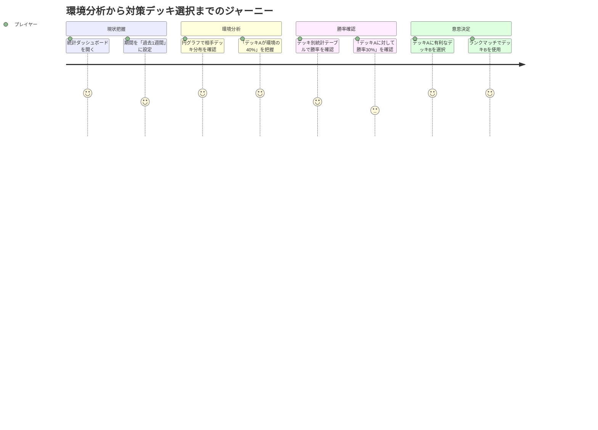

# Statistics Dashboard グラフ表示機能 ユーザストーリー

## 概要

このドキュメントはStatistics Dashboard グラフ表示機能（TASK-0019）の詳細なユーザストーリーを記載します。対戦相手デッキ分布を円グラフで視覚化し、ユーザーが環境（メタゲーム）を直感的に把握できるようにします。

**タスクID**: TASK-0019
**関連要件定義**: [📋 task-0019-requirements.md](task-0019-requirements.md)
**親ユーザストーリー**: [📖 shadowverse-battle-log-user-stories.md](shadowverse-battle-log-user-stories.md)

## ユーザー種別の定義

### プライマリユーザー

- **シャドウバースプレイヤー**: シャドウバースをプレイし、統計ダッシュボードで対戦成績を分析する個人ユーザー
  - 環境（メタゲーム）を把握したい
  - 対戦相手のデッキ分布を視覚的に理解したい
  - テーブルよりもグラフの方が直感的に分かりやすいと感じる
  - PC・スマートフォンでダッシュボードを閲覧

## ユーザストーリー

**【信頼性レベル凡例】**:
- 🔵 **青信号**: EARS要件定義書・設計文書・ユーザヒアリングを参考にした確実なストーリー
- 🟡 **黄信号**: EARS要件定義書・設計文書・ユーザヒアリングから妥当な推測によるストーリー
- 🔴 **赤信号**: EARS要件定義書・設計文書・ユーザヒアリングにない推測によるストーリー

---

## フェーズ1: 基本グラフ表示機能

### 📚 エピック1: 環境分析の視覚化 🔵 *REQ-204・ユーザヒアリング2025-10-23・2025-11-09より*

#### ストーリー1.1: 対戦相手のデッキ分布を円グラフで確認したい 🔵 *ユーザストーリー3.3・ユーザヒアリング2025-10-23・2025-11-09より*

**ユーザストーリー**:
- **私は** シャドウバースプレイヤー **として**
- **統計ダッシュボードで**
- **対戦した相手のデッキタイプの分布を円グラフで確認したい**
- **そうすることで** 現在の環境（メタゲーム）を視覚的に把握し、デッキ選択に活かせる

**詳細説明**:
- **背景**: 環境に多いデッキタイプに有利なデッキを選ぶことが重要。テーブル表示だけでは割合の比較が直感的でない。
- **前提条件**:
  - 統計ダッシュボードを表示している
  - 複数の対戦履歴が登録されている（複数の相手デッキと対戦済み）
  - TASK-0018（基本統計表示）が実装済み
- **利用シーン**:
  - 今週はどのデッキが流行っているか視覚的に確認したいとき
  - 対策デッキを選ぶ参考にしたいとき
  - 「このデッキが環境の3割を占めている」ことを一目で把握したいとき
- **期待する体験**:
  - デッキ別統計テーブルの横に円グラフが表示される
  - 円グラフの各セグメントが異なる色で区別されている
  - セグメントにマウスを乗せると、デッキ名・対戦回数・割合が表示される
  - 凡例にデッキ名と対戦回数が一覧表示される
  - グラフが見やすくカラフルに表示される（色覚多様性に配慮）

**関連要件**: REQ-GRAPH-001, REQ-GRAPH-002, REQ-GRAPH-003, REQ-GRAPH-004, REQ-GRAPH-005

**優先度**: 高

**見積もり**: 5ストーリーポイント

---

#### ストーリー1.2: グラフ上の詳細情報をホバーで確認したい 🔵 *ユーザヒアリング2025-11-09 Q3より*

**ユーザストーリー**:
- **私は** シャドウバースプレイヤー **として**
- **円グラフの各セグメントにマウスを乗せたときに**
- **そのデッキの詳細情報（デッキ名、対戦回数、割合%）を確認したい**
- **そうすることで** グラフを見ながら具体的な数値を把握できる

**詳細説明**:
- **背景**: 円グラフだけでは正確な数値が分からない。ツールチップで詳細情報を表示することで、視覚的な理解と数値的な理解を両立できる。
- **前提条件**:
  - 円グラフが表示されている
  - PC・タブレットでマウス操作が可能
- **利用シーン**:
  - 「このセグメントは何%くらいだろう？」と疑問に思ったとき
  - 「対戦回数が10回以上のデッキはどれだろう？」と確認したいとき
  - グラフの凡例が小さくて見づらいとき
- **期待する体験**:
  - セグメントにマウスを乗せると、ツールチップが表示される
  - ツールチップに「デッキ名: 15回 (25.0%)」のような情報が表示される
  - ツールチップが読みやすいフォントサイズで表示される
  - マウスを外すとツールチップが消える（画面がすっきり保たれる）

**関連要件**: REQ-GRAPH-009, REQ-GRAPH-010

**優先度**: 中

**見積もり**: 2ストーリーポイント

---

#### ストーリー1.3: スマホでも円グラフを見やすく確認したい 🔵 *ユーザヒアリング2025-11-09 Q5より*

**ユーザストーリー**:
- **私は** シャドウバースプレイヤー **として**
- **スマートフォンで統計ダッシュボードを閲覧するときに**
- **円グラフを見やすいサイズで確認したい**
- **そうすることで** 外出先でも環境を把握できる

**詳細説明**:
- **背景**: PC版と同じレイアウトをスマホで表示すると、グラフが小さくて見づらい。モバイル専用のレイアウトが必要。
- **前提条件**:
  - スマートフォンで統計ダッシュボードにアクセスしている
  - 画面幅が768px未満（モバイルサイズ）
- **利用シーン**:
  - 電車の中でスマホから対戦成績を確認するとき
  - PC版と同じ情報をスマホでも見たいとき
- **期待する体験**:
  - スマホ表示では円グラフのみが1カラムレイアウトで表示される
  - デッキ別統計テーブルは非表示（または別セクションに配置）
  - 円グラフが画面幅いっぱいに表示され、タップしやすいサイズ
  - PC版と同じアスペクト比で表示される（縦長にならない）

**関連要件**: REQ-GRAPH-008, REQ-GRAPH-012, NFR-GRAPH-103

**優先度**: 中

**見積もり**: 3ストーリーポイント

---

### 📚 エピック2: グラフとテーブルの統合表示 🔵 *ユーザヒアリング2025-11-09 Q2より*

#### ストーリー2.1: グラフとテーブルを並べて比較したい 🔵 *ユーザヒアリング2025-11-09 レイアウト案Bより*

**ユーザストーリー**:
- **私は** シャドウバースプレイヤー **として**
- **統計ダッシュボードで**
- **デッキ別統計テーブルと円グラフを並べて表示したい**
- **そうすることで** 割合（グラフ）と勝率（テーブル）を同時に把握できる

**詳細説明**:
- **背景**: 環境に多いデッキが分かっても、そのデッキとの勝率が分からないと対策デッキを選べない。グラフとテーブルを並べることで、両方の情報を一画面で確認できる。
- **前提条件**:
  - 統計ダッシュボードを表示している
  - PC・タブレット（画面幅768px以上）
  - TASK-0018（DeckStatsTable）が実装済み
- **利用シーン**:
  - 「環境に多いデッキAとの勝率は？」を確認したいとき
  - グラフで環境を把握し、テーブルで詳細な勝率を確認したいとき
  - 画面を切り替えずに両方の情報を見たいとき
- **期待する体験**:
  - PC表示では左側にデッキ別統計テーブル、右側に円グラフが表示される
  - 2カラムのグリッドレイアウトで整然と配置される
  - グラフとテーブルの高さが揃っている（見た目が美しい）
  - スクロールせずに両方が見える（1画面に収まる）

**関連要件**: REQ-GRAPH-006, REQ-GRAPH-007

**優先度**: 高

**見積もり**: 3ストーリーポイント

---

#### ストーリー2.2: 期間を変更したらグラフも即座に更新されてほしい 🔵 *REQ-205・ユーザヒアリング2025-11-09より*

**ユーザストーリー**:
- **私は** シャドウバースプレイヤー **として**
- **統計ダッシュボードで期間選択を変更したときに**
- **円グラフも即座に更新されてほしい**
- **そうすることで** 異なる期間の環境変化を素早く比較できる

**詳細説明**:
- **背景**: 「今週の環境」と「先週の環境」を比較することで、環境の変化（流行デッキの移り変わり）を把握できる。
- **前提条件**:
  - 統計ダッシュボードを表示している
  - 期間選択（TASK-0018のPeriodSelector）が実装済み
  - 複数の期間にデータが存在する
- **利用シーン**:
  - 「過去1週間」→「過去1ヶ月」に期間を変更したとき
  - カスタム期間（開始日〜終了日）を指定したとき
  - 環境の変化を時系列で確認したいとき
- **期待する体験**:
  - 期間選択を変更すると、円グラフが即座に再描画される
  - ページ全体がリロードされない（スムーズな体験）
  - ローディング中は円グラフの位置にスピナーが表示される
  - 新しい期間のデータでグラフが更新される

**関連要件**: REQ-GRAPH-103, REQ-GRAPH-201

**優先度**: 中

**見積もり**: 2ストーリーポイント

---

### 📚 エピック3: データが少ない場合の体験 🟡 *エッジケース要件から妥当な推測*

#### ストーリー3.1: データが0件のときに適切なメッセージが見たい 🟡 *REQ-405から妥当な推測*

**ユーザストーリー**:
- **私は** シャドウバースプレイヤー **として**
- **選択した期間にデータが0件のときに**
- **円グラフの代わりに「データなし」メッセージを見たい**
- **そうすることで** グラフが表示されない理由を理解できる

**詳細説明**:
- **背景**: データが0件の期間を選択した場合、空のグラフを表示するよりも明確なメッセージを表示した方がユーザーフレンドリー。
- **前提条件**:
  - 統計ダッシュボードを表示している
  - 選択した期間に対戦履歴が0件
- **利用シーン**:
  - 未来の期間を誤って選択したとき
  - 対戦していない期間を選択したとき
  - アプリを使い始めたばかりでデータが少ないとき
- **期待する体験**:
  - 円グラフの代わりに「この期間にはデータがありません」とメッセージが表示される
  - メッセージが中央に配置され、読みやすい
  - 空のグラフやエラーが表示されない

**関連要件**: REQ-GRAPH-101

**優先度**: 低

**見積もり**: 1ストーリーポイント

---

#### ストーリー3.2: 対戦相手が1種類だけのときも円グラフが見たい 🟡 *EDGE-GRAPH-102から妥当な推測*

**ユーザストーリー**:
- **私は** シャドウバースプレイヤー **として**
- **対戦相手が1種類のデッキのみのときも**
- **100%の単一セグメント円グラフを見たい**
- **そうすることで** グラフ表示が一貫していることを確認できる

**詳細説明**:
- **背景**: 特定のデッキとしか対戦していない期間（例: フレンド戦で同じデッキと10回対戦）でも、グラフ表示を維持することで一貫性を保つ。
- **前提条件**:
  - 統計ダッシュボードを表示している
  - 選択した期間の対戦相手デッキが1種類のみ
- **利用シーン**:
  - 新しいデッキのテストで特定の相手デッキとだけ練習しているとき
  - フレンド戦で同じ相手とだけ対戦しているとき
- **期待する体験**:
  - 100%の単一色セグメント円グラフが表示される
  - ツールチップに「デッキ名: 10回 (100.0%)」と表示される
  - エラーやメッセージではなく、正常なグラフとして表示される

**関連要件**: REQ-GRAPH-102

**優先度**: 低

**見積もり**: 1ストーリーポイント

---

## ユーザージャーニー

### ジャーニー1: 環境分析→デッキ選択の意思決定 🔵 *ユーザヒアリング2025-10-23より*

**詳細**:
1. **統計ダッシュボードを開く**: ランクマッチ前に今週の環境を確認
2. **期間を「過去1週間」に設定**: 最新の環境トレンドを知りたい
3. **円グラフで相手デッキ分布を確認**: 視覚的に環境を把握（デッキAが最大セグメント）
4. **「デッキAが環境の40%」を把握**: ツールチップで正確な割合を確認
5. **デッキ別統計テーブルで勝率を確認**: 自分のデッキごとの勝率をチェック
6. **「デッキAに対して勝率30%」を確認**: 現在のデッキでは不利と判断
7. **デッキAに有利なデッキBを選択**: 対策デッキに変更する意思決定
8. **ランクマッチでデッキBを使用**: データに基づいたデッキ選択で勝率向上を目指す

---

## ペルソナ定義

### ペルソナ1: 競技志向プレイヤー「タクミ」🔵 *ユーザヒアリング2025-10-23より*

- **基本情報**:
  - 28歳、会社員
  - シャドバ歴3年、ランクマッチメイン
  - ランク: ダイアモンド〜ルビー帯
  - プレイ頻度: 週20〜30戦
  - 利用デバイス: PC（自宅）、スマホ（通勤中）

- **ゴール**:
  - ランクマッチでマスターランクを達成したい
  - 環境を理解し、有利なデッキを選択したい
  - データに基づいた戦略的なデッキ選択をしたい

- **課題**:
  - テーブル表示だけでは環境の割合が直感的に分からない
  - 「どのデッキが流行っているか」をパッと見で把握したい
  - スマホでも統計を手軽に確認したい

- **行動パターン**:
  - 週末にPC で1週間の成績を振り返る
  - 円グラフで環境を確認し、対策デッキを選ぶ
  - 通勤中にスマホで統計を確認する

- **利用環境**:
  - PC: Windows 11 + Chrome
  - スマホ: iPhone + Safari

### ペルソナ2: カジュアルプレイヤー「ユイ」🟡 *一般的なペルソナから妥当な推測*

- **基本情報**:
  - 24歳、大学院生
  - シャドバ歴1年、ランクマッチとフレンド戦
  - ランク: サファイア帯
  - プレイ頻度: 週10戦程度
  - 利用デバイス: スマホ（主）、PC（たまに）

- **ゴール**:
  - 友達と対戦して楽しみたい
  - 自分のデッキの勝率を知りたい
  - 環境を把握して流行のデッキを試したい

- **課題**:
  - 数字だけの統計は読むのが面倒
  - グラフの方が分かりやすい
  - スマホで手軽に確認したい

- **行動パターン**:
  - 月に1回くらい統計を確認
  - 円グラフで「今何が流行ってるか」を確認
  - 流行デッキをコピーして使ってみる

- **利用環境**:
  - スマホ: Android + Chrome

---

## 非機能的ユーザー要求

### ユーザビリティ要求

- **学習容易性**: 初回利用時に円グラフの見方を5秒以内に理解できる 🟡
- **効率性**: 円グラフを見て環境を把握するのに10秒以内 🟡
- **記憶しやすさ**: デッキタイプごとの色が固定されており、次回も同じ色で表示される 🔵
- **エラー対応**: データが0件の場合に明確なメッセージが表示される 🟡
- **満足度**: グラフが見やすく、テーブルよりも直感的に理解できる 🟡

### アクセシビリティ要求

- **視覚**: 色覚多様性に配慮したカラーパレット使用 🟡
- **操作**: マウスホバーだけでなく、キーボード操作でもツールチップが表示される（将来対応） 🔴
- **読み上げ**: 円グラフに適切なaria-label属性を設定し、スクリーンリーダー対応 🟡

---

## 関連文書

- **要件定義書**: [📋 task-0019-requirements.md](task-0019-requirements.md)
- **受け入れ基準**: [✅ task-0019-acceptance-criteria.md](task-0019-acceptance-criteria.md)
- **親ユーザストーリー**: [📖 shadowverse-battle-log-user-stories.md](shadowverse-battle-log-user-stories.md)
- **TASK-0018ユーザストーリー**: 基本統計表示機能

---

## 変更履歴

| 日付 | 変更内容 | 変更者 |
|------|---------|-------|
| 2025-11-09 | 初版作成（TASK-0019ユーザストーリー） | Claude Code |
